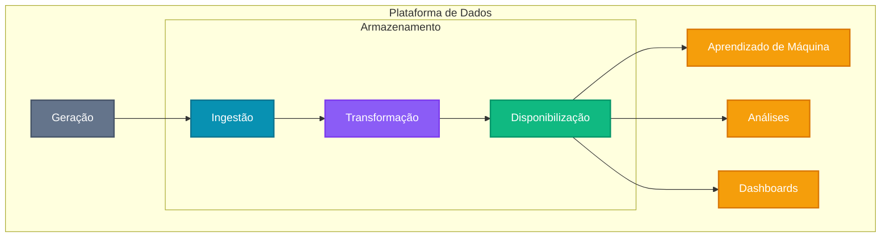
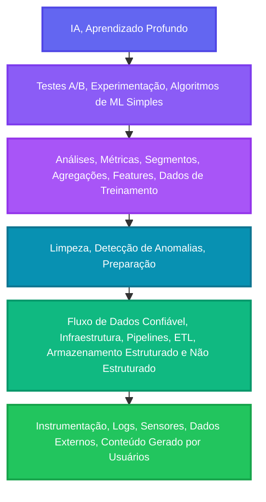

# Ciclo de vida e Profissionais

## Ciclo de vida da engenharia de dados

O **ciclo de vida da engenharia de dados** representa um processo contínuo e interconectado que transforma dados brutos em valor para a organização (adaptado de FDE):

Este fluxo inicia com a **geração** de dados em diversas fontes (sistemas transacionais, sensores, APIs, *logs*) e passa por três etapas fundamentais dentro da plataforma de dados:

- **ingestão** (coleta e captura),
- **transformação** (limpeza, estruturação e enriquecimento)
- e **disponibilização** (armazenamento otimizado para consumo).

O produto final alimenta desde modelos de machine learning até dashboards executivos e análises exploratórias, criando um ecossistema onde dados se tornam a base para decisões estratégicas e inovação.

## Engenharia de dados *versus* Ciência de dados

As tarefas necessárias para tornar a extração de valor a partir de dados possível será realizada por diferentes profissionais. Por mais que a engenharia de dados possua interseção com as áreas de ciência de dados e análise, ela não deve ser confundida como uma subárea direta dessas disciplinas.

!!! info
    Embora trabalhem de forma complementar, cada uma possui objetivos e competências distintas.

Considere a **hierarquia de necessidades da ciência de dados** (adaptado de FDE):

Apesar do interesse de muitos cientistas de dados em criar e aprimorar modelos de Machine Learning, grande parte de seu tempo (entre 70% e 80%) é consumida nas três etapas da base pirâmide. 

Por não serem, em geral, especializados na construção de sistemas de dados para produção, acabam realizando essas atividades de maneira não otimizada.

!!! danger "Recruta-se Engenheiros(as) de dados!"
    Sem base sólida, o trabalho de ciência de dados tende a ser **ineficiente** e **limitado** pelo **tempo gasto em tarefas de preparação**.

Assim, podemos considerar que engenharia de dados está localizada nas etapas primárias do fluxo de trabalho com dados: é responsável por **coletar**, **organizar**, **transformar** e **disponibilizar** dados de forma **confiável** e **escalável**, fornecendo insumos de alta qualidade para que cientistas de dados possam gerar análises, treinarr modelos de aprendizado de máquina e identificar *insights* estratégicos.

!!! danger "Atenção!"
    Sem essa base sólida, o trabalho de ciência de dados tende a ser ineficiente e limitado pelo tempo gasto em tarefas de preparação.

## Profissionais de dados

Para facilitar a compreensão da área de **Engenharia de Dados**, vamos explorar os principais papéis e responsabilidades dos profissionais que atuam nesse campo:

!!! danger "Não seja tão rígido!"
    Esta lista serve como um guia geral para as principais atuações na área de dados.
    
    Na prática, as responsabilidades de cada profissional podem se sobrepor e variar bastante de empresa para empresa.

- **Engenheiro de Dados (Data Engineer)**: Este profissional é responsável por projetar, construir e manter os sistemas e infraestruturas que coletam, armazenam e processam grandes volumes de dados. É ele quem garante que os dados estejam disponíveis e prontos para serem utilizados pelos analistas e cientistas.

- **Arquiteto de Dados (Data Architect)**: O Arquiteto de Dados é o responsável por desenhar a estratégia e a arquitetura geral de dados da organização. Ele define como os dados serão armazenados, integrados e consumidos, garantindo que a infraestrutura seja escalável, segura e eficiente.

!!! tip "Atenção"
    Os dois próximos cargos são bastante focados em dar visão sobre o estado atual dos dados da empresa (geralmente sem envolver construção de modelos, predição).

- **Analista de Dados (Data Analyst)**: Focado na análise exploratória de dados, o Analista de Dados coleta, limpa e interpreta conjuntos de dados para identificar tendências, padrões e insights. Ele utiliza ferramentas como **SQL** e Excel para criar relatórios e dashboards que ajudam na visualização dos resultados.

- **Analista de BI (Business Intelligence Analyst)**: Este profissional é especializado em transformar dados brutos em informações úteis para os negócios. Ele constrói *dashboards*, relatórios e visualizações que permitem que líderes e gestores monitorem o desempenho da empresa e tomem decisões mais assertivas.

!!! tip "Atenção"
    Os dois próximos cargos são bastante focados em **Machine Learning**.

- **Engenheiro de Machine Learning (Machine Learning Engineer)**: Responsável por desenvolver, treinar e otimizar modelos de machine learning. Este profissional tem um perfil mais técnico e focado na parte de criação do modelo, utilizando técnicas estatísticas e programação para resolver problemas complexos.

- **Cientista de Dados (Data Scientist)**: O Cientista de Dados utiliza técnicas estatísticas, programação e aprendizado de máquina para extrair insights valiosos dos dados. Sua principal função é construir modelos preditivos (ML) e algoritmos que ajudam a resolver problemas complexos e a tomar decisões estratégicas.

!!! tip "Atenção"
    O próximo cargo é bastante focado em tornar a operação de machine learning mais eficiente. Os modelos produzidos pelos cientistas de dados viram produtos e são **monitorados e gerenciados** em produção pelo Engenheiro de MLOps.

- **Engenheiro de MLOps (MLOps Engineer)**: Este profissional atua como uma ponte entre o desenvolvimento de modelos de machine learning e o ambiente de produção. Ele automatiza, implanta e monitora os modelos, garantindo que funcionem de forma confiável, escalável e eficiente em um ambiente real. Ele aplica os princípios de **DevOps** para o mundo do machine learning.

- **Engenheiro de Software (Software Engineer)**: Embora não seja um profissional exclusivo da área de dados, o Engenheiro de Software desempenha um papel crucial. Ele é responsável por desenvolver aplicações e sistemas robustos e eficientes, muitas vezes colaborando com equipes de dados para integrar modelos de machine learning e pipelines de dados nas soluções de software da empresa.

- **Database Administrator (DBA)**: O **DBA** é responsável por gerenciar, manter e otimizar sistemas de gerenciamento de bancos de dados (SGBDs). Ele garante a segurança, a integridade e o desempenho dos bancos de dados, sendo fundamental para o armazenamento e acesso aos dados.

- **Engenheiro de Segurança de Dados (Data Security Engineer)**: O Engenheiro de Segurança de Dados protege os dados da organização. Ele implementa medidas de segurança como criptografia, controle de acesso e auditorias, garantindo que os dados estejam seguros e em conformidade com regulamentações.

- **Especialista em Governança de Dados**: Foca no gerenciamento e controle de qualidade dos dados, garantindo conformidade com políticas internas e regulamentações externas.

## Exercícios

Vamos utilizar os exercícios a seguir para verificar os conhecimentos adquiridos sobre os cargos na área de dados.

!!! question "Importante"
    Chame o professor caso tenha dúvidas!

!!! exercise choice "Question"
    Uma empresa precisa projetar e implementar toda a infraestrutura para coleta, armazenamento e processamento de dados vindos de múltiplas fontes, garantindo que os dados estejam sempre disponíveis para análise. Qual profissional é mais adequado para liderar esta tarefa?

    - [X] Engenheiro de Dados
    - [ ] Cientista de Dados
    - [ ] Analista de BI
    - [ ] Database Administrator

    !!! answer "Answer"
        O Engenheiro de Dados é responsável por projetar, construir e manter os sistemas e infraestruturas que coletam, armazenam e processam grandes volumes de dados.

!!! exercise choice "Question"
    O CEO de uma startup está planejando a estratégia de dados da empresa para os próximos 5 anos. Ele precisa definir como os dados serão armazenados, integrados e consumidos, garantindo escalabilidade e eficiência. Qual profissional deve ser consultado?

    - [ ] Engenheiro de Dados
    - [X] Arquiteto de Dados
    - [ ] Analista de Dados
    - [ ] Engenheiro de MLOps

    !!! answer "Answer"
        O Arquiteto de Dados é responsável por desenhar a estratégia e a arquitetura geral de dados da organização, definindo como os dados serão armazenados, integrados e consumidos.

!!! exercise choice "Question"
    Uma empresa precisa migrar seu sistema legado de dados para a nuvem, implementando uma arquitetura moderna que inclua data lakes, data warehouses e ferramentas de processamento distribuído. Além disso, é necessário garantir que os pipelines de dados sejam resilientes a falhas e possam se recuperar automaticamente. Qual é a principal responsabilidade do Engenheiro de Dados neste projeto?

    - [ ] Definir a estratégia geral de arquitetura de dados
    - [ ] Criar dashboards para monitorar a migração
    - [X] Implementar e manter a infraestrutura técnica de dados
    - [ ] Analisar os dados migrados para validar qualidade

    !!! answer "Answer"
        O Engenheiro de Dados é responsável por implementar tecnicamente a infraestrutura de dados, construir pipelines resilientes, configurar ferramentas de processamento distribuído e garantir que os sistemas funcionem de forma confiável e escalável na nuvem.

!!! exercise choice "Question"
    Uma empresa de e-commerce quer identificar padrões de comportamento dos clientes através de análise exploratória dos dados de vendas. Eles precisam criar relatórios e dashboards para visualizar tendências. Qual profissional é mais adequado?

    - [X] Analista de Dados
    - [ ] Engenheiro de Machine Learning
    - [ ] Engenheiro de Segurança de Dados
    - [ ] Especialista em Governança de Dados

    !!! answer "Answer"
        O Analista de Dados é focado na análise exploratória de dados, coletando, limpando e interpretando conjuntos de dados para identificar tendências, padrões e insights.

!!! exercise choice "Question"
    Um modelo de *Machine Learning* já foi desenvolvido e testado em ambiente de desenvolvimento. Agora precisa ser colocado em produção com monitoramento automatizado. Qual profissional é responsável por esta tarefa?

    - [ ] Cientista de Dados
    - [ ] Engenheiro de Machine Learning
    - [X] Engenheiro de MLOps
    - [ ] Engenheiro de Software

    !!! answer "Answer"
        O Engenheiro de MLOps atua como ponte entre o desenvolvimento de modelos e o ambiente de produção, automatizando, implantando e monitorando os modelos em produção.

        O Engenheiro de Machine Learning tem um papel focado no desenvolvimento e treinamento de modelos de machine learning. Ele é responsável por selecionar algoritmos, ajustar os modelos e garantir que eles tenham um bom desempenho durante o treinamento. No entanto, ao passar para o ambiente de produção e necessitar de monitoramento e automação, o Engenheiro de MLOps assume a responsabilidade, pois ele é especializado na implantação, automação e monitoramento dos modelos em ambientes de produção.

        Portanto, enquanto o Engenheiro de Machine Learning pode atuar na fase de desenvolvimento, o Engenheiro de MLOps é o profissional que realmente cuida da integração e manutenção contínua do modelo em produção.

!!! exercise choice "Question"
    Uma empresa detectou que seus bancos de dados estão com performance baixa e precisa otimizar consultas, gerenciar backups e garantir a integridade dos dados. Qual profissional é mais adequado?

    - [ ] Engenheiro de Dados
    - [ ] Arquiteto de Dados
    - [ ] Analista de BI
    - [X] Database Administrator (DBA)

    !!! answer "Answer"
        O DBA é responsável por gerenciar, manter e otimizar sistemas de gerenciamento de bancos de dados, garantindo segurança, integridade e desempenho.

!!! exercise choice "Question"
    Uma organização precisa construir um modelo preditivo para prever a rotatividade de funcionários usando técnicas de machine learning e análise estatística avançada. Qual profissional deve liderar este projeto?

    - [ ] Analista de Dados
    - [X] Cientista de Dados
    - [ ] Analista de BI
    - [ ] Engenheiro de Dados

    !!! answer "Answer"
        O Cientista de Dados utiliza técnicas estatísticas, programação e aprendizado de máquina para construir modelos preditivos e algoritmos que resolvem problemas complexos.

!!! exercise choice "Question"
    Uma empresa de *streaming* recebe dados de milhões de usuários em tempo real (cliques, visualizações, curtidas) e precisa processar esses dados continuamente para alimentar recomendações instantâneas. A infraestrutura atual não consegue lidar com o volume e a velocidade dos dados. Qual profissional é fundamental para resolver este problema?

    - [X] Engenheiro de Dados
    - [ ] Analista de Dados
    - [ ] Database Administrator
    - [ ] Cientista de Dados

    !!! answer "Answer"
        O Engenheiro de Dados é responsável por projetar e construir pipelines de dados em tempo real, implementar tecnologias de *streaming* e garantir que a infraestrutura possa processar grandes volumes de dados com baixa latência.

!!! exercise choice "Question"
    O gerente de logística de uma grande empresa sente que está perdido em relação aos números de sua área. Ele deseja obter, em um dashboard, números sobre o negócio: quantidade de pedidos entregues, quantidade de clientes atendidos por estado, valor total dos pedidos entregues, quantidade de reclamações. Considerando que os dados já estão disponíveis, qual o profissional mais adequado para desenvolver a solução e atender esta demanda?

    - [ ] Cientista de Dados
    - [ ] Engenheiro de MLOps
    - [X] Analista de Dados

    !!! answer "Answer"
        Tanto o Analista de Dados quando o Analista de BI seriam prováveis profissionais adequados para a função!

!!! exercise choice "Question"
    Uma empresa descobriu que dados sensíveis de clientes podem estar expostos e precisa implementar criptografia, controles de acesso e auditorias de segurança. Qual profissional é mais adequado?

    - [ ] Database Administrator
    - [ ] Especialista em Governança de Dados
    - [X] Engenheiro de Segurança de Dados
    - [ ] Arquiteto de Dados

    !!! answer "Answer"
        O Engenheiro de Segurança de Dados protege os dados da organização implementando medidas como criptografia, controle de acesso e auditorias.

!!! exercise choice "Question"
    Verdadeiro ou Falso: Um Engenheiro de Machine Learning tem como principal responsabilidade monitorar modelos em produção.

    - [ ] Verdadeiro
    - [X] Falso

    !!! answer "Answer"
        Falso. O Engenheiro de Machine Learning é responsável por desenvolver, treinar e otimizar modelos de machine learning. Quem monitora modelos em produção é o Engenheiro de MLOps.

!!! exercise choice "Question"
    Verdadeiro ou Falso: Analistas de Dados e Analistas de BI têm focos similares em dar visão sobre o estado atual dos dados da empresa (mais análise exploratória, menos predição).

    - [X] Verdadeiro
    - [ ] Falso

    !!! answer "Answer"
        Verdadeiro. Ambos os profissionais são focados em dar visão sobre o estado atual dos dados da empresa, geralmente sem envolver construção de modelos ou projeções complexas.

!!! exercise choice "Question"
    O servidor centralizado de dados da empresa está sobrecarregado porque diferentes equipes criam suas próprias extrações de dados, resultando em processos duplicados e inconsistências. É necessário criar um pipeline centralizado que extraia dados de múltiplas fontes (bancos transacionais, APIs, arquivos CSV), transforme-os segundo regras de negócio e os carregue no servidor centralizado de dados de forma automatizada. Qual profissional deve liderar esta iniciativa?

    - [ ] Arquiteto de Dados
    - [X] Engenheiro de Dados
    - [ ] Analista de BI
    - [ ] Especialista em Governança de Dados

    !!! answer "Answer"
        O Engenheiro de Dados é responsável por construir e manter pipelines ETL/ELT, automatizar processos de extração, transformação e carga de dados, garantindo que os dados fluam de forma eficiente e confiável entre diferentes sistemas.

## Referências

- FDE. Reis, J., Housley, M. (2022). Fundamentals of Data Engineering: Plan and Build Robust Data Systems. Estados Unidos: O'Reilly Media.
- DDIA. Kleppmann, M. (2017). Designing Data-Intensive Applications: The Big Ideas Behind Reliable, Scalable, and Maintainable Systems. Estados Unidos: O'Reilly Media.
- BDPBP. Warren, J., Marz, N. (2015). Big Data: Principles and Best Practices of Scalable Realtime Data Systems. Estados Unidos: Manning.
