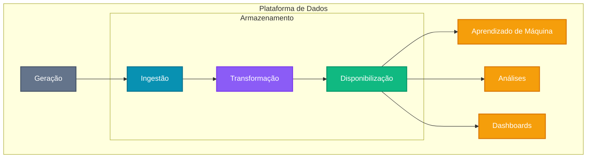

# Warm Up

## Habilidades do Engenheiro de Dados

O trabalho do engenheiro de dados envolve atuar em áreas fundamentais como **segurança**, **gestão** e **arquitetura de dados**, ***DataOps*** :material-information-outline:{ title="O DataOps (abreviação de Data Operations) é uma abordagem que combina práticas de desenvolvimento ágil, engenharia de dados e operações para melhorar a velocidade, a qualidade e a confiabilidade no ciclo de vida dos dados. Inspirado em conceitos do DevOps, o DataOps promove automação, integração contínua e monitoramento de pipelines de dados, garantindo que as informações fluam de forma eficiente desde a coleta até o consumo. Seu objetivo principal é reduzir o tempo entre a geração dos dados e a entrega de valor para o negócio, mantendo padrões elevados de qualidade e facilitando a colaboração entre engenheiros de dados, analistas, cientistas de dados e demais stakeholders." } e **engenharia de software**.

É essencial compreender como as ferramentas de dados se encaixam ao longo do ciclo de vida da engenharia de dados, desde a origem das informações até o momento em que são utilizadas para gerar valor por analistas e cientistas de dados.

Relembrando o ciclo de vida:




Além disso, o engenheiro de dados precisa equilibrar constantemente fatores como **custo**, **agilidade**, **escalabilidade**, **simplicidade**, **reutilização** e **interoperabilidade**, escolhendo as soluções mais adequadas para cada contexto.

Até pouco tempo atrás, o trabalho do engenheiro de dados envolvia o domínio de um conjunto limitado, porém robusto, de tecnologias como Hadoop e Spark.

Essas ferramentas exigiam habilidades avançadas (engenharia de software, redes, computação distribuída, armazenamento) e grande parte das atividades era voltada à gestão e manutenção de *clusters*, ao controle de recursos e à implementação de *pipelines* e rotinas de transformação de dados.

Atualmente, as ferramentas modernas tornaram o cenário menos complexo e mais ágil, permitindo arquiteturas de dados que evoluem conforme novas tendências surgem.

Embora precise ter noções de análise, *machine learning* e criação de relatórios, o engenheiro de dados não é o responsável direto por essas tarefas.


## Warm Up

Para esquentarmos para o restante do semestre e começarmos a por em prática os conceitos que estamos aprendendo, vamos propor uma atividade prática que envolva **um primeiro contato** com ferramentas de análise de dados para um projeto específico.

A ideia é que vocês, enquanto testam as ferramentas, pesquisem suas características, vantagens e desvantagens, considerando aspectos como facilidade de uso, integração com outras tecnologias, custo e suporte da comunidade.

### Local de Armazenamento dos arquivos

Os arquivos estão armazenados no **S3**. O **S3** é um serviço de armazenamento de objetos da Amazon Web Services (AWS) que oferece alta durabilidade, escalabilidade e segurança para dados. Pense nele como um **Dropbox** ou **Google Drive** para dados estáticos em grande escala.

Os arquivos podem ser acessados através de URLs específicas, e o S3 oferece recursos como versionamento, controle de acesso e integração com outras ferramentas da AWS.

## AWS CLI - Command Line Interface

A **AWS CLI** (*Command Line Interface*) é uma ferramenta que permite gerenciar serviços da AWS através da linha de comando. Com ela, você pode executar comandos para criar, modificar e excluir recursos na AWS, facilitando a automação de tarefas e a integração com scripts.

### Instalação

[**Clique Aqui**](https://docs.aws.amazon.com/cli/latest/userguide/getting-started-install.html) para instalar o AWS CLI.

### Credenciais de acesso

Para acessar os dados no **S3**, você precisará de credenciais da AWS. Essas credenciais geralmente consistem em uma chave de acesso (**Access Key**) e uma chave secreta (**Secret Key**). 

!!! info
    Pergunte ao professor onde obter as credenciais de acesso ao S3.

### Configuração

Configure a região e as credenciais fornecidas pelo professor.

<div class="termy">

    ```console
    $ aws configure --profile dataeng-warmup
    AWS Access Key ID [None]: ????????????
    AWS Secret Access Key [None]: ????????????????????????????????
    Default region name [None]: us-east-1
    Default output format [None]: 
    ```

</div>
<br>

### Definir perfil

Para definir um perfil padrão, use:

!!! warning "Atenção"
    Tudo bem caso não consiga definir um perfil padrão.

    Nos comandos de CLI, sempre utilize o parâmetro `--profile` para especificar o perfil a ser utilizado.

=== "Linux"

    <div class="termy">

    ```console
    $ export AWS_PROFILE=dataeng-warmup
    ```

    </div>
    <br>

=== "Windows CMD (Prompt de Comando)"

    <div class="termy">

    ```console
    $ set AWS_PROFILE=dataeng-warmup
    ```

    </div>
    <br>

=== "Windows PowerShell"

    <div class="termy">

    ```console
    $ env:AWS_PROFILE="dataeng-warmup"
    ```

    </div>
    <br>

### Exemplo: listar conteúdo do bucket S3

Agora você pode usar o AWS CLI para criar, listar ou remover recursos. Por exemplo, para listar os objetos no bucket S3 que utilizaremos na aula:

<div class="termy">

    ```console
    $ aws s3 ls s3://dataeng-warmup --recursive --profile dataeng-warmup
    ```

</div>


Você deve obter algo como:

```console
2025-08-10 17:30:06          0 data_processed/
2025-08-10 17:27:42          0 data_raw/
2025-08-10 17:28:04       5647 data_raw/station.csv
2025-08-10 17:34:31 1989696383 data_raw/status.csv
2025-08-10 17:28:04   80208848 data_raw/trip.csv
2025-08-10 17:28:05     438063 data_raw/weather.csv
```

Eles representam informações sobre [estações de bicicleta em São Francisco](https://www.kaggle.com/datasets/benhamner/sf-bay-area-bike-share/data).
