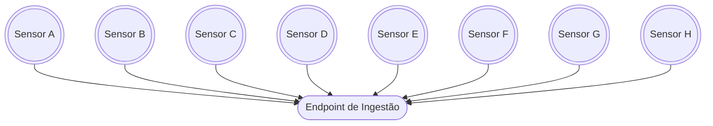
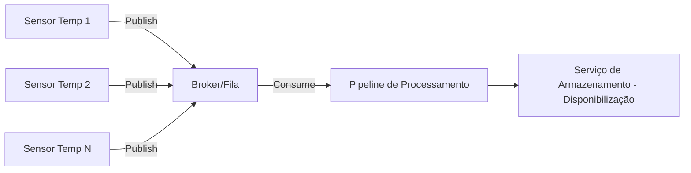

# Exemplo: Sensores

Suponha um cenário onde sensores de temperatura são utilizados em uma fábrica. Esses sensores enviam dados de temperatura em tempo real para um sistema central.



O *endpoint* de ingestão é responsável por receber os dados dos sensores e encaminhá-los para tratamento adequado (transformação e disponibilização).

!!! example "Exemplo de Mensagem"
    Exemplo de mensagem enviada por um sensor:

    ```json
    {
        "sensor_id": "S1",
        "timestamp": "2023-10-01T12:00:00Z",
        "temperature": 22.5
    }
    ```

Neste cenário, o modelo de ingestão é *push-based*. Como vantagens para este modelo, podemos considerar:

1. **Dados em tempo real**:
    - Sensores podem enviar leituras assim que elas são coletadas, garantindo **baixa latência**.
    - Em casos como detecção de superaquecimento, tempo de resposta rápido é essencial.

2. **Eficiência energética e de rede**:
    - O sensor só transmite quando tem dados, economizando energia (importante para IoT).
    - Evita tráfego desnecessário de *polling* contínuo.

3. **Simplicidade de implementação**:
    - Sensores não precisam implementar lógica complexa para gerenciar conexões ou estados.
    - O envio de dados é feito de forma simples e direta.

4. **Armazenamento nos sensores**:
    - Os sensores não precisam implementar lógica de armazenamento, pois os dados são enviados em tempo real para o *endpoint* de ingestão.

!!! warning "Requisitos!"
    Em um cenário real, a escolha pelo modelo de ingestão deve considerar o cenário atual da empresa e os requisitos de projeto.

## Questão importante

Assim, o *endpoint* de ingestão precisa ser algum serviço que consiga receber as mensagens e lidar com a taxa de transmissão dos sensores.

Como cada sensor irá realizar uma conexão para envio das mensagens, precisamos garantir que o sistema seja escalável e capaz de lidar com picos de tráfego.

!!! danger "Perigo!"
    Caso o *endpoint* de ingestão não consiga lidar com a taxa de transmissão dos sensores, podemos enfrentar problemas como:

    - **Perda de dados**: Mensagens podem ser descartadas se o sistema estiver sobrecarregado. O sensor pode não esperar o *endpoint* processar a mensagem (*timeout*).
    - **Atrasos**: O processamento de dados pode ser retardado, afetando a análise em tempo real.
    - **Lock dos sensores**: Sensores podem ficar bloqueados, impedindo o envio de novas mensagens (espera até que ocorra garantia de entrega da mensagem).

## Filas

As filas são uma solução eficaz para lidar com a ingestão de dados em cenários de alta taxa de transmissão, como o dos sensores de temperatura.

Elas irão atuar como intermediárias entre os **produtores de dados** (sensores) e os **consumidores** (serviços de processamento).

Ao invés do endpoint de ingestão receber as mensagens diretamente dos sensores, os sensores irão publicar suas mensagens em uma fila. Os serviços de processamento, **quando tiverem disponibilidade**, irão consumir as mensagens dessa fila.

Este é o modelo proposto:



!!! info "Benefícios"

    Com o uso de filas, ganharemos em:

    1. **Escalabilidade**:
        - Adicionar mais sensores não sobrecarrega um job central de coleta; cada sensor publica no seu ritmo.
        - A fila fará o gerenciamento da entrega para o *pipeline de processamento*.

    1. **Desacoplamento**:
        - Se o processador (*pipeline de processamento*) estiver indisponível por alguns segundos, as mensagens podem ficar na fila e serem processadas depois.

!!! tip "Dica!"
    Desacoplamento é o princípio de projetar sistemas de forma que seus componentes funcionem de maneira independente, **reduzindo dependências** diretas entre eles.
    
    Isso permite que partes do pipeline (como ingestão, processamento e armazenamento) possam evoluir, ser escaladas ou substituídas sem afetar drasticamente as demais.
    
    Técnicas como uso de filas, APIs e contratos bem definidos entre serviços ajudam a alcançar esse isolamento, trazendo mais resiliência, flexibilidade e facilidade de manutenção às arquiteturas de dados.

Mas toda tecnologia tem suas complexidades e *trade-offs*! O uso de filas, por exemplo, pode introduzir latências adicionais e requer um gerenciamento cuidadoso para evitar problemas como o acúmulo de mensagens não processadas.

Considere se o uso de filas não irá trazer mais complexidade do que benefício ao fluxo de dados. Isso acontece, por exemplo, em *pipelines* simples e diretos, onde um componente chama outro imediatamente e não há necessidade de desacoplamento ou de lidar com variações de carga.

!!! danger "Evite uso de filas se:"

    - Não há variações de carga / pico de tráfego
    - Volume de dados pequeno e previsível
    - Não há múltiplos produtores ou consumidores
    - A resposta precisa ser imediata e não há tolerância para processamento assíncrono.

    Nestes casos, a sobrecarga operacional de gerenciar e monitorar uma fila pode ser desnecessária!