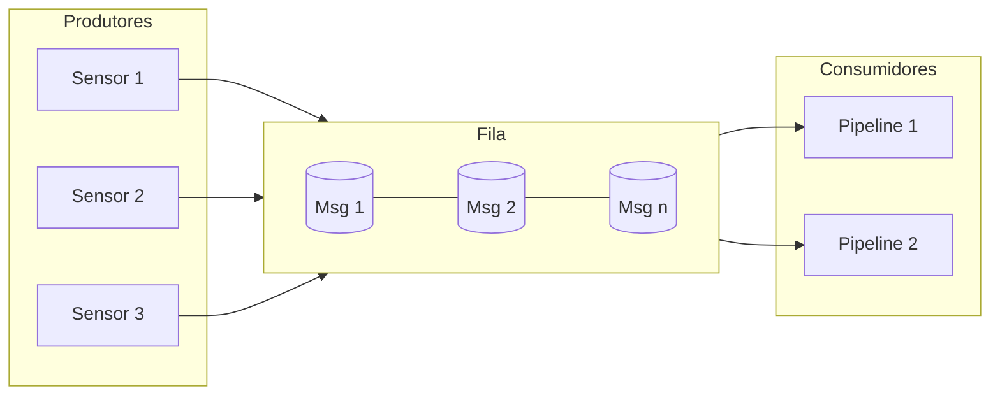

# Programar Pipeline

Iremos programar **consumidores** para processar as mensagens enviadas para o **RabbitMQ**.

Desta forma, o fluxo estará completo. As mensagens são produzidas por sensores e consumidas por pipelines de processamento.



Vamos criar `pipeline-proc.py` contendo um consumidor para processar as mensagens do RabbitMQ:

```python { .copy }
import json
import random
import time
import sys
import os
import pika
from datetime import datetime

# Configurações do RabbitMQ via variáveis de ambiente
RABBITMQ_HOST = os.getenv('RABBITMQ_HOST', 'rabbitmq')
RABBITMQ_PORT = int(os.getenv('RABBITMQ_PORT', '5672'))
RABBITMQ_USER = os.getenv('RABBITMQ_USER', '')
RABBITMQ_PASS = os.getenv('RABBITMQ_PASS', '')
QUEUE_NAME = os.getenv('QUEUE_NAME', '')

def conectar_rabbitmq():
    """Estabelece conexão com RabbitMQ"""
    credentials = pika.PlainCredentials(RABBITMQ_USER, RABBITMQ_PASS)
    parameters = pika.ConnectionParameters(
        host=RABBITMQ_HOST,
        port=RABBITMQ_PORT,
        credentials=credentials
    )
    
    try:
        connection = pika.BlockingConnection(parameters)
        channel = connection.channel()
        
        # Declara a fila (garante que existe)
        channel.queue_declare(queue=QUEUE_NAME, durable=True)
        
        return connection, channel
    except Exception as e:
        print(f"Erro ao conectar com RabbitMQ: {e}", flush=True)
        return None, None

def processar_mensagem(ch, method, properties, body):
    """Processa uma mensagem recebida do RabbitMQ"""
    try:
        # Decodifica a mensagem
        mensagem = body.decode('utf-8')
        dados = json.loads(mensagem)
        
        # Imprime a mensagem formatada
        timestamp = datetime.now().strftime("%Y-%m-%d %H:%M:%S")
        print(f"[{timestamp}] Mensagem recebida:", flush=True)
        print(f"  Sensor ID: {dados.get('id', 'N/A')}", flush=True)
        print(f"  Data: {dados.get('data', 'N/A')}", flush=True)
        print(f"  Temperatura: {dados.get('temperatura', 'N/A')}°C", flush=True)
        print(f"  Mensagem completa: {mensagem}", flush=True)
        print("-" * 50, flush=True)
        
        # Simula processamento com tempo aleatório entre 0.5 e 5 segundos
        tempo_processamento = random.uniform(0.5, 5.0)
        print(f"Processando por {tempo_processamento:.2f} segundos...", flush=True)
        time.sleep(tempo_processamento)
        
        # Confirma o processamento da mensagem
        ch.basic_ack(delivery_tag=method.delivery_tag)
        print("Mensagem processada com sucesso!\n", flush=True)
        
    except json.JSONDecodeError as e:
        print(f"Erro ao decodificar JSON: {e}", flush=True)
        print(f"Mensagem recebida: {body}", flush=True)
        # Mesmo com erro, confirma a mensagem para não ficar em loop
        ch.basic_ack(delivery_tag=method.delivery_tag)
        
    except Exception as e:
        print(f"Erro ao processar mensagem: {e}", flush=True)
        # Em caso de erro, rejeita a mensagem sem reprocessar
        ch.basic_nack(delivery_tag=method.delivery_tag, requeue=False)

def wait_for_rabbitmq():
    """Aguarda RabbitMQ ficar disponível"""
    max_retries = 30
    retry_count = 0
    
    while retry_count < max_retries:
        try:
            connection, channel = conectar_rabbitmq()
            if connection is not None and channel is not None:
                connection.close()
                print("RabbitMQ está disponível!", flush=True)
                return True
        except Exception as e:
            pass
        
        retry_count += 1
        print(f"Aguardando RabbitMQ... tentativa {retry_count}/{max_retries}", flush=True)
        time.sleep(2)
    
    print("RabbitMQ não ficou disponível após 60 segundos", flush=True)
    return False

def main():
    print("=== Pipeline de Processamento de Sensores ===", flush=True)
    
    # Aguarda RabbitMQ ficar disponível
    if not wait_for_rabbitmq():
        print("Encerrando: RabbitMQ não está disponível", flush=True)
        sys.exit(1)
    
    # Conecta ao RabbitMQ
    connection, channel = conectar_rabbitmq()
    if connection is None or channel is None:
        print("Falha ao estabelecer conexão com RabbitMQ", flush=True)
        sys.exit(1)
    
    try:
        # Configura o consumidor
        channel.basic_qos(prefetch_count=1)  # Processa uma mensagem por vez
        channel.basic_consume(
            queue=QUEUE_NAME,
            on_message_callback=processar_mensagem
        )
        
        print(f"Aguardando mensagens da fila '{QUEUE_NAME}'. Para sair, pressione CTRL+C", flush=True)
        print("=" * 60, flush=True)
        
        # Inicia o consumo
        channel.start_consuming()
        
    except KeyboardInterrupt:
        print("\nInterrompendo o processamento...", flush=True)
        channel.stop_consuming()
        
    except Exception as e:
        print(f"Erro durante o consumo: {e}", flush=True)
        
    finally:
        # Fecha a conexão
        try:
            if connection and not connection.is_closed:
                connection.close()
                print("Conexão com RabbitMQ fechada", flush=True)
        except:
            pass

if __name__ == "__main__":
    main()
```

Agora, vamos criar um arquivo `Dockerfile.pipeline` contendo as instruções para construir a imagem do contêiner do pipeline:

```dockerfile  { .copy }
FROM python:3.11-slim

WORKDIR /app

# Instalar dependências
RUN pip install pika

# Copiar arquivos necessários
COPY pipeline-proc.py .
COPY .env .

# Definir variável de ambiente para saída não bufferizada
ENV PYTHONUNBUFFERED=1

# Executar o script
CMD ["python", "-u", "pipeline-proc.py"]
```

Será necessário também atualizar o arquivo `docker-compose.yml` para incluir o novo serviço do pipeline:

```yaml { .copy }
services:
  rabbitmq:
    image: rabbitmq:3-management
    container_name: rabbitmq-sensores
    restart: always
    ports:
      - 5675:5672
      - 15675:15672
    volumes:
      - ./rabbitmq:/var/lib/rabbitmq
    environment:
      - RABBITMQ_DEFAULT_USER=${RABBITMQ_USER}
      - RABBITMQ_DEFAULT_PASS=${RABBITMQ_PASS}
    env_file:
      - .env

  pipeline-processor:
    build:
      context: .
      dockerfile: Dockerfile.pipeline
    container_name: pipeline-processor
    restart: always
    env_file:
      - .env
    depends_on:
      - rabbitmq

  sensor-1:
    build: .
    container_name: sensor-python-1
    restart: always
    environment:
      - SENSOR_ID=1
    env_file:
      - .env
    depends_on:
      - rabbitmq

  sensor-2:
    build: .
    container_name: sensor-python-2
    restart: always
    environment:
      - SENSOR_ID=2
    env_file:
      - .env
    depends_on:
      - rabbitmq

  sensor-3:
    build: .
    container_name: sensor-python-3
    restart: always
    environment:
      - SENSOR_ID=3
    env_file:
      - .env
    depends_on:
      - rabbitmq
```

!!! exercise
    Atualize os arquivos necessários para que o pipeline processe as mensagens.

!!! exercise
    Reinicie os serviços:

    <div class="termy">

    ```bash
    $ docker compose build
    $ docker compose up -d
    ```

    </div>

!!! exercise
    Em diferentes janelas do terminal (abra lado a lado), confira os logs dos sensores e do *pipeline*:

    <div class="termy">

    ```bash
    $ docker logs -f sensor-python-1
    $ docker logs -f sensor-python-2
    $ docker logs -f sensor-python-3
    ```

    </div>
    <br>

    <div class="termy">

    ```bash
    $ docker logs -f pipeline-processor
    ```

    </div>

!!! exercise
    Teste outras variações:

    - Alterar a frequência de envio dos sensores.
    - Adicionar mais sensores.
    - Adicione mais unidades da *pipeline* de processamento.
    - Altere os tempos de consumo da mensagem (que por enquanto simula um tempo de processamento).
    - Monitore o tamanho da fila no painel do **RabbitMQ**.

!!! exercise
    Altere o código do pipeline para que ele armazene as informações dos sensores em um banco de dados relacional.

    Você pode utilizar coisas como:
    - SQLite ou PostgreSQL (atualize `docker-compose.yml` para incluir o serviço de banco de dados)
    - ORM para facilitar a interação com o banco de dados, como o SQLAlchemy.

!!! exercise
    Altere o código do pipeline para que ele armazene as informações dos sensores em um banco de dados relacional.

    Você pode utilizar coisas como:
    - SQLite ou PostgreSQL (atualize `docker-compose.yml` para incluir o serviço de banco de dados)
    - ORM para facilitar a interação com o banco de dados, como o SQLAlchemy.

!!! exercise
    Crie uma `view` que exiba as medidas resumo da última hora e dados dos sensores.

    Algo como:
    - Temperatura média, mínima, máxima da última hora.

!!! exercise
    Refatore o código do sensor e *pipeline*.
    
    Separe funcionalidades em módulos (arquivos Python distintos) e/ou classes.