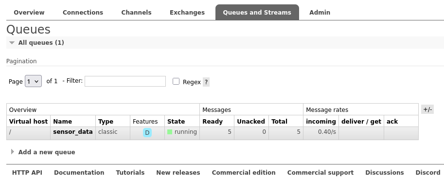
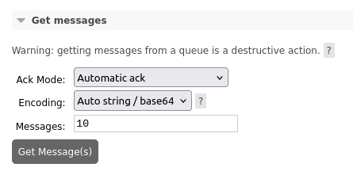

# Programar Sensores

Agora iremos programar os sensores para que eles enviem dados para o **RabbitMQ**.

Primeiro, vamos definir uma função que, a cada um segundo, captura a data atual, gera uma temperatura aleatória e devolve um *JSON*:

```python { .copy }
import json
import random
import time
from datetime import datetime

def gerar_dados_sensor():
    dados = {
        "data": datetime.now().isoformat(),
        "temperatura": random.uniform(20.0, 30.0)
    }
    return json.dumps(dados)

while True:
    dados = gerar_dados_sensor()
    print(dados)
    time.sleep(1)
```

!!! exercise
    Copie o código em um arquivo `sensor.py` e execute-o. Você verá que a cada segundo um novo *JSON* é impresso no terminal.


    <div class="termy">

    ```bash
    $ python sensor.py 
    {"data": "2025-08-11T23:16:59.428169", "temperatura": 23.8459438494851}
    {"data": "2025-08-11T23:17:00.428268", "temperatura": 24.943463028936346}
    {"data": "2025-08-11T23:17:01.429249", "temperatura": 20.52063245882019}
    {"data": "2025-08-11T23:17:02.430248", "temperatura": 29.410169922982647}
    ```

    </div>

## Executando o Sensor em um Contêiner Docker

Para executar o sensor em um contêiner Docker, crie um arquivo `Dockerfile` contendo:

```dockerfile { .copy }
FROM python:3.11-slim

WORKDIR /app

# Copiar o arquivo Python
COPY sensor.py .

# Definir variável de ambiente para saída não bufferizada
ENV PYTHONUNBUFFERED=1

# Executar o script
CMD ["python", "-u", "sensor.py"]
```

Depois, atualize o `docker-compose.yml` para incluir o serviço do sensor:

```yaml { .copy }
services:
  rabbitmq:
    image: rabbitmq:3-management
    container_name: rabbitmq-sensores
    restart: always
    ports:
      - 5672:5672
      - 15672:15672
    volumes:
      - ./rabbitmq:/var/lib/rabbitmq
    environment:
      - RABBITMQ_DEFAULT_USER=admin
      - RABBITMQ_DEFAULT_PASS=112233

  sensor:
    build: .
    container_name: sensor-python
    restart: always
    depends_on:
      - rabbitmq
```

Reinicialize os serviços:

<div class="termy">

    ```bash
    $ docker compose build
    $ docker compose up -d
    ```

</div>

E confira os logs com:

<div class="termy">

    ```bash
    $ docker logs sensor-python -f
    ```

</div>

!!! exercise
    Garanta que consegue ver as mensagens com temperatura no terminal do contêiner do sensor.

## Múltiplos sensores

Vamos atualizar o código do sensor para receber um `ID`:

??? "Código do sensor"
    ```python { .copy }
    import json
    import random
    import time
    import sys
    import os
    from datetime import datetime

    # Pega o ID do sensor da variável de ambiente ou usa 1 como padrão
    SENSOR_ID = int(os.getenv('SENSOR_ID', '1'))

    def gerar_dados_sensor():
        dados = {
            "id": SENSOR_ID,
            "data": datetime.now().isoformat(),
            "temperatura": random.uniform(20.0, 30.0) # Temperatura aleatória (Dummy)
        }
        return json.dumps(dados)

    while True:
        dados = gerar_dados_sensor()
        print(dados, flush=True)
        # O tempo de espera é baseado no ID do sensor (1 espera menos, 3 espera mais)
        time.sleep(SENSOR_ID)
    ```

E atualizar o `docker-compose.yml` para inicializar três sensores:

??? "Atualização do `docker-compose.yml`"
    ```yaml { .copy }
    services:
        rabbitmq:
            image: rabbitmq:3-management
            container_name: rabbitmq-sensores
            restart: always
            ports:
            - 5672:5672
            - 15672:15672
            volumes:
            - ./rabbitmq:/var/lib/rabbitmq
            environment:
            - RABBITMQ_DEFAULT_USER=admin
            - RABBITMQ_DEFAULT_PASS=112233

        sensor-1:
            build: .
            container_name: sensor-python-1
            restart: always
            environment:
            - SENSOR_ID=1
            depends_on:
            - rabbitmq

        sensor-2:
            build: .
            container_name: sensor-python-2
            restart: always
            environment:
            - SENSOR_ID=2
            depends_on:
            - rabbitmq

        sensor-3:
            build: .
            container_name: sensor-python-3
            restart: always
            environment:
            - SENSOR_ID=3
            depends_on:
            - rabbitmq
    ```

Reinicialize os serviços:

<div class="termy">

    ```bash
    $ docker compose build
    $ docker compose up -d
    ```

</div>

E confira os logs com:

<div class="termy">

    ```bash
    $ docker logs sensor-python-1
    $ docker logs sensor-python-2
    $ docker logs sensor-python-3
    ```

</div>

!!! exercise
    Garanta que consegue ver as mensagens com temperatura no terminal do contêiner do sensor.

    !!! note
        Você pode usar o comando `docker logs -f <container_name>` para seguir os logs em tempo real.

## Conectando tudo!

Agora, vamos fazer com que os dados dos sensores sejam enviados para o RabbitMQ.

!!! info "Fila"
    As mensagens com os dados dos sensores serão enviadas para a fila `sensor_data` no RabbitMQ.

    Lá, ficarão aguardando para serem processadas.

Primeiro, vamos atualizar o `Dockerfile`:

??? "Código do `Dockerfile`"
    ```dockerfile { .copy }
    FROM python:3.11-slim

    WORKDIR /app

    # Instalar dependências
    RUN pip install pika

    # Copiar arquivos necessários
    COPY sensor.py .
    COPY .env .

    # Definir variável de ambiente para saída não bufferizada
    ENV PYTHONUNBUFFERED=1

    # Executar o script
    CMD ["python", "-u", "sensor.py"]
    ```

Crie um arquivo para variáveis de ambiente.

??? "Código do arquivo `.env`"
    ```console { .copy }
    # Configurações do RabbitMQ
    RABBITMQ_HOST=rabbitmq
    RABBITMQ_PORT=5672
    RABBITMQ_USER=admin
    RABBITMQ_PASS=112233
    QUEUE_NAME=sensor_data
    ```

Atualize o código `sensor.py`.

??? "Código do arquivo `sensor.py`"
    ```python { .copy }
    import json
    import random
    import time
    import sys
    import os
    import pika
    from datetime import datetime

    # Pega o ID do sensor da variável de ambiente ou usa 1 como padrão
    SENSOR_ID = int(os.getenv('SENSOR_ID', '1'))

    # Configurações do RabbitMQ via variáveis de ambiente
    RABBITMQ_HOST = os.getenv('RABBITMQ_HOST', 'rabbitmq')
    RABBITMQ_PORT = int(os.getenv('RABBITMQ_PORT', '5672'))
    RABBITMQ_USER = os.getenv('RABBITMQ_USER', 'admin')
    RABBITMQ_PASS = os.getenv('RABBITMQ_PASS', '')
    QUEUE_NAME = os.getenv('QUEUE_NAME', '')

    def conectar_rabbitmq():
        """Estabelece conexão com RabbitMQ"""
        credentials = pika.PlainCredentials(RABBITMQ_USER, RABBITMQ_PASS)
        parameters = pika.ConnectionParameters(
            host=RABBITMQ_HOST,
            port=RABBITMQ_PORT,
            credentials=credentials
        )
        
        try:
            connection = pika.BlockingConnection(parameters)
            channel = connection.channel()
            
            # Declara a fila (cria se não existir)
            channel.queue_declare(queue=QUEUE_NAME, durable=True)
            
            return connection, channel
        except Exception as e:
            print(f"Erro ao conectar com RabbitMQ: {e}", flush=True)
            return None, None


    def wait_for_rabbitmq():
        """Aguarda RabbitMQ ficar disponível"""
        max_retries = 30
        retry_count = 0
        
        while retry_count < max_retries:
            try:
                connection, channel = conectar_rabbitmq()
                if connection is not None and channel is not None:
                    connection.close()
                    print("RabbitMQ está disponível!", flush=True)
                    return True
            except Exception as e:
                pass
            
            retry_count += 1
            print(f"Aguardando RabbitMQ... tentativa {retry_count}/{max_retries}", flush=True)
            time.sleep(2)
        
        print("RabbitMQ não ficou disponível após 60 segundos", flush=True)
        return False

    def gerar_dados_sensor():
        dados = {
            "id": SENSOR_ID,
            "data": datetime.now().isoformat(),
            "temperatura": random.uniform(20.0, 30.0) # Temperatura aleatória (Dummy)
        }
        return json.dumps(dados)

    def send_message(channel, dados):
        """Envia mensagem para RabbitMQ usando canal existente"""
        try:
            # Publica a mensagem na fila
            channel.basic_publish(
                exchange='',
                routing_key=QUEUE_NAME,
                body=dados,
                properties=pika.BasicProperties(
                    delivery_mode=2,  # Torna a mensagem persistente
                )
            )
            print(f"Mensagem enviada para RabbitMQ: {dados}", flush=True)
            
        except Exception as e:
            print(f"Erro ao enviar mensagem: {e}", flush=True)
            raise  # Re-lança a exceção para que o loop principal possa lidar com ela


    # Aguarda RabbitMQ ficar disponível antes de começar
    if not wait_for_rabbitmq():
        print("Encerrando: RabbitMQ não está disponível", flush=True)
        sys.exit(1)

    print(f"Sensor {SENSOR_ID} iniciado!", flush=True)

    # Cria conexão uma única vez no início
    connection, channel = conectar_rabbitmq()
    if connection is None or channel is None:
        print("Falha ao estabelecer conexão inicial com RabbitMQ", flush=True)
        sys.exit(1)

    try:
        while True:
            dados = gerar_dados_sensor()
            
            try:
                send_message(channel, dados)
            except Exception as e:
                # Se houver erro na conexão, tenta reconectar
                print(f"Erro na conexão, tentando reconectar: {e}", flush=True)
                try:
                    connection.close()
                except:
                    pass
                
                connection, channel = conectar_rabbitmq()
                if connection is None or channel is None:
                    print("Falha na reconexão. Tentando novamente no próximo ciclo.", flush=True)
                else:
                    # Tenta enviar a mensagem novamente com a nova conexão
                    try:
                        send_message(channel, dados)
                    except Exception as retry_error:
                        print(f"Falha ao reenviar mensagem: {retry_error}", flush=True)

            # O tempo de espera é baseado no ID do sensor (1 espera menos, 3 espera mais)
            time.sleep(SENSOR_ID)

    except KeyboardInterrupt:
        print(f"Sensor {SENSOR_ID} interrompido pelo usuário", flush=True)
    except Exception as e:
        print(f"Sensor {SENSOR_ID} teve erro: {e}", flush=True)
    finally:
        # Fecha a conexão ao final
        try:
            if connection and not connection.is_closed:
                connection.close()
                print("Conexão com RabbitMQ fechada", flush=True)
        except:
            pass
    ```

Também será necessário atualizar o `docker-compose.yml`:

??? "Código do arquivo `docker-compose.yml`"
    ```yaml { .copy }
    services:
        rabbitmq:
            image: rabbitmq:3-management
            container_name: rabbitmq-sensores
            restart: always
            ports:
            - 5672:5672
            - 15672:15672
            volumes:
            - ./rabbitmq:/var/lib/rabbitmq
            environment:
            - RABBITMQ_DEFAULT_USER=${RABBITMQ_USER}
            - RABBITMQ_DEFAULT_PASS=${RABBITMQ_PASS}
            env_file:
            - .env

        sensor-1:
            build: .
            container_name: sensor-python-1
            restart: always
            environment:
            - SENSOR_ID=1
            env_file:
            - .env
            depends_on:
            - rabbitmq

        sensor-2:
            build: .
            container_name: sensor-python-2
            restart: always
            environment:
            - SENSOR_ID=2
            env_file:
            - .env
            depends_on:
            - rabbitmq

        sensor-3:
            build: .
            container_name: sensor-python-3
            restart: always
            environment:
            - SENSOR_ID=3
            env_file:
            - .env
            depends_on:
            - rabbitmq
    ```

Reinicialize os serviços:

<div class="termy">

    ```bash
    $ docker compose build
    $ docker compose up -d
    ```

</div>

!!! exercise
    No painel do **RabbitMQ**, acesse a aba de filas (*Queues*) e confira se:

    - A fila foi criada
    - Está recebendo mensagens

    

!!! tip "Dica: consumir mensagens"
    Enquanto não implementamos um **consumidor** (*pipeline* de processamento), você pode clicar no nome da fila e acessar a opção **Get Messages** para consumir parte das mensagens.

    !!! danger
        Cuidado ao consumir mensagens diretamente do RabbitMQ, pois isso pode afetar o fluxo de dados da sua aplicação.

        **Automatic ack** irá fazer com que as mensagens obtidas sejam consideradas como **propriamente consumidas**! Se você estiver em um ambiente de produção, isto significa que as mensagens serão removidas da fila, mesmo que o processamento não tenha sido concluído com sucesso.

    
