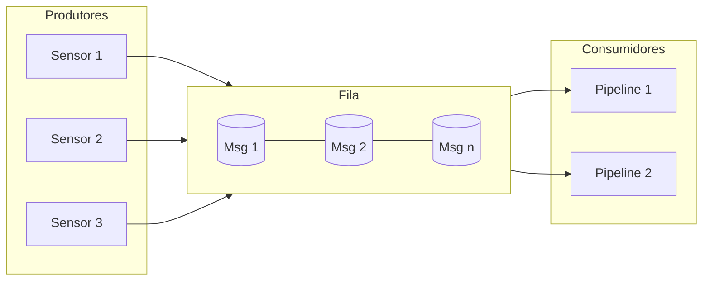
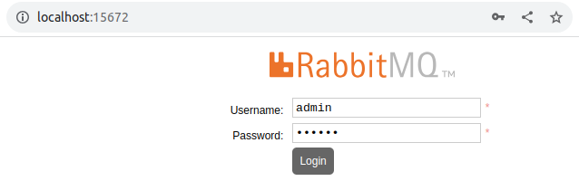

# RabbitMQ

O **RabbitMQ** é um sistema de mensageria de código aberto que implementa o padrão de fila de mensagens.

Ele permite que diferentes partes de uma aplicação se comuniquem de forma assíncrona pelo protocolo **AMQP**, enviando mensagens :material-information-outline:{title="No exemplo, as mensagens são os JSONs de temperatura"} entre **produtores** e **consumidores**.

!!! info
    No exemplo, as mensagens são os **JSONs** de temperatura



??? info "**AMQP**"
    O **AMQP** (**Advanced Message Queuing Protocol**) é um protocolo aberto e padronizado para comunicação entre sistemas por meio de mensagens, usado pelo **RabbitMQ**.
    
    Ele define como as mensagens são formatadas, roteadas, entregues e confirmadas, permitindo que aplicações escritas em **diferentes linguagens** e **rodando em diferentes plataformas** troquem dados de forma **confiável** e **desacoplada**.

O **RabbitMQ** é amplamente utilizado em arquiteturas de **microserviços**, onde a comunicação entre serviços pode ser feita de forma desacoplada e escalável.

## Iniciar o RabbitMQ

!!! success "Sucesso!"
    Para ter sucesso durante o curso, mantenha a organização!

    Crie um diretório para manter os arquivos da aula!

    <div class="termy">

    ```bash
    $ mkdir -p ~/aula02
    $ cd ~/aula02
    ```

    </div>

### Criar `docker-compose.yml`

Vamos iniciar um serviço **RabbitMQ** usando **Docker**.

Crie um arquivo `docker-compose.yml` com o seguinte conteúdo:

```yaml
services:
  rabbitmq:
    image: rabbitmq:3-management
    container_name: rabbitmq-sensores
    restart: always
    ports:
      - 5672:5672
      - 15672:15672
    volumes:
      - ./rabbitmq:/var/lib/rabbitmq
    environment:
      - RABBITMQ_DEFAULT_USER=admin
      - RABBITMQ_DEFAULT_PASS=112233
```

!!! warning
    É recomendável utilizar uma senha mais forte que `112233`

!!! exercise text long "Question"
    Explique o que significa esta seção do `docker-compose.yml`:

    ```yaml
    ports:
      - 5672:5672
      - 15672:15672
    ```

    !!! answer "Resposta!"
        A seção *ports* mapeia as portas do *container* (interna) para as portas do *host* (externa, sua máquina):

        - `5672:5672`: Isso mapeia a porta `5672` do container RabbitMQ para a porta `5672` na máquina host. A porta `5672` é a porta padrão para **AMQP** (*Advanced Message Queuing Protocol*), que é usada para mensageria pelo RabbitMQ.

        - `15672:15672`: Isso mapeia a porta `15672` do container RabbitMQ para a porta `15672` na máquina host. A porta `15672` é a porta padrão para o **RabbitMQ Management Plugin**, que fornece uma interface web para gerenciar o RabbitMQ.

        !!! tip "Dica"
            Caso ocorra um conflito de porta (outros serviços que possam estar usando a mesma porta), você pode alterar a porta do host (a primeira) para um número diferente, como `15673:15672`.

### Inicie o RabbitMQ

Para iniciar o RabbitMQ, execute o seguinte comando no terminal:


<div class="termy">

    ```bash
    $ docker compose up -d
    ```

</div>

Isso iniciará o RabbitMQ em segundo plano. Você pode verificar se o RabbitMQ está em execução acessando a interface de gerenciamento em [http://localhost:15672](http://localhost:15672) com o usuário e senha definidos no `docker-compose.yml`.

Para conferir se o RabbitMQ está em execução, você pode usar o seguinte comando:

<div class="termy">

    ```bash
    $ docker compose ps
    ```

</div>

E para acompanhar os logs:

<div class="termy">

    ```bash
    $ docker compose logs -f
    ```

</div>

??? tip "Uma outra forma"
    Você pode usar o comando `docker logs` para visualizar os logs do container diretamente:

    <div class="termy">

    ```bash
    $ docker logs -f rabbitmq-sensores
    ```

    </div>

    O mesmo para `docker ps`:

    <div class="termy">

    ```bash
    $ docker ps
    ```

    </div>

## Painel RabbitMQ

Acesse a interface de gerenciamento do RabbitMQ em [http://localhost:15672](http://localhost:15672) com o usuário e senha definidos no `docker-compose.yml`.

!!! bug "Problema"
    Caso você não consiga acessar a interface web, verifique se o container do RabbitMQ está em execução e se as portas estão corretamente mapeadas.



