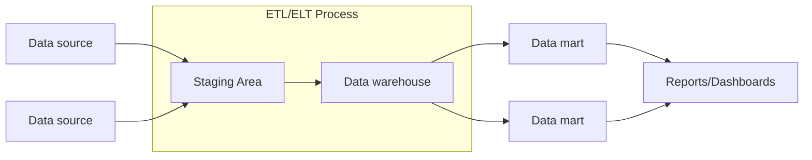

# Data Warehousing

O **Data Warehousing** é uma abordagem para a **coleta**, **armazenamento** e **análise** de grandes volumes de dados provenientes de diversas fontes. O objetivo principal de um **Data Warehouse** é fornecer uma visão unificada e consistente dos dados, facilitando a tomada de decisões estratégicas nas organizações.

## Características de um Data Warehouse

Um Data Warehouse possui características específicas que o diferenciam de sistemas transacionais:

- **Subject-Oriented (Orientado por Assunto)**: Os dados são organizados por temas ou assuntos de negócio (vendas, marketing, finanças) ao invés de por aplicações.

- **Integrated (Integrado)**: Dados de diferentes fontes são padronizados e consolidados em um formato consistente.

- **Time-Variant (Variável no Tempo)**: Mantém histórico de dados, permitindo análises temporais e identificação de tendências.

- **Non-Volatile (Não Volátil)**: Uma vez carregados, os dados não são alterados, garantindo consistência nas análises.

## Arquitetura Típica de Data Warehouse

A arquitetura de um **Data Warehouse** segue uma estrutura bem definida que permite a transformação eficiente de dados brutos em informações analíticas.

Esta arquitetura reflete diretamente o [ciclo de vida da engenharia de dados](../01-intro/profissionais.md#ciclo-de-vida-da-engenharia-de-dados) que vimos anteriormente: **ingestão**, **transformação** e **disponibilização** dos dados.

### Componentes da Arquitetura

1. **Fontes de Dados**: Sistemas OLTP, APIs, arquivos CSV, logs de aplicações, sensores IoT
2. **ETL/ELT**: Processos de extração, transformação e carga dos dados
3. **Staging Area**: Área temporária onde dados são processados e validados
4. **Data Warehouse**: Repositório central consolidado e otimizado para análises
5. **Data Marts**: Subconjuntos especializados por departamento ou área de negócio
6. **Camada de Apresentação**: Dashboards, relatórios e ferramentas de Business Intelligence

### ETL vs ELT

No contexto do ciclo de vida da engenharia de dados, tanto **ETL** quanto **ELT** são abordagens para implementar as etapas de **ingestão** e **transformação**. A escolha entre elas depende dos recursos disponíveis e das necessidades específicas do projeto.

#### ETL (Extract, Transform, Load)

O **ETL** é a abordagem tradicional onde os dados são transformados **antes** de serem carregados no destino.

- **Processo**: Dados são extraídos da fonte, transformados em um sistema intermediário, e depois carregados
- **Vantagem**: Dados chegam ao destino já limpos e estruturados
- **Limitação**: Requer mais recursos computacionais no sistema de processamento intermediário
- **Quando usar**: Ideal para dados que precisam de limpeza pesada ou quando o sistema de destino tem recursos limitados

#### ELT (Extract, Load, Transform)

O **ELT** é uma abordagem mais moderna onde os dados são carregados **antes** de serem transformados.

- **Processo**: Dados são extraídos da fonte, carregados diretamente no destino, e transformados lá
- **Vantagem**: Aproveita o poder computacional do sistema de destino (ex: cloud data warehouses)
- **Limitação**: Requer um sistema de destino com capacidade de processamento robusta
- **Quando usar**: Ideal com sistemas cloud modernos que têm grande capacidade de processamento

!!! example "Benefícios do Data Warehouse"
    - **Centralização**: Uma única fonte da verdade para toda a organização
    - **Performance**: Otimizado para consultas analíticas complexas
    - **Histórico**: Capacidade de análise temporal e identificação de tendências
    - **Qualidade**: Dados limpos, padronizados e validados
    - **Segurança**: Controle centralizado de acesso e auditoria

!!! info "Resumo"
    O **Data Warehouse** é um repositório centralizado que coleta e integra dados de diversas fontes de dados menores, que podem ser bancos de dados operacionais (como sistemas de vendas, RH ou finanças), arquivos de texto, planilhas, etc.

    Enquanto os bancos de dados operacionais são otimizados para operações diárias e em tempo real (como registrar uma venda, por exemplo), o Data Warehouse é projetado para **análise** e tomada de decisão.

## Voltando ao Problema Inicial

Agora conseguimos entender por que a proposta inicial do analista era problemática. A solução adequada seria:

1. **Manter o PostgreSQL** para operações **OLTP** (vendas)
2. **Criar um pipeline ETL** para extrair dados do PostgreSQL
3. **Implementar um Data Warehouse** otimizado para análises (**OLAP**)
4. **Conectar o Dashboard** ao **Data Warehouse**, não ao sistema transacional

!!! exercise choice "Arquitetura de Data Warehouse"
    Uma empresa possui dados de vendas no **PostgreSQL**, dados de marketing no **MySQL** e dados de atendimento em arquivos CSV. Para criar um Dashboard unificado, qual seria a abordagem mais adequada?

    - [ ] Conectar o Dashboard diretamente em cada fonte de dados
    - [ ] Migrar todos os dados para um único PostgreSQL (todos passam a utilizar apenas esse banco)
    - [X] Criar um Data Warehouse que integre dados de todas as fontes via ETL
    - [ ] Usar apenas os dados do PostgreSQL por ser o mais completo

    !!! answer "Resposta"
        A abordagem mais adequada é criar um **Data Warehouse** que integre dados de todas as fontes via ETL. Isso permite ter uma visão unificada e consistente, otimizada para análises, **sem impactar os sistemas operacionais**.
        
        As outras opções apresentam limitações de performance, integração ou completude dos dados.

!!! exercise text long
    Descreva as principais diferenças entre usar um sistema OLTP diretamente para análises versus implementar um Data Warehouse dedicado.

    !!! answer "Resposta"
        **Sistema OLTP diretamente:**

        - **Performance**: Consultas analíticas podem impactar operações transacionais
        - **Estrutura**: Dados normalizados dificultam consultas complexas com muitos JOINs
        - **Integração**: Dificuldade para combinar dados de múltiplas fontes
        - **Histórico**: Limitado, pois dados antigos são frequentemente arquivados ou deletados
        - **Segurança**: Risco de expor dados operacionais sensíveis

        **Data Warehouse dedicado:**

        - **Performance**: Otimizado para consultas analíticas sem impactar operações
        - **Estrutura**: Dados desnormalizados facilitam análises complexas
        - **Integração**: Consolida dados de múltiplas fontes em formato consistente
        - **Histórico**: Mantém dados históricos por longos períodos para análise temporal
        - **Segurança**: Ambiente controlado e auditado, separado dos sistemas operacionais
        - **Qualidade**: Dados limpos, validados e padronizados através do processo ETL

!!! info "Controle da fonte de dados"
    O Engenheiro de dados geralmente não tem controle sobre a fonte de dados.

    Suponha que um sistema da empresa utiliza **MySQL** ou **Oracle** como **SGBD-R** (*Sistema de Gerenciamento de Banco de Dados Relacional*). Se este sistema é fonte importante de dados para um *Dashboard* que será disponibilizado para o time de vendas, é sua tarefa, como engenheiro, trabalhar com estas tecnologias e criar rotinas adequadas para **ingestão**, **transformação** e **disponibilização** dos dados.

## Ponto importante

O papel do engenheiro de dados vai muito além das **habilidades técnicas**. Você precisará interagir com diferentes equipes, entender as necessidades de negócios e garantir que os dados estejam alinhados com os objetivos da organização.

!!! tip "Dica"
    A **comunicação eficaz** e a **colaboração** são essenciais para o sucesso na implementação de soluções de dados.

## Referências

- FDE. Reis, J., Housley, M. (2022). Fundamentals of Data Engineering: Plan and Build Robust Data Systems. Estados Unidos: O'Reilly Media.
- DDIA, Cap 3. Kleppmann, M. (2017). Designing Data-Intensive Applications: The Big Ideas Behind Reliable, Scalable, and Maintainable Systems. Estados Unidos: O'Reilly Media.