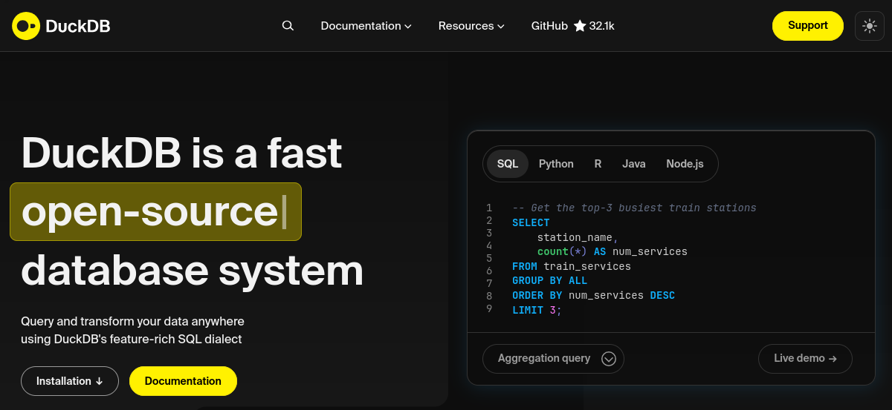

# DuckDB



O **DuckDB** é um sistema de gerenciamento de banco de dados (**SGBD**) analítico (*OLAP*) projetado para análise de dados. É conhecido por sua velocidade, facilidade de uso e capacidade de processar diretamente arquivos em formato como **Parquet**, **CSV** e **JSON**.

!!! info
    O **DuckDB** é otimizado para consultas analíticas.
    
    Oferece execução columnar e processamento vetorizado para alta performance.

## Características principais

- **In-process**: Roda como uma biblioteca embarcada, sem necessidade de servidor separado
- **ACID compliant**: Garante consistência transacional
- **SQL padrão**: Suporte completo ao SQL com extensões para análise
- **Formatos diversos**: Lê diretamente Parquet, CSV, JSON e outros formatos
- **Zero-copy**: Acessa dados sem necessidade de importação prévia
- **Parallel processing**: Execução paralela automática de consultas

## Preparando o ambiente

Vamos configurar um ambiente Python para trabalhar com **DuckDB** e os dados do **warm up** da primeira aula.

!!! exercise
    Crie um ambiente virtual Python para o projeto:

    !!! tip "Dica"
        Utilize `venv`, `conda` ou `uv` conforme sua preferência!

    <div class="termy">

    ```bash
    $ uv venv --python 3.12 venv-duckdb
    ```

    </div>

!!! exercise
    Ative o ambiente virtual:

    === "Linux/macOS"

        <div class="termy">

        ```bash
        $ source venv-duckdb/bin/activate
        ```

        </div>

    === "Windows"

        <div class="termy">

        ```bash
        $ venv-duckdb\Scripts\activate
        ```

        </div>

!!! exercise
    Instale as dependências necessárias:

    ??? "`requirements.txt`:"

        ```text  { .copy }
        duckdb==1.3.2
        pytz==2025.2
        pyarrow==21.0.0
        pandas==2.3.1
        ```

    <div class="termy">

    ```bash
    $ uv pip install -r requirements.txt
    ```

    </div>

## Obtendo os dados

Vamos utilizar os dados do **S3** da aula de [*warm up*](../01-intro/warmup.md) para praticar com o **DuckDB**.

!!! exercise
    Caso ainda não tenha feito, configure as credenciais AWS conforme instruções da [aula de warm up](../01-intro/warmup.md#aws-cli-command-line-interface):

    <div class="termy">

    ```bash
    $ aws configure --profile dataeng
    ```

    </div>

!!! exercise
    Defina o perfil AWS:

    === "Linux/macOS"

        <div class="termy">

        ```bash
        $ export AWS_PROFILE=dataeng
        ```

        </div>

    === "Windows CMD"

        <div class="termy">

        ```bash
        $ set AWS_PROFILE=dataeng
        ```

        </div>

    === "Windows PowerShell"

        <div class="termy">

        ```bash
        $ $env:AWS_PROFILE="dataeng"
        ```

        </div>

!!! exercise
    Crie um diretório para os dados e baixe os arquivos do S3:

    !!! tip "Dica"
        O comando abaixo irá ignorar o *download* do arquivo `status.csv` pois ele tem quase **2GB**!

    <div class="termy">

    ```bash
    $ mkdir dados
    $ aws s3 cp s3://dataeng-warmup/data_raw/ dados/ --recursive --exclude="status.csv" --profile dataeng-warmup
    ```

    </div>

    !!! tip "Arquivo grande!"
        Caso também queira baixar o arquivo `status.csv`, você pode remover a opção `--exclude`:

        <div class="termy">

        ```bash
        $ mkdir dados
        $ aws s3 cp s3://dataeng-warmup/data_raw/ dados/ --recursive --profile dataeng-warmup
        ```

        </div>

!!! exercise
    Verifique os arquivos baixados:

    <div class="termy">

    ```bash
    $ ls -la dados/
    ```

    </div>

    Você deve ver arquivos como `station.csv`, `status.csv`, `trip.csv` e `weather.csv`.

## Primeiros passos com DuckDB

### Interface Python

Apesar do **DuckDB** ter API compatível com diversas linguagens (C, Go, Rust, R, etc.), vamos trabalhar principalmente através da interface Python do **DuckDB**.

!!! exercise
    Crie uma pasta `src` para manter seus scripts organizados:

    <div class="termy">

    ```bash
    $ mkdir src
    ```

    </div>

!!! attention "Atenção!"
    Para os códigos experimentais na sequência, você pode tanto criar um **jupyter notebook** ou utilizar arquivos `.py`, conforme sua preferência.

!!! exercise
    Crie um arquivo `duckdb_inicio.py` com o seguinte conteúdo:

    ```python { .copy }
    import duckdb
    import pandas as pd

    # Conecta ao DuckDB (em memória)
    conn = duckdb.connect()

    # Executa uma query simples
    result = conn.execute("SELECT 'Hello DuckDB!' as mensagem").fetchall()
    print(result)

    # Executa query que retorna a data e hora atual
    result = conn.execute("SELECT NOW() as agora").fetchall()
    print(result)

    conn.close()
    ```

!!! tip "Dica"
    A estrutura do diretório será:

    ```bash
    ./
    ├── dados
    │   ├── station.csv
    │   ├── status.csv
    │   ├── trip.csv
    │   └── weather.csv
    ├── requirements.txt
    └── src
        ├── codigos-duckdb.ipynb # Caso tenha criado
        └── duck_inicio.py

    ```

!!! exercise
    Execute o script:

    <div class="termy">

    ```bash
    $ python duckdb_inicio.py
    ```

    </div>

## Lendo dados diretamente

Uma das grandes vantagens do **DuckDB** é a capacidade de ler dados diretamente de arquivos, sem necessidade de importação prévia.

### Lendo arquivos CSV

!!! exercise
    Crie um script `src/ler_csv.py` para explorar os dados das estações:

    ```python { .copy }
    import duckdb

    conn = duckdb.connect()

    # Lê diretamente o arquivo CSV
    query = """
    SELECT * 
    FROM '../dados/station.csv' 
    LIMIT 5
    """

    result = conn.execute(query).fetchdf()
    print("Primeiras 5 linhas das estações:")
    print(result)
    print(f"\nTotal de linhas: {len(result)}")

    conn.close()
    ```

!!! exercise
    Execute e analise o resultado:

    <div class="termy">

    ```bash
    $ python ler_csv.py
    ```

    </div>

!!! exercise
    Utilizando o script anterior como referência, crie um arquivo `src/total_viagens.py` que retorna a quantidade total de viagens realizadas.

    !!! answer "Resposta"
        ```python
        import duckdb

        conn = duckdb.connect()

        query = """
        SELECT COUNT(*) AS qtde_viagens
        FROM '../dados/trip.csv'
        """

        result = conn.execute(query).fetchdf()
        print("Quantidade total de viagens:")
        print(result)

        conn.close()
        ```

### Consultas analíticas

!!! exercise
    Crie um script `src/analise_viagens.py` para realizar consultas analíticas:

    ```python { .copy }
    import duckdb

    conn = duckdb.connect()

    # Top 10 estações de origem mais utilizadas
    query_top_estacoes = """
    SELECT 
        start_station_name,
        COUNT(*) as total_viagens
    FROM '../dados/trip.csv'
    GROUP BY start_station_name
    ORDER BY total_viagens DESC
    LIMIT 10
    """

    print("Top 10 estações de origem:")
    result = conn.execute(query_top_estacoes).fetchdf()
    print(result)

    # Duração média das viagens por dia da semana
    query_duracao = """
    SELECT 
        DAYNAME(strptime(start_date, '%m/%d/%Y %H:%M')) as dia_semana,
        AVG(duration) as duracao_media_segundos,
        AVG(duration)/60 as duracao_media_minutos
    FROM '../dados/trip.csv'
    GROUP BY DAYNAME(strptime(start_date, '%m/%d/%Y %H:%M'))
    ORDER BY duracao_media_segundos DESC
    """

    print("\n\nDuração média por dia da semana:")
    result = conn.execute(query_duracao).fetchdf()
    print(result) # Exiba DF sem print se estiver utilizando jupyter notebooks

    conn.close()

    result
    ```

!!! exercise
    Execute a análise:

    <div class="termy">

    ```bash
    $ python analise_viagens.py
    ```

    </div>

## Criando tabelas e databases

### Database persistente

!!! exercise
    Crie um script `src/criar_database.py` para trabalhar com um database persistente:

    ```python { .copy }
    import duckdb
    import os

    # Remove database existente se houver
    if os.path.exists('bike_share.db'):
        os.remove('bike_share.db')

    # Conecta a um database persistente
    conn = duckdb.connect('bike_share.db')

    print("Database criado: bike_share.db")
    print("Tabelas disponíveis:", conn.execute("SHOW TABLES").fetchall())

    conn.close()
    ```

!!! exercise
    Execute o script:

    <div class="termy">

    ```bash
    $ python criar_database.py
    ```

    </div>

### Criando tabelas a partir de arquivos

!!! exercise
    Crie um script `src/importar_dados.py` para criar tabelas no database:

    ```python { .copy }
    import duckdb 

    # Conecta ao database persistente
    conn = duckdb.connect('bike_share.db')

    # Cria tabela de estações
    conn.execute("""
        CREATE TABLE station AS 
        SELECT * FROM '../dados/station.csv'
    """)

    # Cria tabela de viagens (pode ser grande, então vamos limitar)
    conn.execute("""
        CREATE TABLE trip AS 
        SELECT * FROM '../dados/trip.csv'
        LIMIT 100000
    """)

    # Cria tabela de clima
    conn.execute("""
        CREATE TABLE weather AS 
        SELECT * FROM '../dados/weather.csv'
    """)

    # Verifica as tabelas criadas
    print("Tabelas no database:")
    tabelas = conn.execute("SHOW TABLES").fetchall()
    for tabela in tabelas:
        print(f"- {tabela[0]}")
        
        # Conta registros
        count = conn.execute(f"SELECT COUNT(*) FROM {tabela[0]}").fetchone()[0]
        print(f"  Registros: {count:,}")

    # Exemplo de consulta usando as tabelas
    print("\nTop 5 estações por número de viagens:")
    result = conn.execute("""
        SELECT 
            e.name as estacao,
            COUNT(t.id) as total_viagens
        FROM trip t
        JOIN station e ON t.start_station_name = e.name
        GROUP BY e.name
        ORDER BY total_viagens DESC
        LIMIT 5
    """).fetchdf()
    print(result)

    conn.close()
    ```

!!! exercise
    Execute o script:

    <div class="termy">

    ```bash
    $ python importar_dados.py
    ```

    </div>

!!! info
    Vantagem de criar tabelas no DuckDB em vez de ler arquivos diretamente a cada consulta:

    **Vantagens de criar tabelas:**

    - **Performance**: Dados ficam otimizados internamente
    - **Índices**: Podem ser criados para acelerar consultas
    - **Joins**: Mais eficientes entre tabelas do mesmo database
    - **Persistência**: Dados ficam disponíveis entre sessões
    
    **Vantagens de ler diretamente:**

    - **Flexibilidade**: Dados sempre atualizados no arquivo fonte
    - **Espaço**: Não duplica armazenamento
    - **Simplicidade**: Útil para protótipos e análises rápidas

## Trabalhando com Parquet

Conforme conversamos na [primeira aula](../01-intro/processar.md), o **Parquet** é um formato columnar altamente eficiente, especialmente adequado para análises com **DuckDB**.

### Exportando para Parquet

!!! exercise
    Crie um script `src/exportar_parquet.py`:

    ```python { .copy }
    import duckdb
    import os

    conn = duckdb.connect('bike_share.db')

    # Cria diretório para parquets
    os.makedirs('../dados/parquets', exist_ok=True)

    # Exporta tabelas para Parquet
    tabelas = ['station', 'trip', 'weather']

    for tabela in tabelas:
        print(f"Exportando {tabela}...")
        conn.execute(f"""
            COPY {tabela} TO '../dados/parquets/{tabela}.parquet' (FORMAT PARQUET)
        """)
        print(f"- {tabela}.parquet criado")

    # Verifica tamanhos dos arquivos
    print("\nTamanhos dos arquivos:")
    for tabela in tabelas:
        size = os.path.getsize(f'../dados/parquets/{tabela}.parquet')
        print(f"- {tabela}.parquet: {size:,} bytes ({size/1024/1024:.2f} MB)")

    conn.close()
    ```

!!! exercise
    Execute o export:

    <div class="termy">

    ```bash
    $ python exportar_parquet.py
    ```

    </div>

### Lendo arquivos Parquet

!!! exercise
    Crie um script `src/ler_parquet.py`:

    ```python { .copy }
    import duckdb

    conn = duckdb.connect()

    # Lê diretamente do Parquet
    print("Informações das estações (de Parquet):")
    result = conn.execute("""
        SELECT 
            COUNT(*) as total_estacoes,
            COUNT(DISTINCT city) as cidades
        FROM '../dados/parquets/station.parquet'
    """).fetchone()

    print(f"Total de estações: {result[0]}")
    print(f"Número de cidades: {result[1]}")

    # Análise complexa combinando múltiplos Parquets
    print("\nAnálise de viagens por cidade:")
    result = conn.execute("""
        SELECT 
            s.city,
            COUNT(t.id) as viagens,
            AVG(t.duration/60.0) as duracao_media_min
        FROM '../dados/parquets/trip.parquet' t
        JOIN '../dados/parquets/station.parquet' s
            ON t.start_station_name = s.name
        GROUP BY s.city
        ORDER BY viagens DESC
    """).fetchdf()

    print(result)

    conn.close()
    ```

!!! exercise
    Execute a análise:

    <div class="termy">

    ```bash
    $ python ler_parquet.py
    ```

    </div>

### Performance: CSV vs Parquet

!!! exercise
    Crie um script `src/benchmark.py` para comparar performance:

    ```python { .copy }
    import duckdb
    import time

    conn = duckdb.connect()

    # Consulta complexa para benchmark
    query_csv = """
        SELECT 
            start_station_name,
            COUNT(*) as viagens,
            AVG(duration) as duracao_media
        FROM '../dados/trip.csv'
        GROUP BY start_station_name
        HAVING COUNT(*) > 100
        ORDER BY viagens DESC
    """

    query_parquet = """
        SELECT 
            start_station_name,
            COUNT(*) as viagens,
            AVG(duration) as duracao_media
        FROM '../dados/parquets/trip.parquet'
        GROUP BY start_station_name
        HAVING COUNT(*) > 100
        ORDER BY viagens DESC
    """

    # Teste CSV
    print("Executando consulta em CSV...")
    start = time.time()
    result_csv = conn.execute(query_csv).fetchall()
    time_csv = time.time() - start
    print(f"CSV: {time_csv:.2f} segundos")

    # Teste Parquet
    print("Executando consulta em Parquet...")
    start = time.time()
    result_parquet = conn.execute(query_parquet).fetchall()
    time_parquet = time.time() - start
    print(f"Parquet: {time_parquet:.2f} segundos")

    speedup = time_csv / time_parquet
    print(f"\nParquet é {speedup:.1f}x mais rápido que CSV")

    conn.close()
    ```

!!! exercise
    Execute o benchmark:

    <div class="termy">

    ```bash
    $ python benchmark.py
    ```

    </div>

    !!! info
        Repita a execução do script múltiplas vezes para verificar se os resultados são consistentes!

!!! exercise text long
    Por que o Parquet é geralmente mais rápido que CSV para consultas analíticas?

    !!! answer "Resposta"
        O **Parquet** é mais eficiente porque:

        - **Formato columnar**: Lê apenas as colunas necessárias para a consulta
        - **Compressão**: Dados similares ficam juntos, comprimindo melhor
        - **Metadados**: Estatísticas permitem pular blocos irrelevantes
        - **Encoding**: Otimizações específicas por tipo de dado

<!-- alterar plugin para suportar múltiplas respostas corretas -->
<!-- !!! exercise choice "Performance"
    Por que o Parquet é geralmente mais rápido que CSV para consultas analíticas?

    - [X] Formato columnar permite ler apenas colunas necessárias
    - [ ] Arquivos Parquet são sempre menores
    - [X] Melhor compressão de dados
    - [X] Metadados permitem skip de blocos desnecessários
    - [ ] Parsing de texto é mais rápido

    !!! answer "Resposta"
        O **Parquet** é mais eficiente porque:
        - **Formato columnar**: Lê apenas as colunas necessárias para a consulta
        - **Compressão**: Dados similares ficam juntos, comprimindo melhor
        - **Metadados**: Estatísticas permitem pular blocos irrelevantes
        - **Encoding**: Otimizações específicas por tipo de dado -->

## Análises avançadas

### Window Functions

!!! exercise
    Crie um script `src/analise_avancada.py`. Neste exemplo, utilizaremos *window functions*:

    !!! tip "Funções de janela"
        As funções de janela permitem realizar cálculos em um conjunto de linhas relacionadas, **sem agrupar os resultados**.
        
        Isso é útil para análises que requerem informações sobre a "janela" de dados ao redor da linha atual.

    ```python { .copy }
    import duckdb

    conn = duckdb.connect()

    # Ranking de estações por viagens
    print("Top estações com ranking:")
    result = conn.execute("""
        SELECT 
            start_station_name,
            COUNT(*) as viagens,
            RANK() OVER (ORDER BY COUNT(*) DESC) as ranking,
            PERCENT_RANK() OVER (ORDER BY COUNT(*)) as percentil
        FROM '../dados/parquets/trip.parquet'
        GROUP BY start_station_name
        ORDER BY viagens DESC
        LIMIT 10
    """).fetchdf()
    print(result)

    # Análise temporal com moving average
    print("\n\nViagens por hora com média móvel:")
    result = conn.execute("""
        SELECT 
            HOUR(strptime(start_date, '%m/%d/%Y %H:%M')) as hora,
            COUNT(*) as viagens,
            AVG(COUNT(*)) OVER (
                ORDER BY HOUR(strptime(start_date, '%m/%d/%Y %H:%M'))
                ROWS BETWEEN 2 PRECEDING AND 2 FOLLOWING
            ) as media_movel_5h
        FROM '../dados/parquets/trip.parquet'
        WHERE start_date IS NOT NULL
        GROUP BY HOUR(strptime(start_date, '%m/%d/%Y %H:%M'))
        ORDER BY hora
    """).fetchdf()
    print(result)

    conn.close()
    ```

!!! exercise
    Execute as análises avançadas:

    <div class="termy">

    ```bash
    $ python analise_avancada.py
    ```

    </div>

## Integração com Pandas

O **DuckDB** integra perfeitamente com **Pandas**, permitindo usar *DataFrames* como tabelas.

!!! exercise
    Crie um script `integracao_pandas.py`:

    ```python { .copy }
    import duckdb
    import pandas as pd

    conn = duckdb.connect()

    # Carrega dados em DataFrame
    df_viagens = pd.read_parquet('../dados/parquets/trip.parquet')
    print(f"DataFrame carregado: {len(df_viagens):,} registros")

    # Usa DataFrame diretamente em query SQL
    result = conn.execute("""
        SELECT 
            subscription_type,
            COUNT(*) as total,
            AVG(duration) as duracao_media
        FROM df_viagens
        GROUP BY subscription_type
    """).fetchdf()

    print("\nAnálise por tipo de assinatura:")
    print(result)

    # Cria novo DataFrame com resultado de SQL
    df_resultado = conn.execute("""
        SELECT 
            start_station_name,
            COUNT(*) as viagens,
            AVG(duration) as duracao_media
        FROM df_viagens
        GROUP BY start_station_name
        HAVING COUNT(*) > 1000
        ORDER BY viagens DESC
    """).df()

    # Usa métodos do Pandas no resultado
    print(f"\nEstatísticas das estações principais:")
    print(f"Média de viagens: {df_resultado['viagens'].mean():.0f}")
    print(f"Mediana de viagens: {df_resultado['viagens'].median():.0f}")
    print(f"Desvio padrão: {df_resultado['viagens'].std():.0f}")

    conn.close()
    ```

!!! exercise
    Execute a integração:

    <div class="termy">

    ```bash
    $ python integracao_pandas.py
    ```

    </div>

## Casos de uso práticos

### ETL com DuckDB

O **DuckDB** é excelente para processos **ETL** (*Extract, Transform, Load*).

!!! exercise
    Crie um script `etl_exemplo.py`:

    ```python { .copy }
    import duckdb
    import os

    conn = duckdb.connect()

    # EXTRACT: Lê dados de múltiplas fontes
    print("=== EXTRACT ===")
    print("Lendo dados de CSV e Parquet...")

    # TRANSFORM: Limpa e processa dados
    print("\n=== TRANSFORM ===")
    query_transform = """
        CREATE TEMP TABLE viagens_limpas AS
        SELECT 
            id,
            strptime(start_date, '%m/%d/%Y %H:%M') as start_date,
            strptime(end_date, '%m/%d/%Y %H:%M') as end_date,
            duration,
            start_station_name,
            end_station_name,
            bike_id,
            subscription_type,
            -- Calcula duração em horas
            duration / 3600.0 as duration_hours,
            -- Categoriza duração
            CASE 
                WHEN duration <= 600 THEN 'Curta'
                WHEN duration <= 1800 THEN 'Média'
                ELSE 'Longa'
            END as categoria_duracao,
            -- Extrai informações temporais
            DAYNAME(strptime(start_date, '%m/%d/%Y %H:%M')) as dia_semana,
            HOUR(strptime(start_date, '%m/%d/%Y %H:%M')) as hora_inicio
        FROM '../dados/trip.csv'
        WHERE 
            duration > 60  -- Remove viagens muito curtas
            AND duration < 86400  -- Remove viagens muito longas (>24h)
            AND start_station_name IS NOT NULL
            AND end_station_name IS NOT NULL
    """

    conn.execute(query_transform)
    print("✓ Dados transformados e limpos")

    # Verifica qualidade dos dados
    stats = conn.execute("""
        SELECT 
            COUNT(*) as total_registros,
            COUNT(DISTINCT start_station_name) as estacoes_origem,
            MIN(duration_hours) as min_duracao_h,
            MAX(duration_hours) as max_duracao_h,
            AVG(duration_hours) as avg_duracao_h
        FROM viagens_limpas
    """).fetchone()

    print(f"Total de registros limpos: {stats[0]:,}")
    print(f"Estações de origem: {stats[1]}")
    print(f"Duração: {stats[2]:.2f}h - {stats[3]:.2f}h (média: {stats[4]:.2f}h)")

    # LOAD: Salva resultado processado
    print("\n=== LOAD ===")
    os.makedirs('../dados/output', exist_ok=True)

    # Salva dados limpos em Parquet
    conn.execute("""
        COPY viagens_limpas 
        TO '../dados/output/viagens_processadas.parquet' 
        (FORMAT PARQUET)
    """)

    # Cria resumo para análise
    conn.execute("""
        COPY (
            SELECT 
                dia_semana,
                hora_inicio,
                categoria_duracao,
                COUNT(*) as viagens,
                AVG(duration_hours) as duracao_media_h
            FROM viagens_limpas
            GROUP BY ALL
            ORDER BY dia_semana, hora_inicio
        ) TO '../dados/output/resumo_viagens.csv' (HEADER)
    """)

    print("✓ Dados salvos em:")
    print("  - ../dados/output/viagens_processadas.parquet")
    print("  - ../dados/output/resumo_viagens.csv")

    conn.close()
    ```

!!! exercise
    Execute o ETL:

    <div class="termy">

    ```bash
    $ python etl_exemplo.py
    ```

    </div>

!!! exercise
    Verifique os arquivos gerados:

    <div class="termy">

    ```bash
    $ ls -la output/
    $ head output/resumo_viagens.csv
    ```

    </div>

## Exercícios finais

!!! exercise text long
    Compare o **DuckDB** com o **PostgreSQL** em relação aos casos de uso. Quando você usaria cada um?

    !!! answer "Resposta"
        **DuckDB** é melhor para:

        - Análise exploratória de dados
        - ETL/ELT em arquivos (Parquet, CSV)
        - Prototipagem rápida
        - Análises científicas
        - Integração com notebooks/Python
        
        **PostgreSQL** é melhor para:

        - Aplicações transacionais (OLTP)
        - Sistemas multi-usuário
        - Requer ACID rigoroso
        - Integração com aplicações web
        - Dados que mudam frequentemente

!!! exercise
    Considere os dados que estamos utilizando nesta aual e crie uma análise que:

    1. Identifique padrões de uso por hora do dia
    2. Calcule a taxa de ocupação das estações
    3. Encontre rotas mais populares
    4. Exporte os resultados em múltiplos formatos (CSV, Parquet, JSON)

!!! exercise
    Experimente conectar o **DuckDB** com dados remotos.

    Faça com que o **DuckDB** leia dados diretamente do *bucket* da [aula 01 - warm up](../01-intro/warmup.md).

!!! tip "Documentação"
    - [Documentação oficial](https://duckdb.org/docs/) do **DuckDB**!

