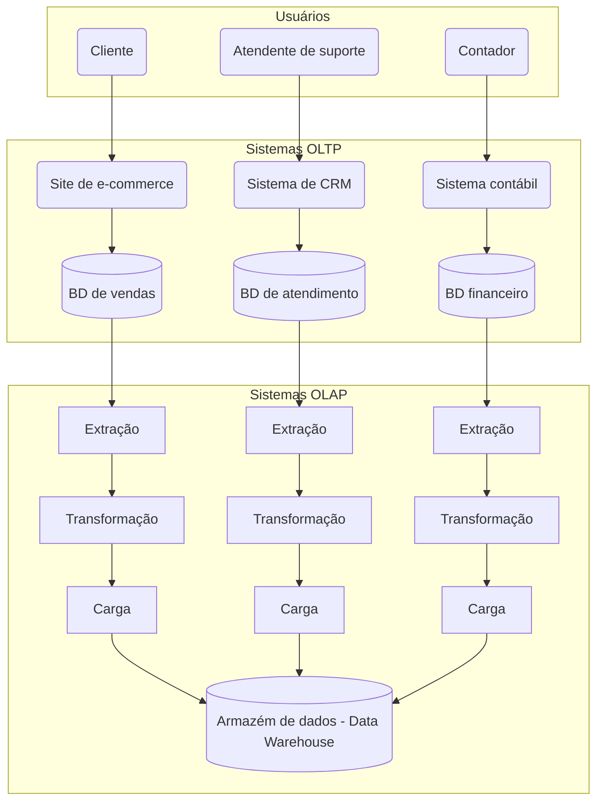
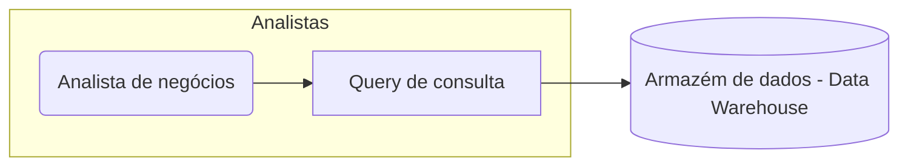

# Sistemas OLAP

Na [aula passada](../03-data-warehouse/intro.md), aprendemos sobre por que separar os ambientes de produção e *analytics*.

Isto nos levou a pensar em duas categorias de sistemas: **OLTP** (*Online Transaction Processing*) e **OLAP** (*Online Analytical Processing*)

!!! exercise text long
    Qual a principal aplicação de sistemas **OLTP**?

    !!! answer "Resposta"
        A principal aplicação de sistemas **OLTP** é em cenários onde as prioridades são o processamento de transações e a manutenção da integridade dos dados (propriedades *ACID*), como em sistemas de vendas, reservas e gerenciamento de estoque.

!!! exercise text long
    Qual a principal aplicação de sistemas **OLAP**?

    !!! answer "Resposta"
        A principal aplicação de sistemas **OLAP** ocorre quando a prioridade é a análise de grandes volumes de dados, como em sistemas de suporte à decisão, *data warehouses* e análise de tendências.

## Fluxo DW

Para ilustrar melhor o fluxo de dados entre sistemas **OLTP** e **OLAP**, considere o diagrama abaixo.

Uma empresa pode conter diversos sistemas **OLTP**. Eles suportam o dia a dia da operação do negócio (sistema de vendas, CRM, gestão de contas, etc.), sendo esperado deles resposta com baixa latência e foco na integridade dos dados.

Para que os dados desses sistemas possam ser analisados de forma eficiente, processos de **ELT** ou **ETL** (**Extract-Transform-Load**) extraem dados de diversos sistemas transacionais, transformam para um formato adequado à análise e os carregam em um **Data Warehouse (DW)**.

Quando os analistas de negócio ou cientistas de dados necessitarem de informações para análise, eles consultarão o **Data Warehouse (DW)**.

!!! info "Info!"
    O **DW** é otimizado para consultas complexas e análises de grandes volumes de dados.

Nesta aula, vamos explorar algumas soluções **OLAP** (*Online Analytical Processing*) e como eles se diferenciam de soluções focadas em **OLTP**.

<!-- Os dados no DW são organizados de forma a facilitar a análise, geralmente utilizando modelos de dados como **star schema** ou **snowflake schema**. -->
