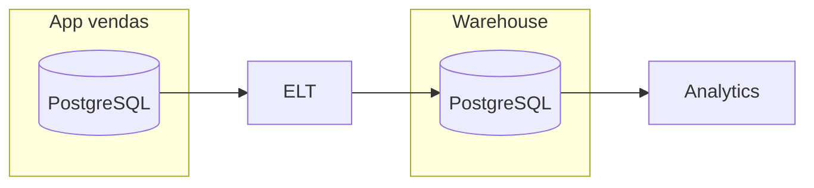
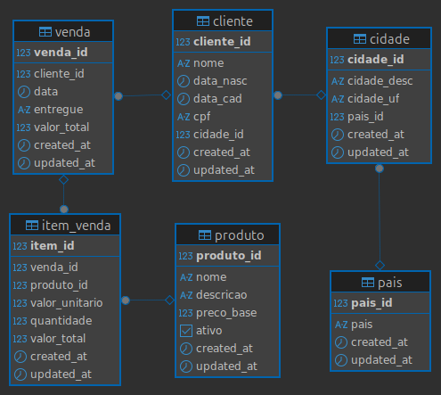
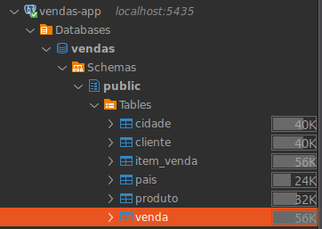

# Praticando

Como prática, iremos implementar um pipeline de ETL para um Data Warehouse.

Nosso desafio será construir um processo que extrai dados da aplicação de vendas e os carrega no *Data Warehouse*.

Este será o **fluxo de dados**:




!!! exercise text short
    No diagrama, quem faz o papel de OLTP?

    !!! answer "Resposta"
        O **PostgreSQL** da aplicação de vendas.

!!! exercise text short
    No diagrama, quem faz o papel de OLAP?

    !!! answer "Resposta"
        O **PostgreSQL** do Data Warehouse.

!!! exercise text short
    O **PostgreSQL** é uma escolha adequada como repositório centralizado de dados para análise (data warehouse)?

    !!! answer "Resposta"
        O **PostgreSQL** é um **OLTP**, ou seja, um sistema de gerenciamento de banco de dados otimizado para transações rápidas e consultas em tempo real (mais adequado para sistemas comerciais onde ACID é importante).

        Entretanto, o **PostgreSQL** também pode ser utilizado como um repositório de dados para análise (data warehouse), embora não seja sua principal função.

!!! info "Info"
    Por enquanto, manteremos o **PostgreSQL** para simplificar nossa arquitetura e posteriormente estudaremos soluções nativamente **OLAP**.

## Sistema de vendas

Iremos trabalhar em um cenário semelhante ao apresentado na [introdução](../03-data-warehouse/intro.md). Suponha que um sistema de vendas esteja em operação, tratando dados de vendas, clientes e produtos.

O banco de dados da aplicação de vendas é um **PostgreSQL** e o seguinte diagrama do modelo relacional representa a estrutura dos dados armazenados:



## Simulador de vendas

Para termos um ambiente de testes, iremos criar um simulador de vendas que irá gerar dados fictícios para nossa aplicação. Esse simulador irá inserir dados aleatórios nas tabelas do banco de dados da aplicação de vendas, permitindo que possamos testar nosso pipeline de ETL.

!!! exercise
    Clone o [repositório base para a aula](https://github.com/macielcalebe/dataeng-03-repo-base/tree/main) e abra no VSCode.

    <div class="termy">

    ```bash
    $ git clone git@github.com:macielcalebe/dataeng-03-repo-base.git
    ```

    </div>

!!! warning "Atenção"
    Execute os próximos exercícios a partir da pasta `01-vendas`.

!!! exercise text long
    Confira o conteúdo do arquivo `sql/0001-ddl.sql`. O que ele faz?

    !!! answer "Resposta"
        O arquivo `sql/0001-ddl.sql` contém as instruções **DDL** (*Data Definition Language*) para criar as tabelas do banco de dados da aplicação de vendas.

!!! exercise text long
    Analise o conteúdo do arquivo `sql/0002-dml-base.sql`. O que ele faz?

    !!! answer "Resposta"
        O arquivo `sql/0002-dml-base.sql` contém as instruções **DML** (*Data Manipulation Language*) para inserir dados fictícios nas tabelas do banco de dados da aplicação de vendas.

        Assim, inicializaremos o simulador com dados de clientes, produtos e cidades.

!!! exercise text long
    Estude o conteúdo dos arquivos `src/init_database.py` e `src/db_utils.py`. Qual a utilidade deles?

    !!! answer "Resposta"
        O arquivo `src/init_database.py` contém o código para inicializar o banco de dados da aplicação de vendas, executando as instruções **DDL** e **DML** contidas nos arquivos **SQL**.

        O arquivo `src/db_utils.py` contém funções utilitárias para interagir com o banco de dados, como executar consultas e manipular dados.

!!! exercise text long
    Confira com atenção o arquivo `src/sales_simulator.py`. Entenda como ele funciona. Quais são suas características principais?

    !!! answer "Resposta"
        O arquivo `src/sales_simulator.py` contém o código para simular vendas na aplicação. Ele gera dados fictícios e os insere nas tabelas do banco de dados da aplicação de vendas.

        As principais características do simulador de vendas são:
        - Geração de dados aleatórios para simular vendas e itens de vendas.
        - Inserção dos dados gerados nas tabelas do banco de dados.

!!! exercise text long
    Agora analise o arquivo `docker-compose.yml`. Quantos serviços são iniciados e quais são eles?

    !!! answer "Resposta"
        São iniciados dois serviços:

        - `postgres-app`: O banco de dados PostgreSQL **OLTP** (aplicação de vendas).
        - `python-app`: O **simulador de vendas**, que irá fazer o papel de aplicação (serviço que produz dados). A sequência de comandos é:

            1. Instala dependências (`pip install -r /app/requirements.txt`).
            2. Inicializa o banco (`python src/init_database.py`).
            3. Inicia o simulador de vendas (`python src/sales_simulator.py`).

!!! exercise text long
    Ainda no arquivo `docker-compose.yml`, o que quer dizer o trecho `${POSTGRES_PORT_APP:-5432}:5432`?
    
    !!! answer "Resposta"
        O trecho permite que, ao definir a variável de ambiente `POSTGRES_PORT_APP`, você escolha dinamicamente em qual porta o Postgres vai aparecer no host, mapeando ela para a porta `5432` no container.

        Se nada for configurado (a variável `POSTGRES_PORT_APP` não está definida), ele abre `5432:5432`.

!!! exercise
    Crie um arquivo `.env` a partir do `.env.example` e ajuste as variáveis de ambiente conforme necessário.

!!! exercise
    Inicie os serviços utilizando o Docker Compose.

    Para iniciar os serviços, execute o seguinte comando no terminal:

    <div class="termy">

    ```bash
    $ docker-compose up
    ```

    </div>
   
    Isso irá iniciar os serviços em primeiro plano.

!!! exercise
    Garanta que você consegue ver, no terminal, o log de inicialização dos serviços e as vendas sendo geradas pelo simulador.

## DBeaver

Vamos instalar um cliente de banco de dados chamado **DBeaver**, que é uma ferramenta gráfica para gerenciar bancos de dados.


!!! info
    Caso você já tenha instalado um cliente que suporte **PostgreSQL**, você pode utilizá-lo para se conectar ao banco de dados da aplicação de vendas e ignorar a instalação do **DBeaver**.

Para instalar o **DBeaver**, siga as instruções para o seu sistema operacional:

=== "Windows"

    1. Baixe o instalador do **DBeaver** [aqui](https://dbeaver.io/download/).
    2. Execute o instalador e siga as instruções na tela.

=== "macOS"

    1. Baixe o arquivo DMG do **DBeaver** [aqui](https://dbeaver.io/download/).
    2. Abra o arquivo DMG e arraste o **DBeaver** para a pasta Aplicativos.

=== "Linux"

    Para distribuições baseadas em Debian/Ubuntu, você pode usar o seguinte comando:
    === "Snap"
        <div class="termy">

        ```bash
        $ sudo snap install dbeaver-ce
        ```
        </div>
    === "Flatpak"
        <div class="termy">

        ```bash
        $ flatpak install flathub io.dbeaver.DBeaverCommunity
        ```
        </div>

Para mais detalhes, consulte a [página oficial](https://dbeaver.io/download/).

Após a instalação, abra o **DBeaver** e crie uma nova conexão com o banco de dados PostgreSQL da aplicação de vendas utilizando as informações configuradas no `.env`.

!!! warning "Atenção"
    Perceba que, no **DBeaver**, a conexão será pela porta exposta pelo `docker-compose.yml` (`5435`).

    Já o *container* do simulador de vendas enxergará o **PostgreSQL** na porta `5432`.

    Para entender melhor, veja `.env.example` e como no serviço `python-app` do `docker-compose.yml` as variáveis `POSTGRES_HOST_APP` e `POSTGRES_PORT_APP` são redefinidas na seção `environment`:

    ```yaml
        # RECORTE DE PARTE DO docker-compose.yml
        postgres-app:
            environment: # Redefine ou define variáveis de ambiente
            - POSTGRES_DB=${POSTGRES_DB_APP}
            - POSTGRES_USER=${POSTGRES_USER_APP}
            - POSTGRES_PASSWORD=${POSTGRES_PASSWORD_APP}
            ports: # A porta exposta no host será `POSTGRES_PORT_APP` (5435)
            - "${POSTGRES_PORT_APP:-5432}:5432"

        python-app:
            environment: # Redefine ou define variáveis de ambiente
            - POSTGRES_HOST_APP=postgres-app # Container name do DB PostgreSQL
            - POSTGRES_PORT_APP=5432 # O python-app acessa o DB pela porta interna do container
    ```

!!! exercise
    Garanta que você consegue observar, no DBeaver, as tabelas e os dados inseridos pelo simulador de vendas.

    

    !!! tip "Dica"
        Dê dois cliques nas tabelas e acesse a aba **data**

!!! exercise choice "Question"
    Os dados do sistema do banco serão persistidos quando o container for parado ou removido?

    - [ ] Sim
    - [X] Não

    !!! answer "Answer"
        Não. Não foi criado nenhum volume para isto. Mas isto não é problema nesta aula pois estamos apenas simulando um ambiente.

## ETL

Agora que a aplicação de vendas está em funcionamento e os dados estão sendo gerados, vamos implementar um pipeline de ETL para extrair esses dados e carregá-los no Data Warehouse.

!!! warning "Atenção"
    Execute os próximos exercícios a partir da pasta `02-etl` do repositório base.

!!! exercise
    No `02-etl/docker-compose.yml`, defina um serviço **PostgreSQL** que servirá como **Data Warehouse**.

    !!! danger "Atenção"
        Garanta que está trabalhando na pasta `02-etl` do repositório base.

        Leia o `.env.example` para entender as variáveis de ambiente que você pode usar.

!!! exercise
    Descubra o **IPv4** local da sua máquina e atualize o arquivo `02-etl/.env` com o valor encontrado.

!!! exercise
    Utilizando o arquivo `01-vendas/sql/0001-ddl.sql` como referência, crie uma versão de **DDL** no arquivo `02-etl/sql/0001-ddl-warehouse.sql` para definir o *schema* inicial do **Data Warehouse**.

    Será apenas uma cópia do arquivo?

    !!! answer "Resposta"
        Não. O *schema* do Data Warehouse deve ser otimizado para análises, então você pode querer ajustar os tipos de dados, remover *constraints* de chave estrangeira, obrigatoriedade de preenchimento das colunas, remover colunas desnecessárias, remover **triggers** de atualização automática, retirar auto-incremento, ou criar índices para melhorar a performance das consultas.

!!! exercise
    Crie um arquivo python `02-etl/src/init_database.py` que leia o arquivo `02-etl/sql/0001-ddl-warehouse.sql` e execute o comando para criar o banco de dados.

!!! exercise
    Execute o arquivo Python para definir o *schema* do **Data Warehouse**.

    Crie uma nova conexão no **DBeaver** e garanta que você consegue visualizar o *schema* da base.


!!! exercise
    Utilizando o **DBeaver**, crie uma nova aba de query (*new SQL script*) para trabalhar em modo explorador!

    Agora, crie uma query que retorne **todos os dados criados nos últimos dois minutos**.

    Pode escolher qualquer tabela de sua preferência.

    !!! answer "Resposta"
        Exemplo para a tabela de `venda`:

        ```sql { .copy }
        SELECT * FROM public.venda
        WHERE created_at >= date_trunc('minute', now()) - INTERVAL '2 minutes'
        ORDER BY created_at
        ```

        Ficaria melhor ainda se não utilizássemos `SELECT *` e sim selecionássemos apenas as colunas necessárias!

!!! exercise
    Crie um script Python `02-etl/src/etl_vendas.py` que irá:
    
    1. Ler os dados criados recentemente na tabela de origem
    2. Inserir os dados no Data Warehouse

    !!! tip "Dica"
        Faça primeiro com uma tabela. Depois, faça o mesmo para as outras tabelas.
        Você pode utilizar bibliotecas como `pandas` para facilitar a manipulação dos dados (ou qualquer outra de sua preferência).

!!! exercise
    Edite o arquivo `02-etl/docker-compose.yml` para incluir o serviço de **ETL**, que deve executar, por exemplo, a cada dois minutos.

    !!! tip "Dica"
        Por enquanto, basta executar um loop infinito com espera ao seu final. Melhoraremos nas próximas aulas!

    !!! warning "Atenção"
        Não se esqueça de atualizar, na seção `environment` do serviço de **ETL**, as variáveis de ambiente para conectar ao banco de dados do **Data Warehouse**:

        ```yaml
        # RECORTE DE PARTE DO ARQUIVO docker-compose.yml DO ETL
        python-etl:
            environment: # Supondo que o serviço DW se chama postgres-warehouse
            - POSTGRES_HOST_WAREHOUSE=postgres-warehouse
            - POSTGRES_PORT_WAREHOUSE=5432
        ```

!!! exercise
    Garanta que o serviço de **ETL** está funcionando corretamente.

    Confira se:

    - Novos dados estão sendo gerados pelo simulador na **origem**.
    - O processo de **ETL** está salvando os dados no **Data Warehouse**.

!!! exercise
    Inicie todos serviços e deixe-os rodando.

## Dashboard

Agora que você já possui os dados no Data Warehouse, é hora de consumir!

Um dashboard é uma ferramenta de visualização de dados que permite acompanhar métricas e indicadores de desempenho. Para simular esta funcionalidade, iremos utilizar um **Jupyter Notebook**.

!!! exercise
    Estude e execute o Jupyter Notebook disponível no diretório `03-dashboard`.

    Garanta que você consegue visualizar as vendas, produtos e clientes no dashboard.

## Para finalizar

!!! exercise text long
    O que aconteceria se os dados fossem atualizados?

    Por exemplo, se o nome de algum cliente for alterado, ou o status de entrega de alguma venda?

    !!! answer "Resposta"
        O **ETL** deve ser projetado para lidar com atualizações, entretanto, nosso **ETL** atual não considera essas mudanças e supõe que os dados são sempre novos (incrementais).

        Para lidar com isso, precisaríamos implementar uma lógica de atualização que identificasse registros existentes no Data Warehouse e os atualizasse conforme necessário.

## Limpeza

!!! exercise
    Para parar e remover os *containers* e volumes:

    !!! warning
        O `-v` no comando abaixo irá garantir que os volumes criados sejam apagados.

        Utilize isto quando quiser apagar dados persistidos em volumes do docker.

        Nesta aula, os volumes mapeiam para pastas do próprio sistema (*bind mounts*), mas fica o aprendizado para as próximas aulas.

    !!! danger "Limpeza!"
        Lembre-se que você criou/alterou dois conjuntos de serviços nesta aula!

    <div class="termy">

    ```bash
    $ docker compose down -v
    ```

    </div>