# Prática

## API de filmes
Para a prática, iremos utilizar uma **API** de filmes.

Ela, construída em [*fastapi*](https://fastapi.tiangolo.com/), será responsável por fornecer informações sobre filmes, como título e ano de lançamento. As informações serão lidas a partir de um **JSON**.

!!! danger "Perigo!"
    Se fizer esta aula pela metade, não deixe **VMs** em execução.

    Confira o comando para parar a **VM** ao final da página. Você também pode utilizar o **console** (menu superior **Instance state** / **Stop instance**).

    Qualquer dúvida, entre em contato com o professor.

Antes de realizarmos o *deploy* na **AWS**, vamos testar localmente e garantir que funciona. Para isso:

!!! exercise "Exercício"
    Em sua máquina, clone o repositório:

    <div class="termy">

    ```console
    $ git clone https://github.com/macielcalebe/movies-api-example-01.git movies-api
    ```

    </div>

!!! exercise "Exercício"
    Crie um ambiente virtual utilizando a ferramenta de sua preferência e instale as dependências do projeto:

    <div class="termy">

    ```console
    $ cd movies-api
    $ uv venv --python 3.12 .venv
    $ source .venv/bin/activate
    $ uv pip install -r requirements.txt
    ```

    </div>

!!! exercise "Exercício"
    Teste a API localmente utilizando o comando:

    <div class="termy">

    ```console
    $ fastapi dev src/main.py
    ```

    </div>

!!! exercise "Exercício"
    Teste em seu navegador:

    !!! warning "Atenção"
        Confira se a porta é realmente `8000`, caso contrário, ajuste a URL.

    - [http://localhost:8000](http://localhost:8000)
    - [http://localhost:8000/docs](http://localhost:8000/docs)
    - [http://localhost:8000/filmes/avatar](http://localhost:8000/filmes/avatar) e tente com outros filmes!
    - [http://localhost:8000/filmes](http://localhost:8000/filmes)

    !!! answer "Resposta"
        No exemplo do `avatar`, você deve ver algo como:
        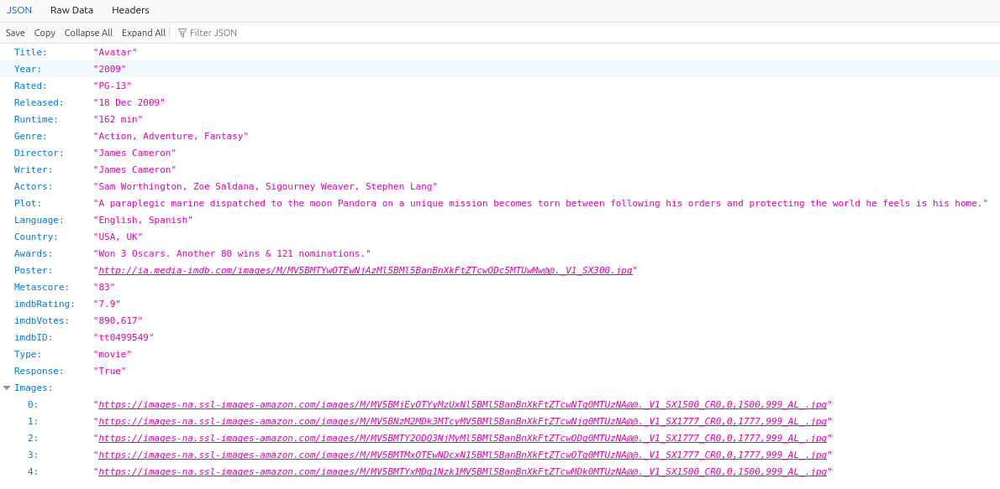

Agora que conferimos a API localmente, vamos explorar o **console da AWS**.

!!! exercise
    Antes de prosseguir, acesse a URL de login da conta **AWS** da disciplina e faça login.

## Explorando o Console

O **console** da **AWS** é uma interface gráfica baseada na web que permite gerenciar e interagir com os serviços da **AWS**.

Vamos explorar o **console** para entender melhor como ele funciona. Com login realizado na conta da **AWS**, encontre o link **AdministratorAccess** para acessar o **console**.

## EC2

No **console** da **AWS**, navegue até o serviço **EC2** (pela barra de busca). Você deve ver um painel como:

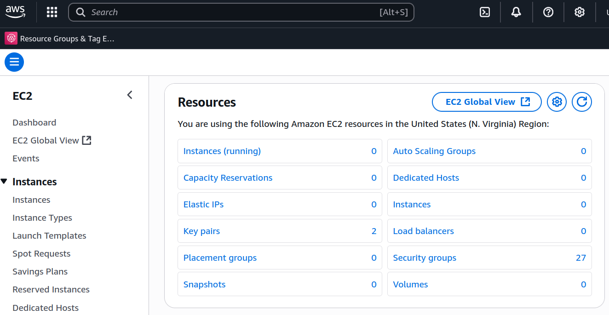

O **EC2** (*Elastic Compute Cloud*) é um serviço que fornece capacidade de computação escalável na nuvem.

Ele permite que os usuários criem e gerenciem instâncias de servidores virtuais (**VMs**, **instâncias EC2**).

As instâncias EC2 podem ser configuradas com diferentes tipos de hardware, sistemas operacionais e softwares, permitindo que os usuários personalizem suas aplicações de acordo com suas necessidades.

## Criar instância
Vamos criar uma instância para fazer *deploy* da nossa **API** de filmes. Inicialmente, vamos criar recursos utilizando o **console** da **AWS**.

### Região
Após acessar o **EC2**, garanta que está na região `N. Virginia` (`us-east-1`). Esta informação estará disponível no menu superior direito.

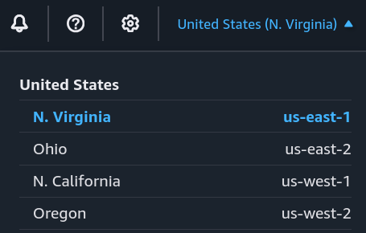

!!! exercise
    Selecione a **região** correta (`us-east-1`) antes de prosseguir.

### Instâncias
No menu esquerdo, clique em **Instances** (Instâncias). Você deve ver um painel como:

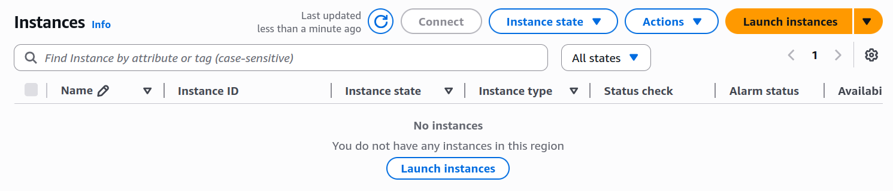

### Criação
Clique em **Launch Instances** (Iniciar Instâncias) para criar uma nova instância.

A primeira configuração necessária será a escolha do **sistema operacional**. Escolha conforme a imagem (**Ubuntu 24.04 LTS**):

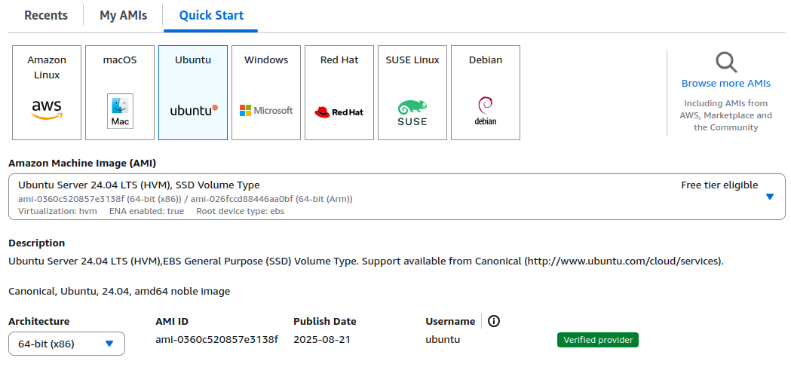

Em seguida, escolha o **tipo de instância**, que delimita o hardware da sua instância. Escolha uma `t3a.micro`.

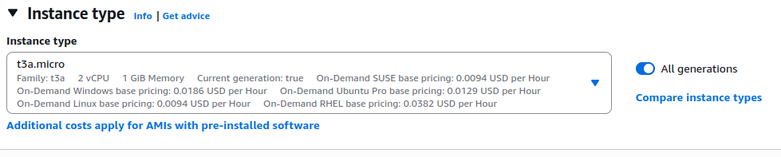

!!! exercise text short
    Pesquise sobre as instâncias. Qual a arquitetura da `t3a.micro`? Qual a arquitetura das instâncias `t4g.*`?

    !!! answer "Resposta"
        A arquitetura da `t3a.micro` é `AMD64` (`x86_64`), aquela que estudaram em SisHard!
        
        A arquitetura das instâncias `t4g.*` é `ARM64` (`aarch64`).

Então, vamos escolher a chave mestre para acessar a instância. Isto será feito pela criação de uma **key pair**.

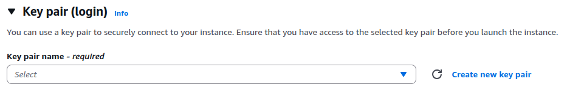

Clique em **Create new key pair** (Criar novo par de chaves).

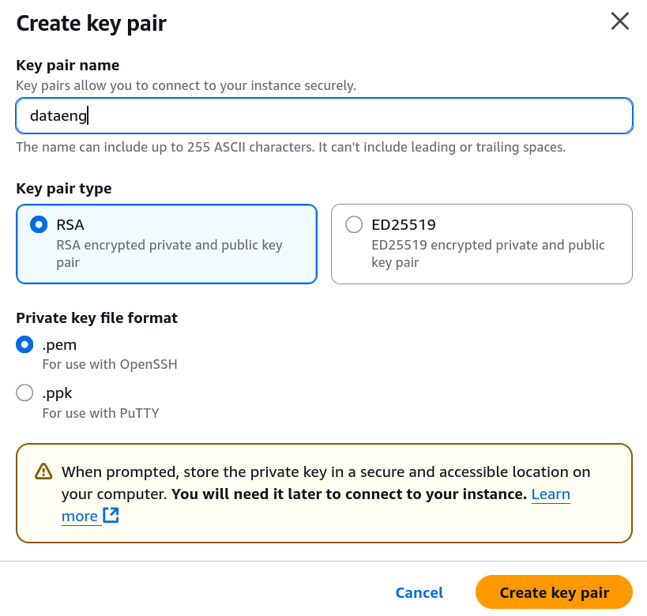

!!! exercise
    Garanta que você fez o *download* da chave privada (`*.pem`).

!!! danger "Atenção"
    Salve a chave privada (`*.pem`) em um **local seguro**.
    
    Você precisará dela para acessar sua instância.

!!! danger "Não compartilhar"
    Nunca compartilhe sua chave privada com ninguém!

Nas configurações de rede, configure conforme a imagem:

!!! warning "Atenção"
    Geralmente, utilizar regras de acesso **SSH** de qualquer IP (`0.0.0.0/0`) não é recomendado em ambientes de produção.

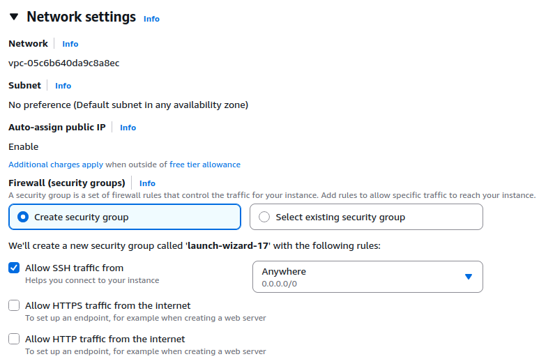

Após isso, clique em **Launch Instances** (Iniciar Instâncias) para criar a instância!

!!! exercise
    Volte para o **Dashboard** do **EC2** e verifique se sua instância está em execução.

## Acesso SSH

Vamos realizar acesso via **SSH**. Para isso, garanta que você tem a chave privada (`.pem`) que foi gerada durante a criação da instância, com as permissões corretas.

!!! attention "Atenção"
    Os comandos abaixo entendem que o arquivo da chave privada está localizado na pasta de trabalho atual.
    
    Caso tenha movido para, por exemplo, `~/.ssh/`, atualize os comandos.

!!! exercise
    Para acessar a **VM** utilizando **SSH**, utilize:

    !!! warning "Endereço IP"
        No painel **EC2**, localize sua instância e copie o **Public DNS** ou **Public IP** e sustitua no comando abaixo (onde está `17.204.229.1`):

    <div class="termy">

    ```console
    $ chmod 700 dataeng.pem
    $ ssh ubuntu@17.204.229.1 -i dataeng.pem
    ```

    </div>

    Responda `y` para a pergunta de segurança!

!!! warning "Atenção!"
    Os próximos comandos devem ser executados dentro da **sessão SSH**.

    Ou seja, na **VM**!

!!! exercise
    Para manter a conexão ativa e não perdermos a sessão SSH, podemos usar o comando `tmux` ou `screen`.
    <div class="termy">

    ```console
    $ tmux
    ```

    </div>

    Para testar, após dar **ENTER**, feche a janela (sem dar `exit` ou `logout`) e abra novamente a conexão SSH. 

    Reestabeleça a sessão com:

    <div class="termy">

    ```console
    $ tmux a
    ```

    </div>

    Sim, um `"a"` no final!


## Configurando a API
Agora que você tem acesso à VM, vamos clonar o repositório da API e testar se ele funciona corretamente.

!!! exercise
    Clone o repositório (pode ser na pasta atual, `/home/ubuntu`):

    <div class="termy">

    ```console
    $ git clone https://github.com/macielcalebe/movies-api-example-01.git
    ```

    </div>

!!! exercise
    Crie um ambiente virtual e instale as dependências.

    Você pode instalar `uv` na **VM**!

!!! exercise
    Com o ambiente virtual ativado, inicialize a API com:
    <div class="termy">

    ```console
    $ fastapi run src/main.py --host 0.0.0.0 --port 8000
    ```

    </div>

!!! exercise
    Tente acessar a **API** em seu navegador. Utilize o endereço `http://<Public_IP>:8000`.

    !!! warning "Atenção"
        Lembre-se de substituir `<Public_IP>` pelo endereço **IP público** da sua instância **EC2**.

        Não irá funcionar, mas tente mesmo assim e siga o *handout*!

Provavelmente não irá funcionar. Por questão de segurança, o **EC2** bloqueia o acesso à porta **8000** por padrão. Para resolver isso, você precisará ajustar as regras de segurança do grupo de segurança associado à sua instância.

!!! exercise
    Acesse **Instances** no painel do **EC2** e localize sua instância. Em seguida, na aba **Security**, clique no ID do grupo de segurança associado à sua instância (**Security groups**).

    Clique em **Edit inbound rules** e adicione uma nova regra:

    - Tipo: **Custom TCP**
    - Protocolo: **TCP**
    - Porta: **8000**
    - Origem: **0.0.0.0/0** (ou o IP específico que você deseja permitir)

    Após adicionar a regra, clique em **Save rules**.

    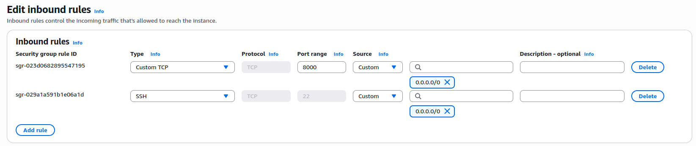

!!! exercise
    Tente acessar novamente a **API** em seu navegador. Utilize o endereço `http://<Public_IP>:8000`.

    Agora deve funcionar! Teste o acesso à documentação e as rotas de consultas a filmes!

!!! exercise
    Derrube a **API** antes de continuar!

## Configuração de serviço

!!! exercise text long
    Qual o usuário da máquina que roda o processo toda vez que a API é acessada?

    Tem algo errado com esta prática?

    !!! answer "Resposta"
        O usuário que roda o processo da API é o usuário `ubuntu`.

        Como o usuário `ubuntu` tem permissões de administrador, isso pode representar um risco de segurança.

        É recomendável criar um usuário específico para rodar a API com permissões limitadas.

Vamos fazer isto e além, criaremos um serviço para nossa **API**.

!!! exercise text long
    Mas o que é um serviço?!

    !!! answer "Resposta"
        Um serviço é um programa que roda em segundo plano e é gerenciado pelo sistema operacional.
        
        Ele é projetado para fornecer funcionalidades específicas e pode ser iniciado automaticamente na inicialização do sistema.

### Criar usuário
O usuário para rodar o serviço da **API** será chamado `uapi`. Seus arquivos estarão localizados na pasta `/srv/movies-api`.

!!! exercise text long
    Pesquise sobre a hierarquia de pastas raiz do Linux. Quais são as pastas principais?

!!! exercise
    Crie o usuário e a pasta de destino do serviço com:

    <div class="termy">

    ```console
    $ sudo useradd --system --create-home --home-dir /srv/movies-api --shell /usr/sbin/nologin uapi
    $ sudo mkdir -p /srv/movies-api/app
    $ sudo chown -R uapi:uapi /srv/movies-api/app
    ```

    </div>

!!! exercise
    Perceba que criamos a pasta `app` para receber os arquivos da aplicação.

    Clone com:

    <div class="termy">

    ```console
    $ sudo -u uapi git clone https://github.com/macielcalebe/movies-api-example-01.git /srv/movies-api/app
    ```

    </div>
    
### Ambiente virtual API
Vamos criar um ambiente virtual para o serviço

=== "uv"
    <div class="termy">

    ```console
    $ sudo -u uapi bash -lc 'curl -LsSf https://astral.sh/uv/install.sh | sh'
    $ sudo -u uapi bash -lc 'export PATH="$HOME/.cargo/bin:$PATH"; uv venv /srv/movies-api/app/.venv'
    $ sudo -u uapi bash -lc 'export PATH="$HOME/.cargo/bin:$PATH"; uv pip install -r /srv/movies-api/app/requirements.txt --python /srv/movies-api/app/.venv/bin/python'
    ```

    </div>
    
=== "venv"
    <div class="termy">

    ```console
    $ sudo apt-get update && sudo apt-get install -y python3-venv
    $ sudo -u uapi python3 -m venv /srv/movies-api/app/.venv
    $ sudo -u uapi bash -lc '/srv/movies-api/app/.venv/bin/pip install --upgrade pip'
    $ sudo -u uapi bash -lc '/srv/movies-api/app/.venv/bin/pip install -r /srv/movies-api/app/requirements.txt'
    ```

    </div>
    
### Criar serviço
Para criar um serviço Linux, precisamos criar um arquivo de configuração na pasta `/etc/systemd/system/`.

!!! exercise
    Execute:
    <div class="termy">

    ```console
    $ sudo vim /etc/systemd/system/movies-api.service
    ```

    </div>

    No **vim**, aperte a tecla **INSERT** para entrar em modo de edição.

    Cole o seguinte conteúdo:

    ```bash { .copy }
    [Unit]
    Description=Movies API service
    After=network.target

    [Service]
    User=uapi
    Group=uapi
    WorkingDirectory=/srv/movies-api/app
    Environment="PATH=/srv/movies-api/app/.venv/bin"
    ExecStart=/srv/movies-api/app/.venv/bin/fastapi run src/main.py --workers 2 --host 0.0.0.0 --port 8000
    Restart=on-failure
    RestartSec=5

    [Install]
    WantedBy=multi-user.target
    ```

    Em seguida, aperte a tecla **ESC** e digite `:wq` para salvar e sair (sim, também precisa digitar os dois pontos!).

!!! exercise text short
    Analise o arquivo de serviço. Qual o usuário irá rodar a API?

    !!! answer "Resposta"
        O usuário que roda a API é o `uapi`.

Agora que o serviço foi criado, precisamos recarregar o **systemd** para reconhecer o novo serviço.

!!! exercise
    Atualize o **systemd** com:

    !!! info "Info"
        Realize este passo sempre que editar o arquivo de serviço!

    <div class="termy">

    ```console
    $ sudo systemctl daemon-reload
    ```

    </div>

!!! exercise
    Inicie ou reinicie o serviço com:
    <div class="termy">

    ```console
    $ sudo systemctl restart movies-api
    ```

    </div>

!!! exercise
    Confira o status do serviço com:
    <div class="termy">

    ```console
    $ sudo systemctl status movies-api
    ```

    </div>

!!! exercise
    Confira os logs do serviço com:
    <div class="termy">

    ```console
    $ sudo journalctl -u movies-api -f
    ```

    </div>

!!! exercise
    Acesse a **API** no **IP público** do navegador e confira se tudo está funcionando corretamente.

    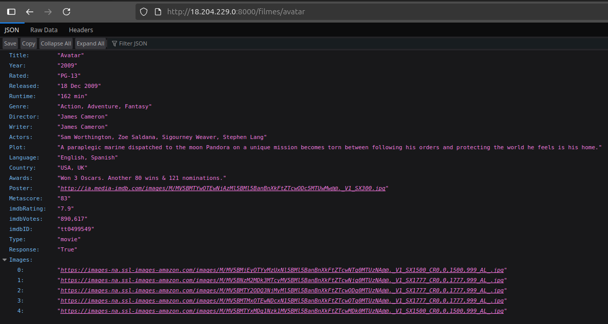

!!! exercise
    Com tudo funcionando, vamos habilitar o serviço para iniciar automaticamente com o sistema.
    <div class="termy">

    ```console
    $ sudo systemctl enable movies-api
    ```

    </div>

!!! exercise
    Reinicie a **VM** e confira se o serviço volta a funcionar.

    !!! warning "Atenção"
        Espere alguns minutos (um ou dois) para a **VM** reiniciar completamente.

    <div class="termy">

    ```console
    $ sudo shutdown -r 0
    ```

    </div>

### Fazendo a limpa

!!! danger "EC2 é caro!"
    Serviços de **computação** em nuvem, como o **EC2** da **AWS**, podem gerar **custos significativos**.

    Certifique-se de parar ou encerrar instâncias que não estão em uso para evitar cobranças desnecessárias.

Vamos fazer isto utilizando o **AWS CLI**.

!!! exercise
    Liste as **VMs** criadas em sua conta:

    <div class="termy">

    ```console
    $ aws ec2 describe-instances --query 'Reservations[*].Instances[*].{ID:InstanceId,State:State.Name}' --output table --profile dataeng
    ```

    </div>


!!! exercise
    Pare a instância retornada:

    !!! warning "Atenção"
        No comando abaixo, substitua `i-00c68fbac********` pelo ID da instância que você deseja parar.

    <div class="termy">

    ```console
    $ aws ec2 stop-instances --instance-ids i-00c68fbac******** --profile dataeng
    ```

    </div>

!!! info "Info!"
    Por enquanto, não é necessário remover a instância. Existem gastos associados à instâncias paradas, mas eles são muito menores do que instâncias em execução.

    Apesar de não ser necessário, você pode fazer isso a qualquer momento utilizando o comando:

    !!! warning "Atenção"
        No comando abaixo, substitua `i-00c68fbac********` pelo ID da instância que você deseja remover.

        Este comando é **irreversível** e resultará na perda de todos os dados armazenados na instância (**EBS**) se a instância estiver com **DeleteOnTermination** habilitado.

        Confira utilizando o comando:
        ```console
        aws ec2 describe-instances \
            --instance-ids i-00c68fbac******** \
            --query "Reservations[].Instances[].BlockDeviceMappings[].Ebs" \
            --profile dataeng
        ```


    <div class="termy">

    ```console
    $ aws ec2 terminate-instances --instance-ids i-00c68fbac******** --profile dataeng
    ```

    </div>

## Conclusão
Esta foi nossa primeira experiência com o **EC2**. Por enquanto, a configuração envolveu etapas manuais, não automatizadas. Trabalharemos nesse tópico nas próximas aulas!

Outras ideias que poderiam ter sido exploradas (você pode tentar, só não deixe a **VM** ligada continuamente!):

- Configurar um servidor web, como **Nginx**, **Apache** ou **Caddy**, para servir a **API**.
- Configurar um domínio personalizado para a **API**, com *reverse proxy*. Você pode conseguir um provisório com o **DuckDNS**.
- Configurar **https** para seu domínio personalizado. Uma dica é utilizar o **certbot Let's Encrypt**.
