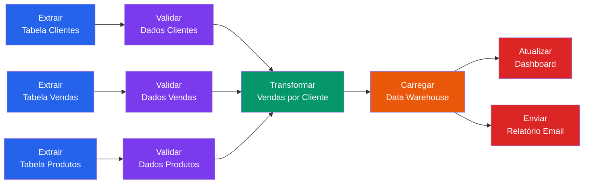

# Orquestração

## Introdução

Na [página anterior](intro-cron.md) exploramos como o **cron** pode ser utilizado para agendar tarefas, mas também identificamos suas limitações para ambientes de produção em engenharia de dados.

Quando lidamos com **pipelines de dados** complexos, precisamos de algo mais robusto que simples agendamento temporal. Imagine um cenário onde você precisa:

- Processar dados de vendas após o backup do banco estar completo
- Executar transformações apenas quando novos arquivos chegarem
- Reprocessar dados caso uma etapa falhe
- Monitorar o *status* de cada etapa do *pipeline*

Para atender a essas necessidades, surgiu o conceito de **orquestração de dados**.

!!! exercise text long "Exercício"
    Com base na sua experiência nas aulas anteriores, quais outros problemas você identifica ao usar apenas **cron** para pipelines de dados complexos?

    !!! answer "Resposta"
        Além dos problemas já mencionados na aula do cron, outros desafios incluem:

        - **Gerenciamento de dependências**: Como garantir que a **tarefa A** execute antes da **tarefa B** (SisHard entrou no chat!)?
        - **Tratamento de falhas**: O que fazer quando uma etapa falha no meio do *pipeline*?
        - **Monitoramento**: Como saber se o *pipeline* está funcionando corretamente?
        - **Versionamento**: Como gerenciar diferentes versões do *pipeline*?
        - **Teste**: Como testar *pipelines* complexos antes de colocá-los em produção?

## O que é Orquestração de Dados?

A **orquestração de dados** é o processo de **coordenar** e **gerenciar** automaticamente a execução de **múltiplas tarefas** e **fluxos de trabalho** de dados, garantindo que sejam executados na **ordem correta**, com as **dependências adequadas** e com **tratamento robusto de erros**.

Diferentemente do simples agendamento, a orquestração considera:

- **Dependências Entre Tarefas**: As tarefas podem depender umas das outras. Por exemplo, um processo de transformação só deve iniciar após a extração dos dados estar completa.

- **Gerenciamento de Estado**: O orquestrador mantém o **estado** de cada tarefa, sabendo quais foram executadas com sucesso, quais falharam e quais estão em execução.

- **Tratamento de Falhas**: Quando uma tarefa falha, o sistema pode automaticamente **retentar**, **alertar** os responsáveis ou **parar** o *pipeline* dependendo da configuração.

- **Monitoramento e Observabilidade**: Fornece visibilidade completa sobre o status do *pipeline*, métricas de performance e *logs* detalhados.

!!! example "Exemplo de *Pipeline* Orquestrado"
    Considere um *pipeline* de análise de vendas:

    1. **Extração**: Buscar dados do PostgreSQL
    2. **Validação**: Verificar qualidade dos dados extraídos
    3. **Transformação**: Agregar vendas por região e período
    4. **Carga**: Inserir dados no **data warehouse**
    5. **Notificação**: Enviar email confirmando a atualização
    
    Cada etapa depende da anterior e tem tratamento específico de erro.

!!! info "Orquestração"
    Em essência, a orquestração é como o maestro de uma orquestra de dados: ele não toca nenhum instrumento diretamente, mas coordena cada músico (cada *job* de dados) para que toquem na ordem certa!

## Conceitos Fundamentais

### DAG (*Directed Acyclic Graph*)
Um **DAG** é a representação visual e lógica de um *pipeline* de dados.

!!! info  "DAG: vertices e arestas"
    Em um **DAG**, as **tarefas** são representadas como **nós** e as **dependências** como **arestas direcionadas**.

- **Directed**: As conexões têm direção (A → B)
- **Acyclic**: Não há ciclos (A não pode depender de B se B depende de A)
- **Graph**: Estrutura que conecta tarefas

### Tarefas (*Tasks*)
Cada **tarefa** representa uma unidade de trabalho específica no *pipeline*, como extrair dados de uma **API**, executar uma transformação ou enviar uma notificação.

### Dependências
As **dependências** definem a **ordem** de execução das tarefas. Uma tarefa só executa quando todas as suas dependências foram concluídas com sucesso.

No exemplo do gráfico, a tarefa de **Validar Dados Clientes** só pode começar após a **Extração da Tabela Clientes** ser concluída. Da mesma forma, a **Transformação de Vendas por Cliente** só pode ocorrer após a validação dos dados de vendas, clientes e produtos.

Veja um outro exemplo de **DAG** com dependências:

!!! exercise choice "Conceitos"
    Em um **DAG**, se a Tarefa **C** depende das Tarefas **A** e **B**, qual é a ordem correta de execução?

    - [ ] C → A → B
    - [ ] A → C → B
    - [X] A e B (podem executar em paralelo) → C
    - [ ] B → A → C

    !!! answer "Resposta"
        Como **C** depende de **A** e **B**, estas duas tarefas precisam executar primeiro.

        **A** e **B** podem executar em paralelo pois não dependem uma da outra, e **C** só executa após ambas terminarem.

        Lembram do ponto de encontro (**RDV**, *rendezvous*) de SisHard?!

## Ferramentas de Orquestração

Existem diversas ferramentas de orquestração disponíveis no mercado, cada uma com suas características e casos de uso específicos.

### Apache Airflow
O **Airflow** é uma das ferramentas mais populares para orquestração de dados. Desenvolvido pelo **Airbnb** e depois doado para a **Apache Foundation**, permite definir **DAGs** usando código Python.

**Características:**

- Interface web rica para monitoramento
- Ampla adoção no mercado
- Flexibilidade para integrações complexas
- Curva de aprendizado mais acentuada

Iremos explorar o **Airflow** em aulas futuras.

### Prefect
O **Prefect** é uma ferramenta moderna de orquestração que busca ser mais **developer-friendly** que o Airflow, com uma abordagem **"Python-first"**.

**Características:**

- Sintaxe Python mais limpa e intuitiva
- Melhor tratamento de erros e retry automático
- Interface moderna e responsiva
- Facilidade para desenvolvimento local

### Outros Orquestradores
Além do **Airflow** e **Prefect**, existem outras ferramentas de orquestração. Alguns exemplos:

- **Dagster**: Foco em qualidade de dados
- **Argo Workflows**: Para ambientes Kubernetes
- **AWS Step Functions** + **AWS Glue**: Nativos da AWS

!!! exercise text short "Exercício"
    Qual é a principal diferença entre usar **cron** e usar um **orquestrador** como Prefect para pipelines de dados?

    !!! answer "Resposta"
        A principal diferença é que o **cron** apenas agenda execuções baseadas em tempo, enquanto orquestradores como **Prefect** gerenciam **dependências**, **estado das tarefas**, **tratamento de falhas** e **monitoramento**, oferecendo controle completo sobre o fluxo de dados.

## Por que Usar Orquestração?

A orquestração resolve problemas críticos em ambientes de produção:

- **Confiabilidade**: Sistemas orquestrados são mais **resilientes a falhas**, com mecanismos automáticos de *retry* e recuperação.

- **Visibilidade**: Você pode acompanhar o status de cada tarefa em tempo real, identificar gargalos e diagnosticar problemas rapidamente.

- **Escalabilidade**: Orquestradores permitem **paralelização** eficiente de tarefas independentes e **distribuição** de cargas de trabalho.

- **Manutenibilidade**: O código fica mais **organizado** e **versionado**, facilitando atualizações e correções.

!!! warning "Complexidade *vs* Benefício"
    A orquestração adiciona **complexidade** ao projeto.
    
    Para **pipelines** muito simples, pode ser **over-engineering**!
    
    Avalie sempre se os benefícios justificam a complexidade adicional para seu caso específico.

## Quando Usar Orquestração?

A orquestração é recomendada quando você tem:

- **Múltiplas tarefas** com dependências entre si
- **Pipelines críticos** que não podem falhar
- **Necessidade de reprocessamento** de dados históricos
- **Equipes** que precisam colaborar no mesmo *pipeline*
- **Requisitos de auditoria** e rastreabilidade

!!! exercise choice "Cenários de Uso"
    Qual cenário mais se beneficia de um orquestrador de dados?

    - [ ] Script simples que roda uma vez por dia para backup
    - [X] Pipeline com cinco etapas que processa dados de vendas e precisa alertar em caso de falha
    - [ ] Aplicação web que consulta dados em tempo real
    - [ ] Processo manual executado semanalmente

    !!! answer "Resposta"
        O *pipeline* com múltiplas etapas, dependências e necessidade de alertas é o cenário ideal para orquestração, pois requer coordenação, monitoramento e tratamento de falhas.

## Próximos Passos

Agora que entendemos os conceitos fundamentais de orquestração, vamos partir para a prática! Na próxima seção, implementaremos nosso primeiro *pipeline* usando **Prefect**, explorando como definir tarefas, dependências e monitorar a execução.

Você verá como a orquestração transforma *pipelines* de dados complexos em fluxos **confiáveis**, **observáveis** e **mantíveis**.