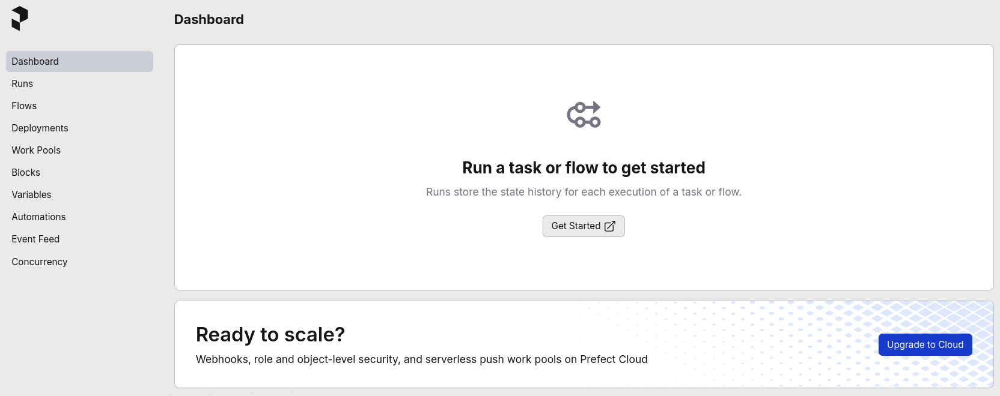

# Orquestração com Prefect

## Introdução

Na [aula anterior](intro-orchestration.md), exploramos os conceitos fundamentais de **orquestração de dados** e identificamos as limitações do **cron** para *pipelines* complexos. Agora é hora de colocar a mão na massa e experimentar uma ferramenta moderna de orquestração.

O **Prefect** se destaca por sua abordagem *Python-first*, oferecendo uma sintaxe adequada para desenvolvedores que já dominam Python.

!!! info "Info!"
    O **Prefect** foi projetado para ser amigável ao desenvolvedor, mantendo a simplicidade sem sacrificar a robustez.

Nesta aula prática, iremos:

- Configurar um ambiente de orquestração local com **Prefect**
- Criar e executar nossos primeiros *flows* e *tasks*
- Explorar a interface web para monitoramento
- Implementar *pipelines* com dependências e tratamento de erros

!!! exercise text long "Exercício"
    Com base no que aprendemos sobre orquestração, quais vantagens você espera encontrar ao usar **Prefect** em comparação com agendamento tradicional usando **cron**?

## Configurando o Ambiente

Vamos começar configurando um ambiente local do **Prefect** usando **Docker**.

Isso nos permite experimentar a ferramenta sem a necessidade de instalações complexas ou configurações de infraestrutura.

!!! exercise "Exercício"
    Crie uma nova pasta para esta parte da aula:

    <div class="termy">

    ```bash
    $ mkdir -p 06-intro-orchestration/03-prefect
    $ cd 06-intro-orchestration/03-prefect
    ```

    </div>

### Docker Compose

O **Prefect** oferece uma imagem **Docker** oficial que facilita a execução local. Vamos configurar um servidor **Prefect** usando **Docker Compose**.

!!! exercise "Exercício"
    Crie um arquivo `docker-compose.yml` com o seguinte conteúdo:

    ```yaml { .copy }
    services:
      prefect-server:
        image: prefecthq/prefect:3.4-python3.12
        container_name: prefect_server
        command: ["prefect", "server", "start"]
        environment:
          - PREFECT_SERVER_API_HOST=0.0.0.0
          - PREFECT_API_URL=http://127.0.0.1:4200/api
          - PREFECT_API_DATABASE_CONNECTION_URL=sqlite+aiosqlite:///prefect.db
        ports:
          - "4200:4200"
        volumes:
          - prefect_data:/root/.prefect
        user: "0:0"

    volumes:
      prefect_data:
    ```

    !!! info "Info!"
        Perceba que estamos utilizando **sqlite** como banco de dados para o Prefect.
        
        Isso é ótimo para desenvolvimento e testes locais, mas em produção, você deve considerar um banco de dados mais robusto.

!!! exercise "Exercício"
    Inicie o servidor Prefect:

    <div class="termy">

    ```bash
    $ docker compose up -d
    ```

    </div>

!!! exercise "Exercício"
    Verifique se o servidor está executando corretamente:

    <div class="termy">

    ```bash
    $ docker logs prefect_server -f
    ```

    </div>

    Você deve ver logs indicando que o servidor Prefect foi iniciado com sucesso.

!!! exercise "Exercício"
    Acesse a interface web do Prefect em seu navegador: [http://localhost:4200](http://localhost:4200)

    Você deve ver o dashboard do Prefect similar à imagem abaixo:

    

!!! exercise text short "Exercício"
    O que você observa na interface inicial do Prefect? Descreva brevemente o que vê no dashboard.

## Primeiro Flow

Agora vamos criar nosso primeiro *flow* com Prefect.

Um **flow** é a unidade principal de organização no **Prefect**, representando um conjunto de tarefas (**tasks**) que devem ser executadas.

### Instalação Local

Para desenvolver localmente, precisamos instalar o Prefect em nossa máquina.

!!! warning "Atenção!"
    Nosso esquema será:
    
    - O servidor **Prefect** rodando em **Docker**
    - Tarefas enviadas para o servidor via API.
        - Isto será rodado localmente (VS Code).
        - As tarefas serão definidas em arquivos Python.
        - Precisaremos de um ambiente virtual!

!!! exercise "Exercício"
    Crie um ambiente virtual utilizando a ferramenta de sua preferência e instale as dependências do projeto:

    **Arquivo `requirements.txt`**:
    ```text { .copy }
    prefect==3.4
    python-dotenv==1.1.1
    ```

    **Ambiente virtual com `uv`**
    <div class="termy">

    ```console
    $ uv venv --python 3.12 venv
    $ source venv/bin/activate
    $ uv pip install -r requirements.txt
    ```

    </div>

### Código Básico

!!! exercise "Exercício"
    Crie um arquivo `primeiro_flow.py` com o seguinte conteúdo:

    ```python { .copy }
    from prefect import flow, task
    from dotenv import load_dotenv

    load_dotenv(override=True)

    @task
    def mensagem_hello():
        return "Olá mundo"

    @flow
    def flow_hello():
        mensagem()

    if __name__ == "__main__":
        flow_hello()
    ```

!!! exercise "Exercício"
    Configure a URL da API do Prefect para conectar ao servidor Docker.

    Para isto, crie um arquivo `.env` contendo:

    ```env { .copy }
    PREFECT_API_URL=http://127.0.0.1:4200/api
    ```

    !!! note "Nota"
        Certifique-se de que o arquivo `.env` está no mesmo diretório que o seu script Python.

        Perceba que temos a chamada `load_dotenv(override=True)` no código para carregar essa variável de ambiente.

!!! exercise "Exercício"
    Execute o script:

    === "Com `uv`"
        <div class="termy">

        ```bash
        $ uv run primeiro_flow.py
        ```

        </div>
    
    === "Com `python`"
        <div class="termy">

        ```bash
        $ python primeiro_flow.py
        ```

        </div>

!!! exercise text short "Exercício"
    O que aconteceu no terminal após executar o script? Descreva a saída.

!!! exercise "Exercício"
    Agora acesse novamente a interface web do Prefect ([http://localhost:4200](http://localhost:4200)) e navegue até as seções:
    
    - **Dashboard**
    - **Runs**
    - **Flows**

## Explorando a Interface

A interface web do Prefect oferece visibilidade completa sobre a execução dos *flows*. Vamos explorar suas funcionalidades principais.

!!! exercise "Exercício"
    Efetue a correção do arquivo `primeiro_flow.py` com o seguinte conteúdo:

    ```python { .copy }
    from prefect import flow, task
    from dotenv import load_dotenv

    load_dotenv(override=True)

    @task
    def mensagem_hello():
        return "Olá mundo"

    @flow
    def flow_hello():
        mensagem_hello() # Alterou apenas aqui!

    if __name__ == "__main__":
        flow_hello()
    ```

    Execute novamente.
    
    Confira as mudanças refletidas no terminal e na interface.

!!! exercise "Exercício"
    Na interface do Prefect, clique no *flow run* que acabou de ser executado para ver os detalhes.

    Considere o *flow* executado com sucesso!

!!! exercise text short "Exercício"
    Quais informações você consegue ver sobre a execução do *flow*?

!!! exercise text short "Exercício"
    Há alguma representação visual do *flow* (como um grafo/DAG)? Descreva o que observa.

## Tarefas com Tempo de Execução

Vamos agora criar um exemplo mais realista, simulando tarefas que demandam tempo de processamento.

Isso nos permitirá observar melhor o comportamento do Prefect durante a execução.

!!! exercise "Exercício"
    Crie um arquivo `flow_processamento.py` com o seguinte conteúdo:

    ```python { .copy }
    from dotenv import load_dotenv
    from prefect import flow, task, get_run_logger
    import time
    import random

    load_dotenv(override=True)

    @task(task_run_name="mensagem(espera={espera}s)")
    def mensagem(espera: int):
        """Simula uma tarefa que espera um tempo aleatório"""
        time.sleep(espera)
        # Redireciona logs para o prefect
        logger = get_run_logger()
        msg = f"Esperou {espera} segundos"
        logger.info(msg)
        return msg

    @flow
    def flow_processamento_dummy():
        mensagem(random.randint(1, 8))
        mensagem(random.randint(1, 8))

    if __name__ == "__main__":
        flow_processamento_dummy()
    ```

!!! exercise "Exercício"
    Execute o novo script. Repita umas duas ou três vezes o comando:

    === "Com `uv`"
        <div class="termy">

        ```bash
        $ uv run flow_processamento.py
        ```

        </div>
    
    === "Com `python`"
        <div class="termy">

        ```bash
        $ python flow_processamento.py
        ```

        </div>

!!! exercise text short "Exercício"
    Quanto tempo demorou para a execução completa? Por que as duas tarefas não executaram em paralelo?

!!! exercise "Exercício"
    Acesse a interface web e examine os detalhes dessa nova execução. Observe particularmente:

    - O tempo total de execução
    - O tempo individual de cada tarefa
    - Os logs gerados

!!! exercise text long "Exercício"
    Compare a experiência de monitoramento no Prefect com o que seria possível usando apenas cron. Quais diferenças você identifica?

## Paralelização de Tarefas

Uma das grandes vantagens dos orquestradores é a capacidade de executar tarefas independentes em paralelo. Vamos modificar nosso *flow* para demonstrar essa funcionalidade.

!!! exercise "Exercício"
    Crie um arquivo `flow_paralelo.py`:

    ```python { .copy }
    from dotenv import load_dotenv
    from prefect import flow, task, get_run_logger
    import time
    import random

    load_dotenv(override=True)

    @task(task_run_name="processar_dados(id={dados_id})")
    def processar_dados(dados_id: int):
        # Simula processamento com tempo variável
        tempo_processamento = random.randint(2, 6)
        time.sleep(tempo_processamento)
        
        logger = get_run_logger()
        logger.info(f"Processamento {dados_id} finalizado em {tempo_processamento}s")
        
        return {
            "id": dados_id,
            "tempo_processamento": tempo_processamento,
            "resultado": f"dados_{dados_id}_processados"
        }

    @flow
    def flow_processamento_paralelo():
        # Lista para armazenar os futures das tarefas
        futures = []
        
        # Submete 4 tarefas para execução
        for i in range(1, 5):
            future = processar_dados.submit(i)
            futures.append(future)
        
        # Aguarda a conclusão de todas as tarefas
        resultados = [future.result() for future in futures]
        
        logger = get_run_logger()
        logger.info(f"Processamento finalizado. Resultados: {resultados}")
        
        return resultados

    if __name__ == "__main__":
        flow_processamento_paralelo()
    ```

!!! exercise "Exercício"
    Execute o script e observe o tempo total de execução:

    === "Com `uv`"
        <div class="termy">

        ```bash
        $ uv run flow_paralelo.py
        ```

        </div>
    
    === "Com `python`"
        <div class="termy">

        ```bash
        $ python flow_paralelo.py
        ```

        </div>

!!! exercise text short "Exercício"
    Qual foi o tempo total de execução? Foi menor que a soma dos tempos individuais das tarefas?

!!! exercise "Exercício"
    Na interface web, examine o gráfico de execução deste *flow*. Como as tarefas aparecem representadas visualmente?

## Dependências Entre Tarefas

Vamos agora implementar um *pipeline* mais realista com dependências entre tarefas, simulando um processo de ETL onde cada etapa depende da anterior.

!!! exercise "Exercício"
    Crie um arquivo `flow_dependencias.py`:

    ??? "`flow_dependencias.py`:"
        ```python { .copy }
        from dotenv import load_dotenv
        from prefect import flow, task, get_run_logger
        import time

        load_dotenv(override=True)

        @task
        def extrair_dados_vendas():
            logger = get_run_logger()
            logger.info("Iniciando extração de dados de vendas")
            
            # Simula extração de dados
            time.sleep(2)
            
            dados = [
                {"id": 1, "produto": "Notebook", "valor": 2500.00, "quantidade": 2},
                {"id": 2, "produto": "Mouse", "valor": 50.00, "quantidade": 5},
                {"id": 3, "produto": "Teclado", "valor": 150.00, "quantidade": 3}
            ]
            
            logger.info(f"Extraídos {len(dados)} registros de vendas")
            return dados

        @task
        def validar_dados(dados):
            logger = get_run_logger()
            logger.info("Iniciando validação de dados")
            
            # Simula validação
            time.sleep(1)
            
            dados_validos = []
            for item in dados:
                if item["valor"] > 0 and item["quantidade"] > 0:
                    dados_validos.append(item)
                    logger.info(f"Registro {item['id']} validado com sucesso")
                else:
                    logger.warning(f"Registro {item['id']} falhou na validação")
            
            return dados_validos

        @task
        def transformar_dados(dados):
            logger = get_run_logger()
            logger.info("Iniciando transformação de dados")
            
            # Simula transformação (cálculo de total)
            time.sleep(1)
            
            for item in dados:
                item["total"] = item["valor"] * item["quantidade"]
                logger.info(f"Produto {item['produto']}: Total = R$ {item['total']:.2f}")
            
            return dados

        @task
        def carregar_dados(dados):
            logger = get_run_logger()
            logger.info("Iniciando carregamento no Data Warehouse")
            
            # Simula carregamento
            time.sleep(2)
            
            logger.info(f"Carregados {len(dados)} registros no Data Warehouse")
            logger.info("Pipeline ETL finalizado com sucesso")
            
            return {"status": "success", "registros_carregados": len(dados)}

        @flow(name="Pipeline ETL Vendas")
        def pipeline_etl_vendas():
            # Definindo o pipeline com dependências
            dados_brutos = extrair_dados_vendas()
            dados_validos = validar_dados(dados_brutos)
            dados_transformados = transformar_dados(dados_validos)
            resultado = carregar_dados(dados_transformados)
            
            return resultado

        if __name__ == "__main__":
            pipeline_etl_vendas()
        ```

!!! exercise "Exercício"
    Execute o pipeline ETL:

    === "Com `uv`"
        <div class="termy">

        ```bash
        $ uv run flow_dependencias.py
        ```

        </div>
    
    === "Com `python`"
        <div class="termy">

        ```bash
        $ python flow_dependencias.py
        ```

        </div>

!!! exercise text short "Exercício"
    Quanto tempo demorou a execução total?

!!! exercise "Exercício"
    Na interface web, explore o *flow run* recém executado.
    
    Examine:
    
    - O grafo visual das dependências
    - Os logs de cada tarefa individual
    - O tempo de execução de cada etapa

!!! exercise text long "Exercício"
    Analisando o grafo visual do *pipeline*, como o **Prefect** representa as dependências entre as tarefas?
    
    Isso facilita o entendimento do *flow*?

## Tratamento de Erros

Uma das grandes vantagens dos orquestradores é o tratamento robusto de erros. Vamos simular falhas para observar como o Prefect lida com essas situações.

!!! exercise "Exercício"
    Crie um arquivo `flow_erros.py`:

    ??? "`flow_erros.py`"
        ```python { .copy }
        from dotenv import load_dotenv
        from prefect import flow, task, get_run_logger
        import time
        import random

        load_dotenv(override=True)

        @task(retries=3, retry_delay_seconds=2)
        def tarefa_instavel():
            logger = get_run_logger()
            
            # 60% de chance de falha
            if random.random() < 0.6:
                logger.error("Simulando falha na tarefa")
                raise Exception("Erro simulado - recurso indisponível")
            
            logger.info("Tarefa executada com sucesso")
            return "dados_processados"

        @task
        def tarefa_dependente(dados):
            logger = get_run_logger()
            logger.info(f"Processando dados recebidos: {dados}")
            time.sleep(1)
            return f"resultado_final_{dados}"

        @flow(name="Pipeline com Tratamento de Erros")
        def pipeline_com_erros():
            try:
                dados = tarefa_instavel()
                resultado = tarefa_dependente(dados)
                return resultado
            except Exception as e:
                logger = get_run_logger()
                logger.error(f"Pipeline falhou: {e}")
                return None

        if __name__ == "__main__":
            pipeline_com_erros()
        ```

!!! exercise "Exercício"
    Execute o script algumas vezes para observar o comportamento com falhas:

    === "Com `uv`"
        <div class="termy">

        ```bash
        $ uv run flow_erros.py
        ```

        </div>
    
    === "Com `python`"
        <div class="termy">

        ```bash
        $ python flow_erros.py
        ```

        </div>

!!! exercise text short "Exercício"
    Quantas tentativas (retries) foram feitas antes da tarefa ter sucesso ou falhar definitivamente?

!!! exercise "Exercício"
    Na interface web, examine as execuções que falharam. Como o Prefect apresenta as informações sobre:

    - Tentativas de retry
    - Mensagens de erro
    - Status final da execução

!!! exercise text long "Exercício"
    Liste algumas situações em que *retry* é um recurso interessante.
    
    !!! answer
        - Interações com APIs externas que podem falhar temporariamente.
        - Tarefas que dependem de recursos externos, como bancos de dados ou serviços de fila.

!!! exercise text long "Exercício"
    Como você implementaria esse mesmo tratamento de erros usando apenas cron? Quais seriam as dificuldades?

## Pipeline de Dados

Vamos agora criar um *pipeline* mais próximo da realidade, simulando um processo de **ETL** que poderia ser usado em produção.

!!! exercise "Exercício"
    Crie um arquivo `pipeline_vendas.py`:

    ??? "`pipeline_vendas.py`"
        ```python { .copy }
        from dotenv import load_dotenv
        from prefect import flow, task, get_run_logger
        import time
        import random
        from datetime import datetime, timedelta

        load_dotenv(override=True)

        @task
        def extrair_vendas_database():
            """Simula extração de dados do banco de vendas"""
            logger = get_run_logger()
            logger.info("Conectando ao banco de dados de vendas")
            
            # Simula tempo de extração
            time.sleep(2)
            
            # Dados simulados
            vendas = []
            for i in range(random.randint(10, 50)):
                venda = {
                    "id": i + 1,
                    "cliente_id": random.randint(1, 100),
                    "produto_id": random.randint(1, 20),
                    "quantidade": random.randint(1, 5),
                    "valor_unitario": round(random.uniform(10, 1000), 2),
                    "data_venda": (datetime.now() - timedelta(days=random.randint(0, 30))).isoformat()
                }
                vendas.append(venda)
            
            logger.info(f"Extraídas {len(vendas)} vendas do banco de dados")
            return vendas

        @task
        def validar_qualidade_dados(vendas):
            """Valida a qualidade dos dados extraídos"""
            logger = get_run_logger()
            logger.info("Iniciando validação de qualidade dos dados")
            
            vendas_validas = []
            problemas = 0
            
            for venda in vendas:
                # Validações básicas
                if (venda["quantidade"] > 0 and 
                    venda["valor_unitario"] > 0 and 
                    venda["cliente_id"] > 0):
                    vendas_validas.append(venda)
                else:
                    problemas += 1
                    logger.warning(f"Venda ID {venda['id']} falhou na validação")
            
            taxa_qualidade = (len(vendas_validas) / len(vendas)) * 100
            logger.info(f"Taxa de qualidade: {taxa_qualidade:.1f}% ({problemas} problemas encontrados)")
            
            if taxa_qualidade < 90:
                raise Exception(f"Taxa de qualidade muito baixa: {taxa_qualidade:.1f}%")
            
            return vendas_validas

        @task
        def aplicar_transformacoes(vendas):
            """Aplica transformações nos dados"""
            logger = get_run_logger()
            logger.info("Aplicando transformações nos dados")
            
            time.sleep(1)
            
            for venda in vendas:
                # Calcula valor total
                venda["valor_total"] = venda["quantidade"] * venda["valor_unitario"]
                
                # Categoriza venda por valor
                if venda["valor_total"] > 500:
                    venda["categoria"] = "alta"
                elif venda["valor_total"] > 100:
                    venda["categoria"] = "media"
                else:
                    venda["categoria"] = "baixa"
            
            logger.info(f"Transformações aplicadas em {len(vendas)} registros")
            return vendas

        @task
        def carregar_data_warehouse(vendas):
            """Carrega dados no Data Warehouse"""
            logger = get_run_logger()
            logger.info("Iniciando carregamento no Data Warehouse")
            
            # Simula carregamento
            time.sleep(3)
            
            # Estatísticas do carregamento
            total_valor = sum(v["valor_total"] for v in vendas)
            vendas_por_categoria = {}
            
            for venda in vendas:
                cat = venda["categoria"]
                vendas_por_categoria[cat] = vendas_por_categoria.get(cat, 0) + 1
            
            logger.info(f"Carregamento concluído:")
            logger.info(f"- Total de registros: {len(vendas)}")
            logger.info(f"- Valor total: R$ {total_valor:.2f}")
            logger.info(f"- Distribuição por categoria: {vendas_por_categoria}")
            
            return {
                "registros_carregados": len(vendas),
                "valor_total": total_valor,
                "distribuicao": vendas_por_categoria
            }

        @task
        def gerar_relatorio_execucao(resultado_carregamento):
            """Gera relatório final da execução"""
            logger = get_run_logger()
            
            relatorio = {
                "timestamp": datetime.now().isoformat(),
                "status": "sucesso",
                "metricas": resultado_carregamento
            }
            
            logger.info("=== RELATÓRIO DE EXECUÇÃO ===")
            logger.info(f"Timestamp: {relatorio['timestamp']}")
            logger.info(f"Status: {relatorio['status']}")
            logger.info(f"Registros processados: {resultado_carregamento['registros_carregados']}")
            
            return relatorio

        @flow(name="Pipeline ETL Vendas Completo", description="Pipeline completo de ETL para dados de vendas")
        def pipeline_etl_completo():
            # Extração
            vendas_brutas = extrair_vendas_database()
            
            # Validação
            vendas_validas = validar_qualidade_dados(vendas_brutas)
            
            # Transformação
            vendas_transformadas = aplicar_transformacoes(vendas_validas)
            
            # Carregamento
            resultado = carregar_data_warehouse(vendas_transformadas)
            
            # Relatório
            relatorio = gerar_relatorio_execucao(resultado)
            
            return relatorio

        if __name__ == "__main__":
            pipeline_etl_completo()
        ```

!!! exercise "Exercício"
    Execute o pipeline completo:

    === "Com `uv`"
        <div class="termy">

        ```bash
        $ uv run pipeline_vendas.py
        ```

        </div>
    
    === "Com `python`"
        <div class="termy">

        ```bash
        $ python pipeline_vendas.py
        ```

        </div>

!!! exercise text short "Exercício"
    Quantas tarefas foram executadas no total? Qual foi a duração total do pipeline?

!!! exercise "Exercício"
    Na interface web, analise a execução completa:

    - Examine o **DAG** gerado
    - Verifique os *logs* de cada tarefa
    - Observe as métricas de tempo

!!! exercise text long "Exercício"
    Agora que você viu um pipeline completo, quais vantagens da orquestração ficaram mais evidentes? Compare com uma implementação usando apenas scripts **Python** e **cron**.

## Executando Múltiplas Vezes

Para simular um ambiente mais próximo da produção, vamos executar o pipeline várias vezes e observar o histórico de execuções.

!!! exercise "Exercício"
    Execute o pipeline de vendas cinco vezes consecutivas:

    <div class="termy">

    ```bash
    $ for i in {1..5}; do python pipeline_vendas.py; sleep 10; done
    ```

    </div>

!!! exercise "Exercício"
    Na interface web, explore a seção **Flow Runs** e examine:

    - O histórico de todas as execuções
    - As diferentes durações de cada execução
    - Possíveis variações nos resultados

## Agendamento

Uma das funcionalidades mais importantes dos orquestradores é a capacidade de agendar execuções regulares de *pipelines*.

O **Prefect** oferece várias formas de configurar agendamentos, desde intervalos simples até expressões **cron**.

### Deployments

No **Prefect**, o agendamento é feito através de **deployments**. Um *deployment* é uma configuração que define como e quando um *flow* deve ser executado.

!!! exercise "Exercício"
    Primeiro, vamos criar um flow simples para agendar. Crie um arquivo `flow_para_agendar.py`:

    ??? "`flow_para_agendar.py`"
        ```python { .copy }
        from dotenv import load_dotenv
        from prefect import flow, task, get_run_logger
        import time
        from datetime import datetime

        load_dotenv(override=True)

        @task
        def processar_dados_diarios():
            """Simula processamento de dados diários"""
            logger = get_run_logger()
            logger.info(f"Executando processamento diário às {datetime.now().strftime('%H:%M:%S')}")
            
            # Simula processamento
            time.sleep(2)
            
            registros_processados = 100 + int(time.time() % 50)
            logger.info(f"Processados {registros_processados} registros")
            
            return registros_processados

        @flow(name="Pipeline Diário")
        def pipeline_diario():
            registros = processar_dados_diarios()
            
            logger = get_run_logger()
            logger.info(f"Pipeline diário executado com sucesso: {registros} registros processados")
            
            return {"timestamp": datetime.now().isoformat(), "registros": registros}

        if __name__ == "__main__":
            pipeline_diario()
        ```

!!! exercise "Exercício"
    Execute uma vez para testar:

    === "Com `uv`"
        <div class="termy">

        ```bash
        $ uv run flow_para_agendar.py
        ```

        </div>
    
    === "Com `python`"
        <div class="termy">

        ```bash
        $ python flow_para_agendar.py
        ```

        </div>

### Criando um Deployment

Agora vamos criar um *deployment* que executará nosso *flow* automaticamente em intervalos regulares.

!!! exercise "Exercício"
    Crie um arquivo `deploy_pipeline.py` para configurar o agendamento:

    ```python { .copy }
    from prefect import serve
    from datetime import timedelta
    from flow_para_agendar import pipeline_diario

    if __name__ == "__main__":
        # Cria um deployment com agendamento de 30 segundos
        deployment = pipeline_diario.to_deployment(
            name="pipeline-diario-30s",
            interval=timedelta(seconds=30),
            description="Pipeline que executa a cada 30 segundos"
        )
        
        # Inicia o serviço que executará o deployment
        serve(deployment)
    ```

!!! exercise "Exercício"
    Execute o deployment em background:

    === "Com `uv`"
        <div class="termy">

        ```bash
        $ uv run deploy_pipeline.py &
        ```

        </div>
    
    === "Com `python`"
        <div class="termy">

        ```bash
        $ python deploy_pipeline.py &
        ```

        </div>

    Isso iniciará um worker que executará o pipeline a cada 30 segundos.

!!! exercise "Exercício"
    Acesse a interface web do Prefect e observe:
    - Na seção **Deployments**, você deve ver o deployment criado
    - Na seção **Flow Runs**, você verá execuções sendo criadas automaticamente

!!! exercise text short "Exercício"
    Quantas execuções foram criadas após 2 minutos? O agendamento está funcionando corretamente?

### Agendamento com Cron

O Prefect também suporta expressões cron tradicionais para agendamentos mais complexos.

!!! exercise "Exercício"
    Crie um arquivo `deploy_cron.py`:

    ```python { .copy }
    from prefect import serve
    from flow_para_agendar import pipeline_diario

    if __name__ == "__main__":
        # Deployment que executa a cada 2 minutos usando cron
        deployment_cron = pipeline_diario.to_deployment(
            name="pipeline-diario-cron",
            cron="*/2 * * * *",  # A cada 2 minutos
            description="Pipeline agendado via expressão cron"
        )
        
        serve(deployment_cron)
    ```

!!! exercise text short "Exercício"
    O que significa a expressão cron `*/2 * * * *`? Compare com o que aprendemos sobre cron na aula anterior.

!!! exercise "Exercício"
    Pare o deployment anterior (Ctrl+C no terminal) e execute o novo:

    === "Com `uv`"
        <div class="termy">

        ```bash
        $ uv run deploy_cron.py &
        ```

        </div>
    
    === "Com `python`"
        <div class="termy">

        ```bash
        $ python deploy_cron.py &
        ```

        </div>

### Múltiplos Agendamentos

Podemos ter múltiplos *deployments* do mesmo *flow* com agendamentos diferentes.

!!! exercise "Exercício"
    Crie um arquivo `deploy_multiplos.py`:

    ```python { .copy }
    from prefect import serve
    from datetime import timedelta
    from flow_para_agendar import pipeline_diario

    if __name__ == "__main__":
        # Deployment 1: A cada 45 segundos
        deployment_rapido = pipeline_diario.to_deployment(
            name="pipeline-rapido",
            interval=timedelta(seconds=45),
            description="Execução rápida para testes"
        )
        
        # Deployment 2: A cada 3 minutos
        deployment_lento = pipeline_diario.to_deployment(
            name="pipeline-lento", 
            cron="*/3 * * * *",
            description="Execução mais espaçada"
        )
        
        # Inicia ambos os deployments
        serve(deployment_rapido, deployment_lento)
    ```

!!! exercise "Exercício"
    Execute os múltiplos deployments:

    === "Com `uv`"
        <div class="termy">

        ```bash
        $ uv run deploy_multiplos.py &
        ```

        </div>
    
    === "Com `python`"
        <div class="termy">

        ```bash
        $ python deploy_multiplos.py &
        ```

        </div>

!!! exercise "Exercício"
    Na interface web, observe:

    - Dois deployments diferentes na seção **Deployments**
    - Execuções intercaladas com frequências diferentes
    - Como o Prefect distingue as execuções de cada deployment

!!! exercise text short "Exercício"
    Qual deployment executa com mais frequência? Como isso aparece no histórico de execuções?

### Agendamento Personalizado

Para cenários mais complexos, podemos criar agendamentos personalizados.

!!! exercise "Exercício"
    Crie um arquivo `deploy_personalizado.py`:

    ```python { .copy }
    from prefect import serve
    from flow_para_agendar import pipeline_diario

    if __name__ == "__main__":
        # Simula agendamento de horário comercial (9h às 18h, segunda a sexta)
        deployment_comercial = pipeline_diario.to_deployment(
            name="pipeline-horario-comercial",
            cron="0 9-18 * * 1-5",  # Todo hora das 9h às 18h, seg-sex
            description="Pipeline executado apenas em horário comercial"
        )
        
        # Para fins de demonstração, vamos usar um agendamento mais frequente
        deployment_demo = pipeline_diario.to_deployment(
            name="pipeline-demo-comercial",
            cron="*/1 * * * *",  # A cada minuto para demonstração
            description="Demo do pipeline comercial"
        )
        
        serve(deployment_demo, deployment_comercial)
    ```

!!! exercise text short "Exercício"
    Como você interpretaria a expressão cron `0 9-18 * * 1-5`? Quebre cada campo e explique.

!!! exercise "Exercício"
    Execute o deployment personalizado:

    === "Com `uv`"
        <div class="termy">

        ```bash
        $ uv run deploy_personalizado.py &
        ```

        </div>
    
    === "Com `python`"
        <div class="termy">

        ```bash
        $ python deploy_personalizado.py &
        ```

        </div>

    Observe as execuções por alguns minutos na interface web.

    Confira as próximas execuções na aba **Upcoming**.


!!! tip "Parando Deployments"
    Para parar os deployments em execução, use Ctrl+C nos terminais onde estão rodando, ou mate os processo no gerenciador de tarefas!

!!! exercise text long "Exercício"
    Compare a experiência de agendamento no Prefect com **cron**. Quais vantagens você identifica no uso de deployments do Prefect?

### Pipeline Incremental com Agendamento

Um padrão comum em produção é agendar pipelines que executam regularmente, mas que possuem lógica condicional para processar apenas quando há dados novos disponíveis.

!!! exercise "Exercício"
    Crie um arquivo `pipeline_incremental.py`:

    ```python { .copy }
    from dotenv import load_dotenv
    from prefect import flow, task, get_run_logger
    import time
    from datetime import datetime

    load_dotenv(override=True)

    @task
    def verificar_novos_dados():
        """Verifica se há novos dados para processar"""
        logger = get_run_logger()
        logger.info("Verificando disponibilidade de novos dados...")
        
        # Simula verificação de novos dados
        time.sleep(1)
        
        # Simula presença de dados (70% de chance)
        tem_dados = time.time() % 10 < 7
        
        if tem_dados:
            logger.info("✅ Novos dados detectados - prosseguindo com pipeline")
            return True
        else:
            logger.info("ℹ️  Nenhum dado novo encontrado - pulando execução")
            return False

    @task
    def processar_dados_incrementais():
        """Processa apenas dados novos"""
        logger = get_run_logger()
        logger.info("Iniciando processamento de dados incrementais...")
        
        time.sleep(3)
        
        # Simula quantidade variável de registros
        registros_novos = int(50 + (time.time() % 100))
        logger.info(f"Processados {registros_novos} novos registros")
        
        return registros_novos

    @task
    def atualizar_controle():
        """Atualiza controles de última execução"""
        logger = get_run_logger()
        timestamp = datetime.now().isoformat()
        logger.info(f"Controle atualizado: última execução em {timestamp}")
        return timestamp

    @flow(name="Pipeline Incremental Agendado")
    def pipeline_incremental_agendado():
        """Pipeline que executa regularmente mas processa apenas dados novos"""
        
        # Sempre verifica se há dados novos
        tem_dados = verificar_novos_dados()
        
        if tem_dados:
            # Processa os dados
            registros = processar_dados_incrementais()
            
            # Atualiza controles
            timestamp_controle = atualizar_controle()
            
            logger = get_run_logger()
            logger.info(f"✅ Pipeline executado com sucesso: {registros} registros processados")
            
            return {
                "status": "processado",
                "registros": registros,
                "timestamp": timestamp_controle
            }
        else:
            logger = get_run_logger()
            logger.info("⏭️  Pipeline pulado - sem dados novos para processar")
            
            return {
                "status": "pulado",
                "registros": 0,
                "timestamp": datetime.now().isoformat()
            }

    if __name__ == "__main__":
        resultado = pipeline_incremental_agendado()
        print(f"Resultado: {resultado}")
    ```

!!! exercise "Exercício"
    Teste o pipeline incremental algumas vezes manualmente:

    === "Com `uv`"
        <div class="termy">

        ```bash
        $ uv run pipeline_incremental.py
        ```

        </div>
    
    === "Com `python`"
        <div class="termy">

        ```bash
        $ python pipeline_incremental.py
        ```

        </div>

!!! exercise text short "Exercício"
    Observe as diferentes execuções. Algumas foram puladas por não haver dados novos? Como isso aparece nos logs?

!!! exercise "Exercício"
    Agora vamos agendar este pipeline para executar automaticamente. Crie um arquivo `deploy_incremental.py`:

    ```python { .copy }
    from prefect import serve
    from datetime import timedelta
    from pipeline_incremental import pipeline_incremental_agendado

    if __name__ == "__main__":
        # Deployment que executa a cada 45 segundos
        deployment_incremental = pipeline_incremental_agendado.to_deployment(
            name="pipeline-incremental-automatico",
            interval=timedelta(seconds=45),
            description="Pipeline que verifica e processa dados incrementais automaticamente"
        )
        
        serve(deployment_incremental)
    ```

!!! exercise "Exercício"
    Execute o deployment incremental:

    === "Com `uv`"
        <div class="termy">

        ```bash
        $ uv run deploy_incremental.py
        ```

        </div>
    
    === "Com `python`"
        <div class="termy">

        ```bash
        $ python deploy_incremental.py
        ```

        </div>

    Deixe executar por alguns minutos e observe na interface web.

    Confira também a aba **Upcoming**.

!!! exercise "Exercício"
    Na interface web, analise o comportamento do pipeline incremental:

    - Quantas execuções foram "processadas" *vs* "puladas"?
    - Como os *logs* diferenciam os dois cenários?
    - Observe os diferentes tempos de execução

!!! tip "Dica!"
    Este padrão de *"pipeline agendado com lógica condicional"* é muito comum em produção.

## Monitoramento e Observabilidade

Uma das principais vantagens da orquestração é a **observabilidade** completa dos processos.

Vamos explorar as capacidades de monitoramento do Prefect.

!!! exercise "Exercício"
    Na interface web do Prefect, explore as seguintes seções:

    - **Flows**: Lista todos os *flows* criados
    - **Flow Runs**: Histórico de execuções
    - **Task Runs**: Detalhes de cada tarefa executada

!!! exercise text long "Exercício"
    Quais métricas e informações você considera mais úteis para monitorar um pipeline em produção? O Prefect fornece essas informações?

!!! exercise "Exercício"
    Execute novamente um dos pipelines anteriores e, enquanto ele executa, observe em tempo real:

    - O status da execução na interface web
    - Os logs sendo gerados
    - A progressão através das tarefas

## Comparação com Cron

Agora que experimentamos o Prefect, vamos refletir sobre as diferenças práticas em relação ao agendamento tradicional.

!!! exercise text long "Exercício"
    Considerando sua experiência com ambas as abordagens, liste pelo menos 3 vantagens específicas que observou ao usar Prefect em comparação com cron.

!!! exercise text long "Exercício"
    Em que cenários você ainda consideraria usar cron ao invés de um orquestrador como Prefect? Explique seu raciocínio.

## Experimentação Livre

Agora é sua vez de experimentar e criar algo único!

!!! exercise "Exercício"
    Escolha uma das opções abaixo ou crie algo próprio:

    **Opção 1: Pipeline de Análise de Logs**

    - Criar tarefas que simulem leitura de arquivos de log
    - Implementar validação e limpeza dos dados
    - Gerar estatísticas e alertas

    **Opção 2: Pipeline de Machine Learning**

    - Simular carregamento de dados de treinamento
    - Implementar pré-processamento
    - Simular treinamento de modelo
    - Validar resultados

    **Opção 3: Pipeline de Monitoramento**

    - Verificar status de serviços externos (APIs)
    - Coletar métricas de performance
    - Gerar alertas baseados em thresholds

!!! exercise text long "Exercício"
    Após implementar seu pipeline customizado, descreva:
    - Qual problema seu pipeline resolve
    - Como você estruturou as dependências
    - Que tipo de tratamento de erro implementou
    - Quais melhorias faria para uso em produção

## Limpeza

Para finalizar a aula, vamos fazer a limpeza do ambiente.

!!! exercise "Exercício"
    Pare e remova os containers do Prefect:

    !!! warning "Atenção!"
        A opção `-v` remove também os volumes, apagando todos os dados salvos (histórico do **Prefect**).

        Como estamos em uma aula, para poupar espaço do seu disco, é ok apagar!

    <div class="termy">

    ```bash
    $ docker compose down -v
    ```

    </div>

Por hoje é só!

Na próxima aula, exploraremos como integrar essas ferramentas em arquiteturas de dados mais complexas.