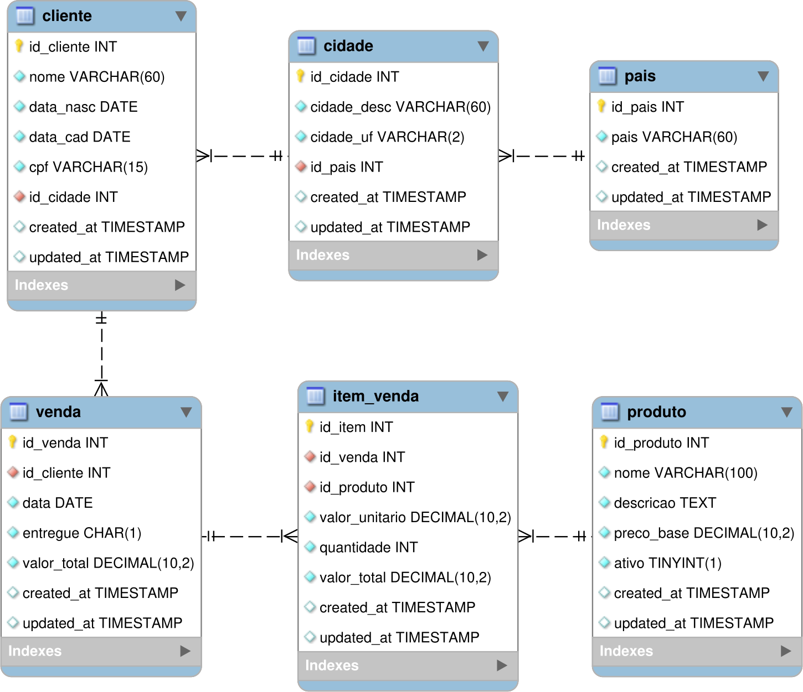

# Modelagem de Dados

## Introdução

**Modelagem de dados** é o processo de *design* utilizado para estruturar e representar informações de forma lógica antes de sua implementação em um sistema de armazenamento.

Isso envolve definir quais dados são importantes, como se relacionam entre si e de que maneira podem ser organizados (por exemplo, em entidades, atributos e relacionamentos).

A modelagem apoia a construção de bancos de dados mais **consistentes** e **fáceis de usar**, auxiliando para que as áreas técnicas possam atender melhor às necessidades de negócio.

!!! info "Importante!"
    Uma modelagem adequada pode **reduzir redundância**, ou propiciar **melhor desempenho** em *analytics*!

Existem diversas técnicas de modelagem de dados. Nesta aula, exploraremos algumas delas!

## Modelagem relacional

A **modelagem relacional** foi desenvolvida por Edgar F. Codd em 1970 e representa uma das abordagens fundamentais para organizar dados em sistemas de informação.

Esta técnica estrutura os dados em tabelas interconectadas, onde cada tabela é composta por linhas (registros ou tuplas) e colunas (campos ou atributos).

O processo de **modelagem relacional** geralmente é iniciado pela criação de um diagrama entidade-relacionamento (ER). Este diagrama fornece uma representação visual de alto nível da estrutura do banco de dados, mostrando as entidades (dados) e os relacionamentos entre elas.

Uma vez concluído o diagrama ER, você pode construir um modelo relacional mais detalhado que represente as tabelas e colunas reais do banco de dados.

Como exemplo, considere a representação do **diagrama do modelo relacional** para o banco de dados de `vendas`, utilizado na [aula 03](../03-data-warehouse/pratica.md):

!!! info "Info!"
    Na [aula 03](../03-data-warehouse/pratica.md) vimos como estruturar um *Data Warehouse*.
    
    Nossa fonte foi um banco de dados fictício de vendas, representado no modelo relacional abaixo.

## Normalização e Formas Normais

Um modelo relacional geralmente utiliza um esquema de banco de dados **normalizado**, onde os dados são armazenados em um **local único** e organizados em múltiplas tabelas com **relacionamentos** definidos entre elas.

A **normalização** é um conjunto de regras aplicadas para decompor um banco de dados complexo em tabelas **menores** e **mais simples**. O objetivo é **minimizar redundância**, melhorar a **integridade dos dados** e tornar o banco de dados mais **eficiente** e **fácil de manter**.

A normalização é aplicada em níveis progressivos, conhecidos como **formas normais**. Vamos explorar as três primeiras formas normais, que são as mais comuns e amplamente utilizadas.

#### Primeira Forma Normal (`1NF`)

Uma tabela está na primeira forma normal se satisfaz a seguinte condição:

- **Cada atributo contém um valor único**: Cada coluna deve armazenar apenas um valor, não uma **lista de valores**

!!! info "Info!"
    Os valores devem ser **atômicos**, ou seja, indivisíveis!

!!! exercise choice "Question"
    Considere uma tabela `pedidos` com as colunas: `id_pedido`, `cliente`, `produtos` (onde `produtos` contém *"Produto A, Produto B, Produto C"*). Esta tabela está na primeira forma normal?

    - [ ] Sim, pois possui uma chave primária
    - [X] Não, pois a coluna `produtos` viola a atomicidade
    - [ ] Sim, pois não há grupos repetitivos
    - [ ] Depende do tipo de dados da coluna `produtos`

    !!! answer "Answer"
        A tabela **não está** na **1NF** porque a coluna `produtos` contém **múltiplos valores** em uma única célula, violando o princípio da atomicidade. Cada produto deveria estar em uma linha separada.

#### Segunda Forma Normal (`2NF`)

Uma tabela está na segunda forma normal se satisfaz todas as condições da **1NF**, além de:

- **Dependência funcional total**: Todo atributo não-chave deve depender completamente da chave primária, não apenas de parte dela.

Considere a seguinte tabela (`funcionario_departamento`) que registra a alocação de **funcionários em departamentos** dentro de uma empresa, bem como o respectivo **salário acordado**:

| id_funcionario (PK)  | id_departamento (PK)  | nome_funcionario | nome_departamento | salario   |
|----------------------|-----------------------|------------------|-------------------|-----------|
| 101                  | 501                   | Alice            | Engenharia        | 9000.00   |
| 101                  | 502                   | Alice            | Pesquisa          | 9500.00   |
| 102                  | 501                   | Bruno            | Engenharia        | 8800.00   |

O objetivo dessa tabela é **registrar em quais departamentos cada funcionário atua** e **qual o salário acordado para aquela alocação específica**.  

!!! info "Info!"
    Perceba que um funcionário pode estar associado a mais de um departamento, com salários diferentes.

!!! exercise choice "Question"
    A tabela `funcionario_departamento` está na **1NF**?

    - [X] Sim
    - [ ] Não

    !!! answer "Resposta"
        Todos os atributos possuem valores atômicos, não existem *arrays* ou campos multivalorados.

!!! exercise choice "Question"
    A tabela `funcionario_departamento` está na **2NF**?

    - [ ] Sim
    - [X] Não

    !!! answer "Resposta"
        A chave primária é composta por (`id_funcionario`, `id_departamento`)

        - A dependência $\{\text{id_funcionario}, \text{id_departamento}\} \rightarrow \{\text{salario}\}$ está correta.  
        - Entretanto, observamos dependências **parciais**:
            - $\{\text{id_funcionario}\} \rightarrow \{\text{nome_funcionario}\}$  
            - $\{\text{id_departamento}\} \rightarrow \{\text{nome_departamento}\}$  
        
        Como essas dependências não dependem da chave composta inteira, então viola a **2NF**.

#### Terceira Forma Normal (`3NF`)

Uma tabela está na terceira forma normal se satisfaz todas as condições da **1NF** e **2NF**, além de:

- **Eliminação de dependências transitivas**: Todo atributo não-chave deve relacionar-se diretamente com a chave primária, não através de outro atributo

Considere a seguinte tabela  (`emprestimo`) que registra **empréstimos de livros em uma biblioteca**:

| id_emprestimo (PK)  | data_emprestimo | id_livro | titulo_livro        | autor        |
|---------------------|-----------------|----------|---------------------|--------------|
| 2001                | 2025-09-01      | 301      | Dom Casmurro        | Machado A.   |
| 2002                | 2025-09-02      | 302      | A Hora da Estrela   | Clarice L.   |
| 2003                | 2025-09-03      | 301      | Dom Casmurro        | Machado A.   |

!!! info "Info!"
    O objetivo é registrar cada **empréstimo** realizado, considerando um livro por empréstimo.

!!! exercise choice "Question"
    A tabela `emprestimo` está na **1NF**?

    - [X] Sim
    - [ ] Não

!!! exercise choice "Question"
    A tabela `emprestimo` está na **2NF**?

    - [X] Sim
    - [ ] Não

!!! exercise choice "Question"
    A tabela `emprestimo` está na **3NF**?

    - [ ] Sim
    - [X] Não

    !!! answer "Resposta"
        Não!

        A tabela `emprestimo` possui dependências transitivas:

        - $\{\text{id_livro}\} \rightarrow \{\text{titulo_livro}, \text{autor}\}$

        Isso significa que atributos não-chave dependem de outros atributos não-chave, violando a **3NF**.

!!! exercise text long "Question"
    Como você faria para normalizar a tabela `emprestimo` para que esteja na **3NF**?

    !!! answer "Resposta"

        Podemos separar a tabela `emprestimo` em duas tabelas:

        **Tabela 1 — `emprestimo`**

        | id_emprestimo (PK) | data_emprestimo | id_livro (FK) |
        |--------------------|-----------------|---------------|
        | 2001               | 2025-09-01      | 301           |
        | 2002               | 2025-09-02      | 302           |
        | 2003               | 2025-09-03      | 301           |

        **Tabela 2 — `livro`**

        | id_livro (PK) | titulo_livro        | autor        |
        |---------------|---------------------|--------------|
        | 301           | Dom Casmurro        | Machado A.   |
        | 302           | A Hora da Estrela   | Clarice L.   |

A normalização busca garantir a integridade dos dados. Esta característica torna os modelos relacionais normalizados especialmente adequados para sistemas **OLTP** (*Online Transaction Processing*), onde a consistência e integridade dos dados são prioritárias em relação à velocidade de consultas analíticas complexas.

Porém, manter uma base normalizada na **3NF** pode tornar as consultas mais demoradas, pois frequentemente é necessário unir (**JOIN**) múltiplas tabelas para recuperar os dados desejados. Na próxima página, exploraremos alternativas mais adequadas, especialmente para **OLAP**.

!!! exercise text long
    Por que a normalização até a terceira forma normal (**3NF**) é considerada o objetivo padrão para bancos **OLTP**?

    Quais são os *trade-offs* envolvidos?

    !!! answer "Resposta"
        A **3NF** é o padrão para OLTP porque:

        - **Integridade**: Elimina redundância e inconsistências
        - **Manutenibilidade**: Facilita atualizações sem anomalias
        - **Consistência**: Garante que alterações sejam feitas em um único local

        **Trade-offs**:

        - **Performance**: Pode exigir mais **JOINs** para consultas complexas
        - **Complexidade**: Aumenta o número de tabelas no modelo

!!! exercise text short
    Você consegue pensar em um cenário onde a normalização até a terceira forma normal (**3NF**) não seria benéfica, mesmo em bancos **OLTP**?