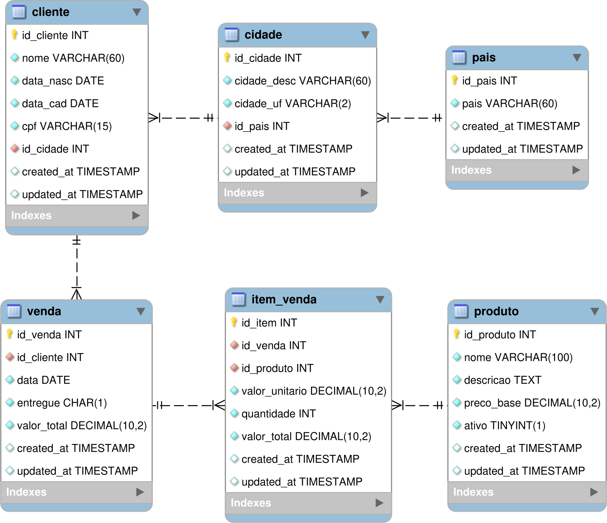

# One Big Table (OBT)

## Relembrando a aula 03

Na aula 03, quando fizemos a implementação do nosso **Data Warehouse (DW)**, foi preciso decidir como organizar os dados no **DW**.

!!! exercise text long
    Como definimos o modelo de dados do **DW**?

    Como ele se diferenciava do modelo de dados operacional (**PostgreSQL OLTP**)?

    !!! answer
        Nós removemos as chaves estrangeiras e a obrigatoriedade de alguns atributos.

        Ademais, a estrutura foi mantida.

!!! exercise text long
    O que você acha de mantermos a estrutura do **DW** quase idêntia à do banco operacional?

    !!! answer
        O padrão de acesso **OLTP** geralmente envolve transações rápidas e de curto prazo, envolvendo poucas linhas.

        Por outro lado, o **DW** é otimizado para **OLAP**, envolvendo consultas complexas, acesso colunar e com grande volume de dados.

        Portanto, manter a estrutura idêntica pode não ser a melhor abordagem para atender a essas diferentes necessidades.

Conforme os dados forem disponibilizados para análise no **DW**, *queries* complexas podem demandar a junção de diversas tabelas, as quais podem conter grande volume de dados. Isto será computacionalmente custoso, especialmente quando o **DW** crescer em volume de dados e complexidade estrutural.

Uma solução possível é o uso do padrão **One Big Table (OBT)**.

## O que é One Big Table (OBT)?

A abordagem **One Big Table (OBT)** representa uma estratégia de modelagem onde todos os dados relevantes para análise são consolidados em uma única tabela **desnormalizada**.

!!! info "Info"
    Desnormalização é o processo de, intencionalmente, adicionar **redundância** a um banco de dados previamente normalizado para **melhorar o desempenho de leitura**, através da combinação de tabelas ou **duplicação** de dados!

Esta técnica surgiu como uma resposta às limitações de performance em consultas analíticas que envolvem múltiplos `JOINs` entre tabelas normalizadas.

!!! abstract "Resumo!"
    Em um modelo **OBT**, ao invés de manter dados distribuídos em várias tabelas relacionais, todas as informações necessárias são combinadas em uma única estrutura tabular.

    Isso elimina a necessidade de operações custosas de `JOIN` durante as consultas analíticas.

## Exemplo

Vamos ilustrar o conceito de OBT com um exemplo de dados hospitalares.

### Tabelas Originais

#### Tabela: `paciente`

| id_paciente | nome         | uf       |
|-------------|--------------|----------|
| 1           | Carla Dias   | SP       |
| 2           | Lucas Prado  | RJ       |

#### Tabela: `medico`

| id_medico | nome_medico  | especialidade |
|-----------|--------------|---------------|
| 10        | Dr. Silva    | Cardiologia   |
| 20        | Dra. Souza   | Pediatria     |

#### Tabela: `atendimento`

| id_atendimento | id_paciente | id_medico | data        | procedimento |
|----------------|-------------|-----------|-------------|--------------|
| 1001           | 1           | 10        | 2025-08-01  | Consulta     |
| 1002           | 2           | 20        | 2025-08-02  | Exame        |
| 1003           | 1           | 20        | 2025-08-03  | Vacina       |

### Tabela OBT Resultante

| id_atendimento | data      | nome_paciente | uf    | nome_medico | especialidade | procedimento |
|----------------|-----------|---------------|-------|-------------|---------------|--------------|
| 1001           | 2025-08-01| Carla Dias    | SP    | Dr. Silva   | Cardiologia   | Consulta     |
| 1002           | 2025-08-02| Lucas Prado   | RJ    | Dra. Souza  | Pediatria     | Exame        |
| 1003           | 2025-08-03| Carla Dias    | SP    | Dra. Souza  | Pediatria     | Vacina       |

Assim, todas as informações relevantes para análise de atendimentos estão consolidadas em uma única tabela, eliminando a necessidade de JOINs.

!!! info "Conceito Fundamental"
    O **OBT** prioriza **performance de leitura** sobre **otimização de armazenamento**, sendo especialmente útil em cenários de **OLAP** onde a velocidade das consultas é crítica.

## Contexto Histórico

O conceito de **OBT** ganhou popularidade com o advento do **Big Data** e ferramentas de processamento distribuído como **Hadoop** e **Spark**. Com a queda do custo de armazenamento e a necessidade crescente de análises em tempo real, a redundância de dados tornou-se um *trade-off* aceitável em muitos cenários.

A abordagem também se tornou viável com o desenvolvimento de **sistemas de armazenamento colunar** como **Parquet**, que consegue comprimir dados redundantes de forma eficiente, minimizando o impacto do aumento no volume de dados.

## Vantagens da Abordagem OBT

Dentre as vantagens do uso de **OBT**, podemos citar:

- **Performance de Consultas**: A principal vantagem do OBT é a **eliminação de JOINs** complexos. Em um **DW** tradicional, uma consulta simples pode requerer junções entre múltiplas tabelas, criando gargalos de performance significativos.

- **Simplicidade de Consultas**: Analistas e cientistas de dados podem escrever consultas mais diretas, sem precisar compreender relações complexas entre tabelas ou memorizar esquemas de junção.

- **Otimização para Ferramentas de BI**: Muitas ferramentas **Business Intelligence** trabalham melhor com estruturas desnormalizadas, aproveitando otimizações internas quando os dados estão em formato *flat*.

- **Paralelização**: Em ambientes distribuídos, consultas em uma única tabela podem ser facilmente paralelizadas e distribuídas entre múltiplos nós de processamento.

!!! exercise choice "Question"
    Qual é a principal vantagem de performance do modelo **OBT** em relação a modelos normalizados?

    - [ ] Menor uso de memória
    - [X] Eliminação de operações JOIN
    - [ ] Menor volume de dados
    - [ ] Maior segurança dos dados

## Desvantagens da Abordagem OBT

Mas o uso de **OBT** também apresenta desvantagens que devem ser consideradas. Dentre elas:

- **Redundância de Dados**: A desnormalização resulta em **duplicação massiva** de informações. Dados que antes apareciam uma única vez em tabelas normalizadas agora são replicados em cada linha da **OBT**.

- **Maior Consumo de Armazenamento**: O volume de dados pode crescer significativamente, resultando em maiores custos de armazenamento e backup.

- **Maior Complexidade de Atualização**: Quando um dado mestre é alterado (como o nome de um cliente), essa mudança precisa ser propagada para **todas as linhas** da **OBT** onde esse cliente aparece, tornando as atualizações mais complexas e custosas.

!!! info "Info!"
    Em muitos casos, a **OBT** é *append-only*.

- **Potencial Inconsistência**: A redundância aumenta o risco de **inconsistências**, especialmente se o processo de **ETL** não for bem projetado ou se houver falhas na sincronização dos dados.

- **Gestão de Migrações**: Alterações no modelo de dados podem exigir migrações complexas, uma vez que a estrutura desnormalizada pode não se adaptar facilmente a mudanças.

## Quando Usar OBT?

A decisão de implementar um OBT deve considerar diversos fatores:

- **Cenários Adequados:**
    - **Análises frequentes** que sempre envolvem os mesmos conjuntos de dados
    - **Relatórios padronizados** com consultas previsíveis
    - Ambientes onde a **performance de leitura** é mais crítica que eficiência de armazenamento
    - **Data marts** específicos para áreas de negócio

- **Cenários Inadequados:**
    - Dados com **alta frequência de atualização**
    - Ambientes com **recursos limitados** de armazenamento
    - Casos onde a **consistência transacional** é crítica
    - Sistemas principalmente **OLTP**

## Implementando OBT

Vamos trabalhar com a transformação do nosso modelo de vendas normalizado em uma OBT. Primeiro, vamos relembrar a estrutura original:



### Projetando a OBT

Para criar nossa **OBT**, precisamos identificar qual será o **grão** (**granularidade**) da tabela.

No nosso caso, o grão natural seria **cada item vendido**, pois representa o nível mais detalhado de informação disponível.

!!! exercise text short
    Por que escolhemos **"item vendido"** como grão da **OBT** ao invés de **"venda"**?

    !!! answer
        Porque uma venda pode conter múltiplos produtos.
        
        Se usássemos **"venda"** como grão, perderiamos o **detalhamento por produto**!

### Campos da OBT de Vendas

Nossa OBT incluirá todos os campos necessários para análises de vendas, eliminando a necessidade de JOINs:

- **Informações da Venda:** `id_venda`, `data_venda`, `entregue`, `valor_total_venda`

- **Informações do Item:** `id_item`, `quantidade`, `valor_unitario`, `valor_total_item`

- **Informações do Produto:** `id_produto`, `nome_produto`, `descricao_produto`, `preco_base`

- **Informações do Cliente:** `id_cliente`, `nome_cliente`, `data_nasc`, `data_cad`, `cpf`

- **Informações Geográficas:** `cidade`, `uf`, `pais`

!!! exercise choice "Question"
    Quantas vezes os dados do cliente "João Silva" aparecerão na **OBT** se ele fez 5 compras com 3 itens cada?

    - [ ] 1 vez
    - [ ] 5 vezes
    - [ ] 3 vezes
    - [X] 15 vezes
    - [ ] Depende dos produtos

## Criando a OBT na Prática

A transformação do modelo normalizado para **OBT**, usando **SQL**, pode ser representada pela seguinte *query*:

!!! warning "Atenção"
    Esta é uma versão refatorada, o nome dos atributos (colunas) pode não bater com o utilizado na aula 03.

```sql { .copy }
    -- Criação da OBT de Vendas
    CREATE TABLE obt_vendas AS
    SELECT 
        -- Informações da venda
        v.id_venda,
        v.data as data_venda,
        v.entregue,
        v.valor_total as valor_total_venda,
        
        -- Informações do item
        iv.id_item,
        iv.quantidade,
        iv.valor_unitario,
        iv.valor_total as valor_total_item,
        
        -- Informações do produto
        p.id_produto,
        p.nome as nome_produto,
        p.descricao as descricao_produto,
        p.preco_base,
        p.ativo as produto_ativo,
        
        -- Informações do cliente
        c.id_cliente,
        c.nome as nome_cliente,
        c.data_nasc,
        c.data_cad,
        c.cpf,
        
        -- Informações geográficas
        cid.cidade_desc as cidade,
        cid.cidade_uf as uf,
        pa.pais
        
    FROM item_venda iv
    JOIN venda v ON iv.id_venda = v.id_venda
    JOIN produto p ON iv.id_produto = p.id_produto
    JOIN cliente c ON v.id_cliente = c.id_cliente
    JOIN cidade cid ON c.id_cidade = cid.id_cidade
    JOIN pais pa ON cid.id_pais = pa.id_pais;
```

### Consultas: Normalizado *vs* OBT

Podemos comparar como seria a estrutura básica de consultas no modelo normalizado e na OBT.

Por exemplo, para obter as vendas por país no último mês, teríamos:

=== "Normalizado"
    ```sql { .copy }
    -- Vendas por país no último mês
    SELECT 
        pa.pais,
        COUNT(*) as total_vendas,
        SUM(v.valor_total) as receita_total
    FROM venda v
    JOIN cliente c ON v.id_cliente = c.id_cliente
    JOIN cidade cid ON c.id_cidade = cid.id_cidade
    JOIN pais pa ON cid.id_pais = pa.id_pais
    WHERE v.data >= DATE_SUB(CURRENT_DATE, INTERVAL 30 DAY)
    GROUP BY pa.pais
    ORDER BY receita_total DESC;
    ```

=== "OBT"
    ```sql { .copy }
    -- Vendas por país no último mês
    SELECT 
        pais,
        COUNT(DISTINCT id_venda) as total_vendas,
        SUM(valor_total_venda) as receita_total
    FROM obt_vendas
    WHERE data_venda >= DATE_SUB(CURRENT_DATE, INTERVAL 30 DAY)
    GROUP BY pais
    ORDER BY receita_total DESC;
    ```

!!! exercise text long
    Compare as duas consultas acima. Quais diferenças você observa em termos de complexidade e potencial performance?

    !!! answer
        A consulta **OBT** é mais simples (sem **JOINs**), potencialmente mais rápida, mas requer atenção especial ao usar `COUNT(DISTINCT id_venda)` para evitar contar a mesma venda múltiplas vezes devido aos múltiplos itens.

!!! tip "Otimizações!"
    Como a OBT será consultada frequentemente, é fundamental criar índices nas colunas mais utilizadas em filtros e agrupamentos:

!!! danger "Explosão de Cardinalidade!"
    Em relacionamentos **muitos-para-muitos**, a OBT pode crescer exponencialmente.
    
    É importante monitorar o tamanho da tabela resultante.

!!! tip "Cuidado!"
    Ao fazer agregações na OBT, tenha cuidado para não **contar duplicatas**:

    ```sql
    -- INCORRETO: conta o mesmo cliente múltiplas vezes
    SELECT COUNT(*) as total_clientes FROM obt_vendas;

    -- CORRETO: conta clientes únicos
    SELECT COUNT(DISTINCT id_cliente) as total_clientes FROM obt_vendas;
    ```

!!! warning "Manutenção de Consistência"
    A redundância exige processos robustos de **ETL** para garantir que todas as cópias dos dados permaneçam consistentes.

!!! exercise text long
    Que estratégias você implementaria para detectar e corrigir inconsistências em uma **OBT**?

    !!! answer
        - Monitoramento contínuo de dados para identificar anomalias.
        - Implementação de testes automatizados para validar a integridade dos dados.
        - Processos de reconciliação periódicos entre a **OBT** e as fontes de dados originais.
