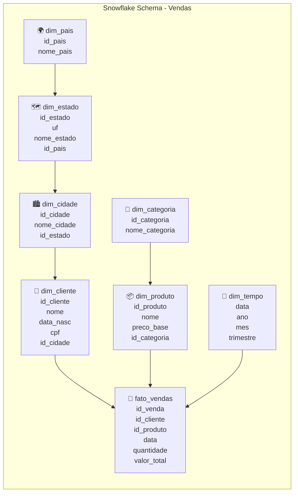

# Snowflake Schema

## Introdução

Após explorarmos o **Star Schema** na seção anterior, vamos conhecer uma variação que busca equilibrar ainda mais **performance** e **normalização**: o **Snowflake Schema**.

O **Snowflake Schema** surge da necessidade de reduzir a redundância presente nas dimensões do **Star Schema**, especialmente quando lidamos com **hierarquias complexas** e **múltiplos níveis** de relacionamento.

!!! exercise text long
    Pensando nas dimensões do **Star Schema** que implementamos (especialmente a dimensão cliente que incluía cidade, UF e país), que problemas de redundância você identifica?

## O que é Snowflake Schema?

O **Snowflake Schema** é uma extensão do **Star Schema** onde as **tabelas dimensão são normalizadas**, eliminando redundâncias através da criação de **tabelas de hierarquia**.

Ao invés de manter todas as informações de uma dimensão em uma única tabela desnormalizada, o Snowflake Schema separa os diferentes **níveis hierárquicos** em tabelas distintas.

Dentre as motivacões para as alterações propostas pelo **Snowflake**, podemos citar a **redução de redundância** e gestão da **atualização dos dados**.

No Star Schema, informações como país e estado são repetidas para cada cidade:

| id_cliente | nome | cidade | uf | pais |
|------------|------|--------|----| -----|
| 1 | João | São Paulo | SP | Brasil |
| 2 | Maria | Campinas | SP | Brasil |
| 3 | Pedro | Santos | SP | Brasil |

!!! warning "Inconsistências Potenciais"
    A redundância aumenta o risco de inconsistências.
    
    Por exemplo, alguém poderia inadvertidamente cadastrar "São Paulo, RJ, Brasil".

Ainda, mudanças em dados hierárquicos (como renomear um estado) requerem atualizações em múltiplas linhas.

## Vantagens do Snowflake Schema

- **Eliminação de Redundância**: Cada informação é armazenada apenas uma vez, reduzindo significativamente o espaço de armazenamento em dimensões com hierarquias profundas.

- **Integridade Referencial**: A normalização garante consistência de dados hierárquicos. É impossível ter inconsistências como "São Paulo, RJ, Brasil".

- **Facilidade de Manutenção**: Mudanças em dados mestres (como renomear um estado) requerem atualizações em apenas uma tabela.

- **Flexibilidade Hierárquica**: Novas hierarquias podem ser facilmente adicionadas sem impacto nas estruturas existentes.

## Desvantagens do Snowflake Schema

- **Complexidade de Consultas**: Consultas analíticas requerem mais **JOINs**, tornando-se mais complexas de escrever e entender.

- **Performance de Consultas**: O maior número de **JOINs** pode impactar negativamente a performance, especialmente em sistemas com grandes volumes de dados.

- **Menor Compatibilidade com Ferramentas BI**: Algumas ferramentas de **Business Intelligence** são otimizadas para **Star Schema** ou **OBT** e podem não funcionar otimamente com estruturas muito normalizadas.

!!! info "Quando Usar Snowflake Schema?"

    **Cenários Adequados:**

    - **Hierarquias complexas e profundas** (geografia, organizacional, produtos)
    - **Dimensões com alta cardinalidade** e redundância significativa
    - Ambientes onde **consistência de dados** é crítica
    - **Recursos limitados** de armazenamento

    **Cenários Inadequados:**

    - **Performance crítica** em consultas frequentes e simples
    - Ambientes com **ferramentas BI legadas** que não suportam múltiplos JOINs
    - **Hierarquias rasas** onde a redundância é mínima
    - Equipes com **pouca experiência** em SQL complexo

## Comparação Final: Escolhendo o Modelo Adequado

| Critério | Normalizado | Snowflake | Star | OBT |
|----------|-------------|-----------|------|-----|
| **Complexidade de consulta** | Muito Alta | Alta | Média | Baixa |
| **Performance de leitura** | Baixa | Média | Boa | Excelente |
| **Redundância de dados** | Nenhuma | Baixa | Média | Alta |
| **Integridade de dados** | Excelente | Boa | Média | Baixa |
| **Facilidade para analistas** | Baixa | Média | Alta | Muito Alta |
| **Custo de armazenamento** | Baixo | Baixo-Médio | Médio | Alto |
| **Complexidade de manutenção** | Alta | Média | Média-Baixa | Baixa |

!!! exercise choice "Question"
    Para um **dashboard** executivo que é consultado poucas vezes por dia mas precisa de alta performance, qual modelo seria ideal?

    - [ ] Modelo normalizado para garantir consistência
    - [ ] Snowflake Schema para economia de espaço
    - [ ] Star Schema para equilibrar performance e manutenção
    - [X] OBT para máxima performance

## Abordagem prática

Não é tarefa fácil escolher o modelo ideal e não existe resposta mágica.

Do ponto de vista de evolução e maturação das áreas de *analytics* das empresas, é comum que iniciem com a replicação do modelo relacional.

Quando as primeiras dores de performance e usabilidade aparecem, migra-se para um **star schema**.

Em algumas empresas mais preocupadas com governança ou padronização, o **star schema** evolui para **snowflake** (dimensões mais normalizadas). Casos comuns para isto incluem:

- Quando o domínio é muito grande (por exemplo, varejo global com hierarquias complexas).
- Há necessidade de evitar redundância em dimensões.

Muitas vezes, uma abordagem **híbrida** é adotada, onde diferentes partes do **data warehouse** utilizam modelos distintos conforme suas necessidades específicas (**star schema** + **OBT**)!

Ainda, podemos considerar a utilização de **views materializadas** ou **caches** para otimizar o desempenho de consultas em modelos mais complexos. Neste cenário, o **star schema** pode ser escolhido como modelo central, e o **OBT**, implementado como **views materializadas**, para áreas críticas de desempenho.
