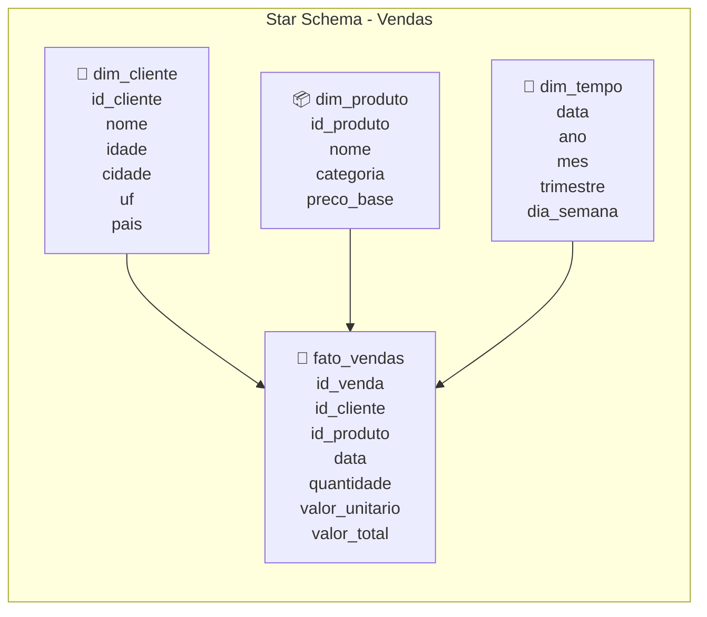

# Star Schema

## Introdução

Na seção anterior, exploramos o conceito de **One Big Table (OBT)**, que propõe uma estratégia de desnormalização completa.

Agora, vamos estudar uma abordagem mais equilibrada: o **Star Schema**!

O **Star Schema** representa um meio-termo entre a normalização completa dos sistemas **OLTP** e a desnormalização total da **OBT**, oferecendo uma estrutura **otimizada para consultas analíticas**.

!!! exercise text long
    Considerando as limitações da **OBT** discutidas na aula anterior (como redundância e complexidade de atualização), como você imagina que um modelo "meio-termo" poderia resolver alguns desses problemas?

    !!! answer
        Um modelo "meio-termo" poderia resolver alguns dos problemas da **OBT** ao:

        - **Reduzir Redundância**: Separando parte dos dados em tabelas, evitando duplicação excessiva.
        - **Facilitar Atualizações**: Com menos redundância, atualizações em dados seriam mais simples e menos propensas a erros.
        - **Otimizar Consultas**: Estruturando os dados para consultas analíticas comuns, melhorando a performance sem sacrificar a integridade.

## O que é Star Schema?

O **Star Schema** é um **modelo de dados dimensional** que organiza informações em duas categorias principais:

- **Tabela Fato** (*Fact Table*): contém as **métricas** e **medidas numéricas** do negócio
- **Tabelas Dimensão** (*Dimension Tables*): contêm os **atributos descritivos** e contextuais

A estrutura recebe esse nome porque, quando visualizada em um diagrama, lembra uma **estrela**: a tabela fato no centro conectada às dimensões ao redor:



## Contexto Histórico

O **Star Schema** foi formalizado por **Ralph Kimball** na década de 1990 como parte da metodologia **Kimball** para **DW**.

Kimball observou que as consultas analíticas típicas seguiam padrões previsíveis: geralmente envolviam **agregações** numéricas (vendas, quantidades, valores) **agrupadas** por atributos descritivos (tempo, geografia, produtos).

!!! info "O que *vs* como!"
    Esta observação levou ao desenvolvimento de uma estrutura que separa claramente **"o que medir"** (fatos) de **"como agrupar"** (dimensões), otimizando ambos para seus respectivos propósitos.

A abordagem dimensional de Kimball contrastava com a metodologia **Inmon**, que defendia estruturas mais normalizadas. Esta diferença gerou o famoso debate **"Kimball vs Inmon"** na comunidade de **DW**.

!!! info "Metodologias Clássicas"
    - **Kimball** (dimensional): foco na facilidade de uso para analistas
    - **Inmon** (normalizada): foco na integridade e consistência dos dados

Vamos explorar um pouco mais os conceitos de **tabelas fato** e **tabelas dimensão**.

## Tabela Fato

A **tabela fato** é o coração do Star Schema. Ela contém:

- **Chaves estrangeiras** para as dimensões
- **Medidas numéricas** (métricas de negócio)
- **Chaves compostas** quando necessário

No nosso exemplo de vendas, a tabela fato conteria:

```sql { .copy }
CREATE TABLE fato_vendas (
    id_venda INT,
    id_item INT,
    id_cliente INT,
    id_produto INT,
    data_venda DATE,
    
    -- Medidas (sempre numéricas)
    quantidade INT,
    valor_unitario DECIMAL(10,2),
    valor_total DECIMAL(10,2),
    
    -- Chave primária composta
    PRIMARY KEY (id_venda, id_item)
);
```

## Tabelas Dimensão

As **tabelas dimensão** fornecem **contexto descritivo** para as medidas. Elas são tipicamente **desnormalizadas** para facilitar consultas.

Por exemplo:
=== "Dimensão Cliente"
    ```sql { .copy }
    CREATE TABLE dim_cliente (
        id_cliente INT PRIMARY KEY,
        nome VARCHAR(60),
        data_nasc DATE,
        data_cad DATE,
        cpf VARCHAR(15),
        idade_atual INT,
        faixa_etaria VARCHAR(20),
        
        -- Informações geográficas desnormalizadas
        cidade VARCHAR(60),
        uf VARCHAR(2),
        pais VARCHAR(60)
    );
    ```

=== "Dimensão Produto"
    ```sql { .copy }
    CREATE TABLE dim_produto (
        id_produto INT PRIMARY KEY,
        nome VARCHAR(100),
        descricao TEXT,
        preco_base DECIMAL(10,2),
        ativo BOOLEAN,
        
        -- Categorização
        categoria VARCHAR(50),
        subcategoria VARCHAR(50)
    );
    ```

=== "Dimensão Tempo"
    A **dimensão tempo** é fundamental em praticamente todos os **data warehouses**:

    ```sql { .copy }
    CREATE TABLE dim_tempo (
        data DATE PRIMARY KEY,
        ano INT,
        mes INT,
        mes_nome VARCHAR(20),
        trimestre INT,
        semestre INT,
        dia_mes INT,
        dia_ano INT,
        dia_semana INT,
        dia_semana_nome VARCHAR(20),
        eh_feriado BOOLEAN,
        eh_fim_semana BOOLEAN
    );
    ```

!!! exercise choice "Question"
    Por que a dimensão tempo geralmente é pré-populada com todos os dias do ano ao invés de ser populada conforme as vendas ocorrem?

    - [ ] Para economizar espaço
    - [X] Para facilitar análises de períodos sem vendas
    - [ ] Por questões de performance
    - [ ] É uma obrigação do modelo dimensional

## Vantagens do Star Schema

Dentre as vantagens do **Star Schema**, podemos destacar:

- **Equilibrio Entre Performance e Manutenibilidade**: O Star Schema oferece **boa performance** para consultas analíticas (menos **JOINs** que modelos normalizados) mantendo **facilidade de manutenção** (menos redundância que OBT).

- **Intuitividade para Analistas**: A estrutura é intuitiva para usuários de negócio, separando claramente *"medidas"* (o que medir) de *"dimensões"* (como agrupar).

- **Compatibilidade com Ferramentas de BI**: A maioria das ferramentas de **OLAP** é otimizada para trabalhar com **Star Schemas**, oferecendo recursos automáticos de *drill-down* e *roll-up*.

- **Flexibilidade Analítica**: Novas análises podem ser facilmente implementadas combinando diferentes dimensões sem modificar a estrutura básica.

!!! exercise text long
    Compare as vantagens do **Star Schema** com as da **OBT**. Em que situações cada abordagem seria mais adequada?

!!! exercise text long
    Quais são as principais diferenças em termos de **redundância de dados** entre **Star Schema**, modelo normalizado (**3NF**) e **OBT**?

## Implementando Star Schema para Vendas

### Tabelas Dimensão

!!! warning "Atenção"
    Esta é uma versão refatorada, o nome dos atributos (colunas) pode não bater com o utilizado na aula 03.

A criação da dimensão cliente, incluindo campos calculados úteis para análise, poderia ser realizada pelo uso de uma *query* semelhante a:

```sql { .copy }
CREATE TABLE dim_cliente AS
SELECT 
    c.id_cliente,
    c.nome,
    c.data_nasc,
    c.data_cad,
    c.cpf,
    
    -- Campos calculados
    TIMESTAMPDIFF(YEAR, c.data_nasc, CURRENT_DATE) as idade_atual,
    CASE 
        WHEN TIMESTAMPDIFF(YEAR, c.data_nasc, CURRENT_DATE) < 25 THEN 'Jovem'
        WHEN TIMESTAMPDIFF(YEAR, c.data_nasc, CURRENT_DATE) < 45 THEN 'Adulto'
        WHEN TIMESTAMPDIFF(YEAR, c.data_nasc, CURRENT_DATE) < 65 THEN 'Meia-idade'
        ELSE 'Senior'
    END as faixa_etaria,
    
    -- Informações geográficas (desnormalizadas)
    cid.cidade_desc as cidade,
    cid.cidade_uf as uf,
    pa.pais,
    
    -- Auditoria
    c.created_at,
    c.updated_at
    
FROM cliente c
JOIN cidade cid ON c.id_cidade = cid.id_cidade
JOIN pais pa ON cid.id_pais = pa.id_pais;
```

A dimensão produto, com categorização adequada:

```sql { .copy }
CREATE TABLE dim_produto AS
SELECT 
    p.id_produto,
    p.nome,
    p.descricao,
    p.preco_base,
    p.ativo,
    
    -- Categorização baseada no nome (exemplo simples)
    CASE 
        WHEN LOWER(p.nome) LIKE '%eletrônico%' THEN 'Eletrônicos'
        WHEN LOWER(p.nome) LIKE '%livro%' THEN 'Livros'
        WHEN LOWER(p.nome) LIKE '%roupa%' THEN 'Vestuário'
        ELSE 'Outros'
    END as categoria,
    
    -- Classificação por faixa de preço
    CASE 
        WHEN p.preco_base < 50 THEN 'Baixo'
        WHEN p.preco_base < 200 THEN 'Médio'
        ELSE 'Alto'
    END as faixa_preco,
    
    p.created_at,
    p.updated_at
    
FROM produto p;
```

E a dimensão tempo:

```sql { .copy }
-- Criar dimensão tempo para os últimos 5 anos
CREATE TABLE dim_tempo AS
WITH RECURSIVE date_range AS (
    SELECT DATE('2020-01-01') as data
    UNION ALL
    SELECT DATE_ADD(data, INTERVAL 1 DAY)
    FROM date_range
    WHERE data < DATE('2025-12-31')
)
SELECT 
    data,
    YEAR(data) as ano,
    MONTH(data) as mes,
    MONTHNAME(data) as mes_nome,
    QUARTER(data) as trimestre,
    CASE WHEN MONTH(data) <= 6 THEN 1 ELSE 2 END as semestre,
    DAY(data) as dia_mes,
    DAYOFYEAR(data) as dia_ano,
    WEEKDAY(data) + 1 as dia_semana,
    DAYNAME(data) as dia_semana_nome,
    CASE WHEN WEEKDAY(data) >= 5 THEN TRUE ELSE FALSE END as eh_fim_semana
FROM date_range;
```

### Tabela Fato

Para a tabela `fato_vendas`, a criação poderia ser realizada com a seguinte *query*:

```sql { .copy }
CREATE TABLE fato_vendas AS
SELECT 
    -- Chaves para dimensões
    v.id_venda,
    iv.id_item,
    v.id_cliente,
    iv.id_produto,
    v.data as data_venda,
    
    -- Medidas
    iv.quantidade,
    iv.valor_unitario,
    iv.valor_total,
    v.valor_total as valor_total_venda,
    
    -- Medidas derivadas
    (iv.valor_unitario * iv.quantidade) as receita_item,
    
    -- Status
    v.entregue,
    
    -- Auditoria
    v.created_at as venda_created_at
    
FROM item_venda iv
JOIN venda v ON iv.id_venda = v.id_venda;
```

## Consultando o Star Schema

Com o Star Schema implementado, as consultas analíticas tornam-se mais diretas:

```sql { .copy }
-- Vendas por país e trimestre
SELECT 
    dc.pais,
    dt.ano,
    dt.trimestre,
    SUM(fv.valor_total) as receita_total,
    COUNT(DISTINCT fv.id_venda) as total_vendas
FROM fato_vendas fv
JOIN dim_cliente dc ON fv.id_cliente = dc.id_cliente
JOIN dim_tempo dt ON fv.data_venda = dt.data
GROUP BY dc.pais, dt.ano, dt.trimestre
ORDER BY dt.ano, dt.trimestre, receita_total DESC;
```

```sql { .copy }
-- Análise de produtos por faixa etária
SELECT 
    dp.categoria,
    dc.faixa_etaria,
    SUM(fv.quantidade) as quantidade_total,
    SUM(fv.valor_total) as receita_total,
    AVG(fv.valor_unitario) as preco_medio
FROM fato_vendas fv
JOIN dim_produto dp ON fv.id_produto = dp.id_produto
JOIN dim_cliente dc ON fv.id_cliente = dc.id_cliente
GROUP BY dp.categoria, dc.faixa_etaria
ORDER BY receita_total DESC;
```

!!! exercise choice "Question"
    Em um **Star Schema**, onde geralmente ficam os campos que são usados em filtros `WHERE` das consultas analíticas?

    - [ ] Apenas na tabela fato
    - [X] Principalmente nas tabelas dimensão
    - [ ] Distribuídos igualmente
    - [ ] Apenas em índices

## Desvantagens

Como desvantagens do **Star Schema**, podemos citar:

- **Desnormalização Parcial**: Embora menor que na **OBT**, ainda existe redundância nas tabelas dimensão.

- **Complexidade de Manutenção das Dimensões**: Mudanças em dados mestres (como alteração do nome de um cliente) ainda requerem atualizações nas dimensões, embora em menor escala que na **OBT**.

- **Limitações em Hierarquias Complexas**: Hierarquias muito profundas podem tornar as tabelas dimensão extensas e difíceis de manter.

## Slowly Changing Dimensions (SCD)

Um desafio importante no **Star Schema** é como lidar com **mudanças nas dimensões** ao longo do tempo. Por exemplo, o que acontece quando um cliente muda de cidade?

- **SCD Tipo 1:** Sobrescrever. O registro é atualizado ou sobrescrito.
```sql
-- Cliente mudou de cidade: atualiza e perde histórico
UPDATE dim_cliente 
SET cidade = 'Nova Cidade', uf = 'SP' 
WHERE id_cliente = 123;
```

- **SCD Tipo 2:** Versionamento. A linha anterior é inativada e uma nova linha é criada.
```sql
-- Mantém histórico criando nova versão
INSERT INTO dim_cliente (
    id_cliente_original, nome, cidade, uf, 
    data_inicio, data_fim, versao_atual
) VALUES (
    123, 'João Silva', 'Nova Cidade', 'SP', 
    '2025-01-01', '9999-12-31', TRUE
);

-- Inativa versão anterior
UPDATE dim_cliente 
SET data_fim = '2024-12-31', versao_atual = FALSE 
WHERE id_cliente_original = 123 AND versao_atual = TRUE;
```

!!! exercise choice "Question"
    Para análises históricas de vendas, qual tipo de SCD seria mais apropriado para a dimensão cliente?

    - [ ] SCD Tipo 1, pela simplicidade
    - [X] SCD Tipo 2, para manter histórico
    - [ ] Depende do volume de dados
    - [ ] Qualquer um serve

## Star Schema vs Outras Abordagens

### Comparação Resumida

| Aspecto | Modelo Normalizado | Star Schema | OBT |
|---------|-------------------|-------------|-----|
| **JOINs em consultas** | Muitos (5-8) | Poucos (2-4) | Nenhum |
| **Redundância** | Mínima | Moderada | Máxima |
| **Performance de leitura** | Lenta | Boa | Excelente |
| **Facilidade de atualização** :material-information-outline:{ title="Considera atualização dos dados." } | Alta | Moderada | Difícil |
| **Uso de espaço** | Mínimo | Moderado | Máximo |
| **Intuitividade para analistas** | Baixa | Alta | Muito Alta |

!!! exercise choice "Question"
    Para um **DW** que precisa ser atualizado diariamente com milhões de transações, qual abordagem seria mais adequada?

    - [ ] Modelo completamente normalizado
    - [X] Star Schema com **SCD** apropriado
    - [ ] OBT atualizada integralmente
    - [ ] Híbrido de acordo com a consulta
