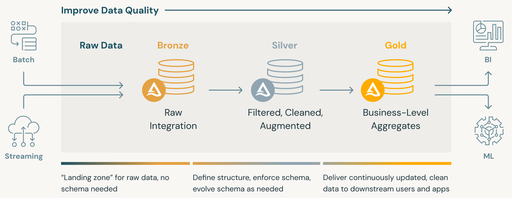

# Introdução Data Lakes

## Introdução

No cenário atual, o engenheiro de dados nem sempre irá ingerir tabelas bem definidas. Logs de aplicação, eventos de sensores, cliques, imagens e textos competem por espaço nas arquiteturas de dados. Uma outra alternativa para armazenar esses dados é o **Data Lake**.

Um **Data Lake** é um repositório de armazenamento de grande escala que mantém **dados brutos no formato nativo**.

Sua popularização cresceu mais significativamente por volta de 2010, quando **data warehouses** relacionais passaram a sofrer com volume, variedade e velocidade de dados semi ou não estruturados.

!!! quote "A pergunta que motivou o surgimento do **Data Lake** foi:"
	*Como guardar tudo isso agora, mesmo sem saber ainda todos os usos futuros?*

!!! info "Metáfora"
	Assim como um lago recebe diferentes afluentes sem tentar "padronizar" a água, o Data Lake aceita múltiplos formatos (estruturado, semi-estruturado, não estruturado) sem impor um esquema antecipado.

Um **Data Lake** funciona como um repositório centralizado que pode conter tanto cópias não processadas de dados de sistemas de origem, (sensores, logs, sistemas), quanto informações já transformadas para uso em *dashboards*, análises avançadas ou treinamento de modelos.

## Por que não só Data Warehouse?

O warehouse tradicional parte de um modelo pré-definido (**schema-on-write**). Isso exige decidir colunas, tipos e regras antes de carregar. Para dados novos e caóticos, esse atrito gera atraso. O **Data Lake** inverte essa lógica: armazena agora, interpreta depois (**schema-on-read**). Assim, a modelagem e padronização ficam próximas do momento de consumo ou de etapas de refinamento.

!!! exercise text long
	Liste dois exemplos de fontes de dados que ficariam difíceis (ou custosos) de colocar diretamente em um **data warehouse** relacional sem um pré-processamento pesado.

	!!! answer "Resposta"
		- Logs de servidores web, que podem ter formatos variados e mudanças frequentes.
		- Dados de sensores IoT, que geram grandes volumes de dados em formatos não estruturados.

## Características

Como características essenciais, um **Data Lake** geralmente apresenta:

1. ***Store first***: ingestão rápida copiando arquivos (ou dados em fluxo) quase como chegam.
2. **Escalabilidade horizontal**: usando armazenamento de objetos (ex.: S3) com custo baixo, ou seja, foco em armazenar grandes volumes de dados de forma econômica.
3. **Neutralidade de computação**: tem capacidade de processar e analisar dados usando diferentes engines de computação e ferramentas analíticas, sem ficar restrito a uma única tecnologia.
4. **Retenção histórica**: raramente se apaga; mantém trilha de eventos brutos.

Observe que nenhuma dessas características garante valor por si só. Sem contexto e organização, vira apenas um repositório barato.

!!! exercise text short
	Por que reter dados brutos pode ajudar a corrigir um erro descoberto meses depois em uma transformação de **ETL**?

	!!! answer "Resposta"
		Reter dados brutos permite **reprocessar** os dados originais com as correções necessárias, garantindo que qualquer erro na transformação anterior possa ser corrigido sem perda de informação.

## Camadas Lógicas

Para evitar que o **Data Lake** se torne um pântano (**data swamp**), é necessário prover uma organização mínima.

Isto pode ser obtido ao aplicar uma separação simples de camadas.

Uma primeira divisão possível é separar dados brutos de dados processados.

| Camada | Objetivo | Exemplo de conteúdo |
| ------ | -------- | ------------------- |
| `raw`  | Captura dos dados | JSON, CSV original, logs, imagens |
| `processed` | Limpeza, padronização, integração | Colunas tipadas, normalização de datas, arquivos de formato colunar (Parquet) |

Uma melhor organização pode ser obtida com a separação em três camadas.

| Camada | Objetivo | Exemplo de conteúdo |
| ------ | -------- | ------------------- |
| `raw` (**Bronze**) | Captura integral e imutável | JSON de eventos, CSV original, logs, imagens |
| `cleansed` (**Silver**) | Limpeza, padronização, integração | Colunas tipadas, normalização de datas, arquivos de formato colunar (Parquet) |
| `presentation` (**Gold**) | Lógica de negócio pronta para consumo | Tabelas derivadas, fatos e dimensões, conjuntos agregados |

!!! info "Info!"
	Apesar de não ser a organização formal, a organização em três camadas (*Bronze*, *Silver*, *Gold*) é um **padrão emergente**, e bastante utilizada na prática.

Na prática vocês verão essas camadas mapeadas em prefixos de caminhos (ex.: `s3://meu-data-lake/raw/...`).

!!! tip "Arquitetura Medallion"
	Este padrão de camadas (*Bronze*, *Silver*, *Gold*) é conhecido como **Medallion Architecture** e foi popularizado pela **Databricks**.

	
	**Fonte**: Adaptado de [Databricks](https://www.databricks.com/sites/default/files/inline-images/building-data-pipelines-with-delta-lake-120823.png)

	Caso queira se aprofundar, veja este [artigo da Databricks](https://www.databricks.com/br/glossary/medallion-architecture)

!!! exercise text short
	Dê um exemplo de transformação típica que ocorre ao mover um dataset de `raw` para `cleansed`.

	!!! answer "Resposta"
		- Conversão de tipos de dados (ex.: transformar strings em datas ou números).
		- Remoção de duplicatas e tratamento de valores nulos.
		- Normalização de formatos (ex.: padronizar datas para um formato único).

!!! warning "Vantagem x Risco"

	Um **Data Lake** geralmente oferece custo baixo por terabyte e flexibilidade para novos usos. Entretanto, sem governança mínima (nomenclatura, controle de versões de *schema*, sem metadados ricos, políticas de retenção :material-information-outline:{ title="Políticas de retenção são regras que definem por quanto tempo os dados devem ser mantidos em um repositório (data lake). Elas ajudam a gerenciar o ciclo de vida dos dados, garantindo que informações antigas ou desnecessárias sejam removidas após um período específico (regulatório ou por controle de custos)." } e padrões de qualidade) ele degrada em um conjunto caótico de pastas!

	!!! info "Data Swamp"
		Usuários deixam de confiar e criam cópias paralelas.

## Checagem Rápida

!!! exercise text long
	Em poucas frases, compare *schema-on-write* e *schema-on-read*, destacando impacto no tempo de disponibilização dos dados.

	!!! answer "Resposta
		- *Schema-on-write* exige definir o esquema antes de armazenar os dados, o que pode atrasar a ingestão, mas garante consistência imediata.
		- *Schema-on-read* permite armazenar dados brutos rapidamente, adiando a definição do esquema para o momento da leitura, o que acelera a disponibilização inicial dos dados.

!!! exercise choice "Question"
	Em um **Data Lake** baseado em S3, não é permitido utilizar *Parquets*, dado que arquivos *Parquets* possuem *schema* embutido.

	- [ ] Verdadeiro
	- [X] Falso

	!!! answer "Answer"
		Falso. Arquivos **Parquet** são amplamente utilizados em **Data Lakes** por serem eficientes em termos de armazenamento e consulta.

		Ao contrário dos bancos de dados tradicionais que impõem um *schema* fixo na escrita (**schema-on-write**), os **Data Lakes** operam com um modelo de schema-on-read. Isso significa que a estrutura dos dados (o *schema*) é definida e aplicada apenas no momento em que você lê e processa os dados.

		Ou seja, você irá conseguir escrever o arquivo **Parquet** no S3 normalmente!

		Obs: deverá haver organização mínima (camadas, catálogo) para evitar que o lago vire um pântano!

!!! exercise text long
	Proponha um conjunto mínimo de pastas para iniciar um Data Lake em S3 alinhado às camadas discutidas.

	!!! answer "Resposta"
		Um conjunto mínimo de pastas para iniciar um **Data Lake** em **S3** poderia ser:

		```
		s3://meu-data-lake/
			|-- raw/
			|-- silver/
			|-- gold/
		```

Nesta introdução, definimos Data Lake, justificamos sua existência, diferenciamos de um **warehouse**, discutimos camadas e riscos. Com isso, vocês estão prontos para experimentar na prática! Siga para a próxima seção.